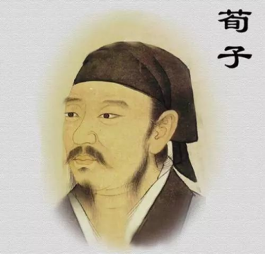
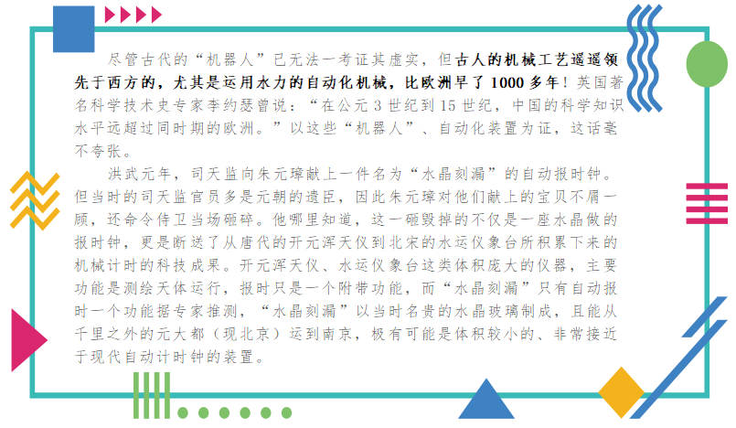
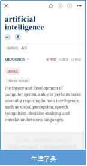
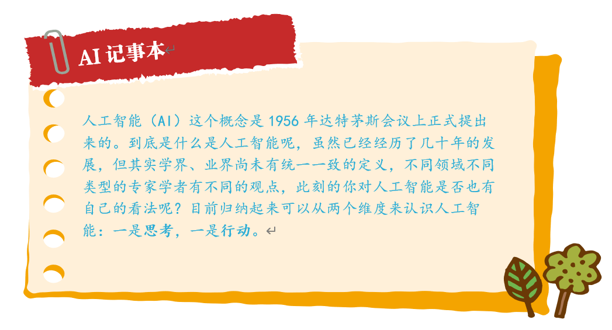
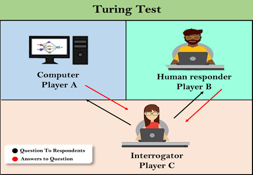
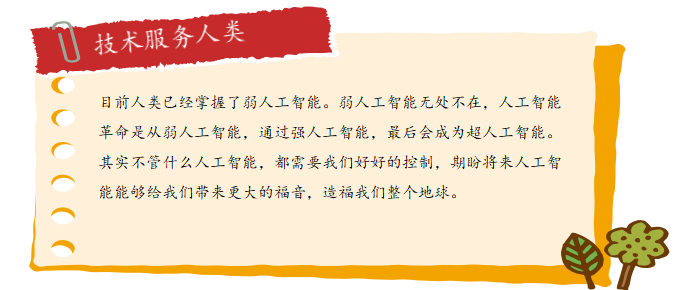

## 任务1.1.1 人工智能知识认知

### 任务描述

&nbsp;&nbsp;&nbsp;&nbsp;&nbsp;&nbsp;&nbsp;我国国务院于 2017年7月印发了《新一代人工智能发展规划》，指导人工智能学科的发展，以求成为世界的人工智能研究中心，引领人工智能的发展。其他国家如美国、英国、德国和日本等都提出了自己雄心勃勃的人工智能发展战略。2019年2月，美国总统特朗普签署行政命令启动“美国人工智能计划”，更是推动了国家层面上人工智能技术的竞争。阅读材料、搜索网络资源、查找书籍，了解中西方智能思想起源和智能技术起源，理解现代人工智能及分类。

### 学习目标

#### 1.知识目标

(1)	了解人工智能的哲学起源；

(2)	了解我国古代的人工智能技术。       

#### 2.能力目标

(1)	能从各类人工智能定义中总结自己对人工智能的认识；

(2)	能发现生活中的人工智能应用。

#### 3.素质素养目标

(1)	培养“技术服务人类”的科学精神素质；

(2)	训练辩证思维能力和发展观；

(3)	树立文化自信。

### 任务分析

#### 1.重点

(1)	从各类人工智能定义中总结自己对人工智能的认识；

(2)	发现生活中人工智能应用。

#### 2.难点

人工智能的哲学起源。

### 知识链接

#### 一、古代智能观————哲学起源

&nbsp;&nbsp;&nbsp;&nbsp;&nbsp;&nbsp;&nbsp;人类在认识世界改造世界的过程中，成为了自然界的最高产物，处于自然界一切生物之上，不断揭开自然界的各种奥秘，走进一个个新的领域，创造了独特的科学文化。人类依靠这特有的科学文化指导自己的主观活动和社会行为，不断发展成为自己的智能。

#### 1 西方的“智能”观

##### （1）休谟之问

&nbsp;&nbsp;&nbsp;&nbsp;&nbsp;&nbsp;&nbsp;18世纪英国哲学家休谟在《人性论》中提出了一个问题：即从“是”能否推出“应该”，也就是“事实”命题能否推导出“价值”命题。这就是在西方近代哲学史上著名的“休谟之问”，因为事实命题一般以“是”为系词，而价值命题一般以“应该”为系词，所以休谟之问又称“实然与应然问题”。有些哲学家认为道德可以像几何学或代数学那样论证其确定性，但是，休谟指出，对于道德问题，科学是无能为力的，科学只能回答“是什么”的问题，而不能告诉我们“应该怎样”的问题，即从“是”中不能推出“应该”。“是”的本质就是“事物的自然属性的肯定状态”，“应该”的本质就是“根据主体生存与发展的客观要求，价值事物的价值属性的肯定状态”，所以休谟之问集中反映了自然规律与社会规律的关系问题，也集中反映了自然科学与社会科学的关系问题。

##### 2）符号逻辑

&nbsp;&nbsp;&nbsp;&nbsp;&nbsp;&nbsp;&nbsp;符号逻辑就是用数学的方法研究关于推理、证明等问题的学科，也叫数理逻辑。十七世纪德国数学家和哲学家莱布尼茨认为一切现实事件都可以通过物理符号将其逻辑化并进行推理，即“万能符号”理论。
为了准确地解释世界、认识世界和给各学科建立统一的表达，莱布尼茨构建了符号逻辑体系，包含本体论、认识论和方法论三个层次。莱布尼茨的符号逻辑具有概念、判断、推理三个角度的理论构造，同时还具有数学化、还原论、内涵逻辑的特征。基于逻辑推理的可以解决很多简单的应用问题，但是超出范围或复杂度高一些机器就不能利用逻辑推理来实现，所以莱布尼茨符号逻辑体系虽未能完全实现，但是催发了现代人工智能思想的萌芽。

##### 3）语言和规则

&nbsp;&nbsp;&nbsp;&nbsp;&nbsp;&nbsp;&nbsp;维特根斯坦在《哲学研究》（Philosophical Investigation）中提出一种观点——“理解一个语句意味着理解一种语言”，即一个系统可以解析语词并将它们作为一个语句加以处理，但它不会将这个语句真正作为人类语言的一部分去理解，因为人类会利用语言游戏来表达不同的意图，人类对话是一种智能的过程，可以通过操纵社会语境来实现说话人的意图。比维特根斯坦稍年轻一些的哲学家约翰·希尔勒（John Searle）遵循前者全新建立的以语言为中心的传统，他利用如今著名的“中文房间”（Chinese Room）思想实验证明，尽管人工智能能够遵循规则，但它无法认识规则。

#### 2我国的“智能观”

##### 1）孟子的智能观

&nbsp;&nbsp;&nbsp;&nbsp;&nbsp;&nbsp;&nbsp;“四端”说是孟子思想的一个重要内容，分别是“仁、义、礼、智”。“是非之心，智之端也。”就是孟子的“智端”说，就是说人有了是非之心便是智慧的开端。另外《孟子·告子上》中写到“是非之心，智也”，非之心就是“智”，你可以有意识，但不一定有智慧，意识是无关乎是非的，而智慧是要知道是非的，明白伦理的。

##### 2）王充的智能观

&nbsp;&nbsp;&nbsp;&nbsp;&nbsp;&nbsp;&nbsp;汉代王充在《论衡·实知》写到“故智能之士，不学不成，不问不知。”，意思是即使有智能（聪明智慧）的人，不学习就没有成就，不请教别人就不会明白。由此可见王充的智能观就是不断学习才能增长智能聪慧。
##### 4）荀子的智能观

&nbsp;&nbsp;&nbsp;&nbsp;&nbsp;&nbsp;&nbsp;荀子在《正名》中写道：“所以知之在人者谓之知，知有所合谓之智。所以能之在人者谓之能，能有所合谓之能”

&nbsp;&nbsp;&nbsp;&nbsp;**（1）“知之在人者谓之知”，这里的知表示感知，即**人认识外界客观事物的本能，包括视觉、听觉、触觉、味觉和压力等这些感知能力，这里的“知”指人对外界客观世界的多通道、多模态的感知。

&nbsp;&nbsp;&nbsp;&nbsp;**（2）“知有所合者谓之智”，**这里的智表示智慧，人将对客观世界的各种感知进行综合思考后形成概念和对象，形成认知结果，掌握客观世界的发展规律。通过感知获得认知结果，形成知识，就产生了智慧。

&nbsp;&nbsp;&nbsp;&nbsp;**（3）“能之在人者谓之能”，**这里“能”指的是基于感知或认知的本能反应。例如，婴幼儿一吃药就会吐出来，因为是苦的，本能的反应就是吐出来。人类的本能可以做到对感知或者认知的结果快速地作出处理。

&nbsp;&nbsp;&nbsp;&nbsp;**（4）“能有所合谓之能”，**这里的“能”可以理解为智能，就是基于对客观世界的感知形成认知结果，并形成与之相关的行动或者决策。比如儿童或成人知道药是苦的还是会吃下去，因为知道吃了药病才能好，克服了本能反应作出了与认知结果相符合的行动。

#### 3古代的人工智能技术

##### 1）能歌善舞的“机器人”

&nbsp;&nbsp;&nbsp;&nbsp;&nbsp;&nbsp;&nbsp;在《列子·汤问》中曾有记载“穆王惊视之,趋步俯仰，俗人也，巧大颔其颐，则歌合律，捧其手，则舞应节。千变万化，唯意所适。王以为实人也，与盛姬并观之。技将终，倡者瞬其目而招王之左右侍妾。王大怒，欲诛偃师。偃师大慑，立剖解倡者以示王，皆草木胶漆白黑丹青之所为，内则肝、胆、心、肺、脾、肾、肠、胃，外则筋骨、肢节、皮毛齿发，皆假物也，而无不毕兴者，合会复如初见。”,这就是一个叫偃师的巧匠为周穆王进贡的木偶“机器人”，这个“机器人”长相精致仿若真人，行动自如，唱歌符合音律，舞蹈也是行云如水。据此可推断早在3000多年前的商周时期我国就出现了“机器人”。
##### 2）能记路程的“机器人”

&nbsp;&nbsp;&nbsp;&nbsp;&nbsp;&nbsp;&nbsp;记里鼓车又有“记里车”“司里车”“大章车”等别名。有关它的文字记载最早见于《晋书·舆服志》：“记里鼓车，驾四。形制如司南。其中有木人执槌向鼓，行一里则打一槌。”晋人崔豹所著的《古今注》中亦有类似的记述。据此可推断记里鼓车在晋或晋以前即已发明了。这个车上的木偶，每走过一里路都会敲一下鼓，行程达到十公里的时候则会敲一下镯，能让车上的木偶动起来，车中有一套减速齿轮，一直和车轮保持同时转动的趋势，最末的一只齿轮轴在行程一公里的时候刚好转完一周，车上的木偶因为受到凹轮的牵系，被绳索拉起的右臂击鼓一次，表明达到了一公里，从而实现自动记录行走的里程。

##### 3）能载货运输的“机器人”

&nbsp;&nbsp;&nbsp;&nbsp;&nbsp;&nbsp;&nbsp;《南齐书·祖冲之传》如是记载：“以诸葛亮有木牛流马，乃造一器，不因风水，施机自运，不劳人力。”，这种“机器人”载重量达到四百斤以上，每日可以达到“特行者数十里，群行三十里”，日夜不休。

##### 4）能飞行的“机器人”

&nbsp;&nbsp;&nbsp;&nbsp;&nbsp;&nbsp;&nbsp;飞行木鸢是一种会飞的机器鸟，用木材做成，内设机关，能在空中飞行。战国时代，鲁班（或称公输般、公输子）与墨子都曾制造木鹊或木鸢。《墨子》记载：“公输子削竹木以为鹊，成而飞之，三日不下。”，《鸿书》中也记载：“公输般为木鸢，以窥宋城。”鲁班制作木鸢以侦查战争的情况，与现代无人机侦查敌方情报非常相似。而后到汉代，张衡创造了飞行木鸟，但是木鸟的飞行引擎机械结构到如今仍旧是个未解之谜。

##### 5）能端茶倒酒的“机器人”

&nbsp;&nbsp;&nbsp;&nbsp;&nbsp;&nbsp;&nbsp;明末姜准在《岐海琐谈集》中写到：“山人黄子复，擅巧思，制为木偶，运动以机，无异生人。尝刻美女，手捧茶橐（茶壶）。自能移步供客。客举觞啜茗，即立以待；橐返于觞，即转其身，仍内向而入。又刻为小者，置诸席上，依次传觞。其行止上视瓯之举否，周旋向背，不须人力。其制一同于犬。刻木为犬，冒以真皮，口自开合，牙端攒聚小针。衔人衣裔，挂齿不脱，无异于真。”，简单来说就是有个叫黄子复的能工巧匠，制作了一个可以自主移动的木人，可以给客人端茶送酒，雕刻的木犬会咬住客人的衣服来挽留客人。

##### （6）希腊古城的机器女仆

&nbsp;&nbsp;&nbsp;&nbsp;&nbsp;&nbsp;&nbsp;公元8世纪《荷马史诗》这本书中记载：希腊之神兼工匠之神赫菲斯托斯被赶出奥林匹克山之后，失去神力成为凡人，身边没有佣人，为了伺候他的衣食住行便制造了两个机器人女仆。与此同时，拥有神奇能力的人形机器人概念便出现了，大约在800年后，古希腊工程师亚历山大的希罗，决定将这个梦想变成现实。他便设计出能够自行驱动上台的小机器，而这些小机器会完成一系列动作，比如点火、倒酒、走路等。而这或许是世上最早具有变革性的技术机器人了。

&nbsp;&nbsp;&nbsp;&nbsp;&nbsp;&nbsp;&nbsp;尽管古代的“机器人”已无法一一考证其虚实，但**我国古人的机械**工艺遥遥领**先于西方的，尤其是运用水力的自动化机械，比欧洲早了1000多年！**英国著名科学技术史专家李约瑟曾说：“在公元3世纪到15世纪，中国的科学知识水平远超过同时期的欧洲。”从这些“机器人”、自动化装置来看，这话一点都不夸张。

#### 二、现代人工智能

&nbsp;&nbsp;&nbsp;&nbsp;&nbsp;&nbsp;&nbsp;人工智能概念诞生于1956年，已有半个多世纪的发展历程，算起来人工智能并不是一项新技术，但是作为现在最前沿的交叉学科，其实学界尚未对“人工智能”有统一—致的定义，不同领域对于人工智能有着不同的理解，所以不同领域对于人工智能的定义也不同。

##### 1.人工智能定义

###### 1）字典里的“人工智能”

&nbsp;&nbsp;&nbsp;&nbsp;&nbsp;&nbsp;&nbsp;**【新华词典在线版】**人工智能是计算机科学的一个分支，是研究应用计算机来模拟人类的某些智力活动，从而代替人类的某些脑力劳动。人工智能是一门涉及数学、心理学、生物学、语言学、经济学、哲学和法律学等的综合性学科，主要研究模式识别、学习过程、探索过程、推理过程等。可以拆分成“人工”和“智能”两个词来理解。

字典里对**人工**的解释如下：

&nbsp;&nbsp;&nbsp;&nbsp;&nbsp;&nbsp;&nbsp;①人为：人做的。与“自然”“天然”相对，比如人工降雨、人工取火、根须茁壮，枝叶繁茂，岂是人工做得出来的。 ②人力：用人力做的工。与“机械力”相对，比如人工开成的渠、拖拉机来不及运，还得用人工挑。 ③劳工：佣工：派人工进山砍伐、贫居乏人工，灌木荒余宅。 ④量词。一个人工作一天的量，比如做一张书桌要用三个人工、算一下打口井要多少人工。

字典里对**智能**的解释如下： ①智谋与才能。 ②指智力。

&nbsp;&nbsp;&nbsp;&nbsp;&nbsp;&nbsp;&nbsp;**【牛津字典】**的解释：一种能够执行通常需要人类智能的任务的计算机系统理论和发展技术，如视觉感知、语音识别、决策和翻译。

###### 2）百科里的“人工智能”

&nbsp;&nbsp;&nbsp;&nbsp;&nbsp;&nbsp;&nbsp;维基百科中的定义：“人工智能就是机器展现出来的智能，所以只要机器有智能的特征和表现，就应该将其视为人工智能。”
百度百科中的定义：“人工智能是研究、开发用于模拟、延伸和扩展人的智能的理论、方法、技术和应用系统的一门新的技术科学。”人工智能是计算机科学的一个分支。现阶段，比较热门的研究方向包括机器人、语音识别、图像识别、自然语言处理等几个方面。

###### 3）《人工智能标准化白皮书（2018年）》里的人工智能

&nbsp;&nbsp;&nbsp;&nbsp;&nbsp;&nbsp;&nbsp;人工智能是利用数字计算机或者由数字计算机控制的机器，模拟、延伸和扩展人类的智能，感知环境、获取知识并使用知识获得最佳结果的理论、方法、技术和应用系统。

###### 4）人工智能之父眼里的“人工智能”

&nbsp;&nbsp;&nbsp;&nbsp;&nbsp;&nbsp;&nbsp;人工智能之父－约翰.麦卡锡对人工智能的定义是“制造智能机器的科学与工程，特别是智能计算机程序”

###### 5）研究领域的“人工智能”

&nbsp;&nbsp;&nbsp;&nbsp;&nbsp;&nbsp;&nbsp;人工智能是研究、开发用于模拟、延伸和扩展人的智能理论、方法、技术及应用系统的一门新的技术学科，它是计算机科学的一个分支。          

###### 6）应用领域的“人工智能”

&nbsp;&nbsp;&nbsp;&nbsp;&nbsp;&nbsp;&nbsp;人工智能是一门综合学科，主旨是研究和开发出智能实体，在这一点上它属于工程学。工程的一些基础学科自不用说，数学、逻辑学、归纳学、统计学、系统学、控制学、工程学、计算机科学，还包括对哲学、心理学、生物学、神经科学、认知科学、仿生学、经济学、语言学等其他学科的研究，可以说这是一个集数门学科精华的尖端学科中的尖端学科。

##### 2.人工智能的四大流派

&nbsp;&nbsp;&nbsp;&nbsp;&nbsp;&nbsp;&nbsp;将思考和行动组合起来就是四种情况，即机器是否能像人一样思考，机器是否可以合理地思考，机器是否能像人一样行动，机器是否可以合理的行动，这四种定义派生出了人工智能四个流派。

###### 1）像人一样思考派

&nbsp;&nbsp;&nbsp;&nbsp;&nbsp;&nbsp;&nbsp;像人一样思考派，代表就是图灵。1950年，艾伦·图灵（Alan Turing）介绍了一项测试，以检查机器是否能像人类一样思考，这项测试称为图灵测试。在这个测试中，图灵提出如果计算机可以在特定条件下模仿人类的反应，那么可以说计算机是智能的。图灵在其1950年的论文“计算机器和智能”中介绍了图灵测试，该论文提出了“机器能想到吗？”的问题。图灵测试基于派对游戏“模仿游戏”，并进行了一些修改。这个游戏涉及三个玩家，其中一个玩家是计算机，另一个玩家是人类响应者，第三个玩家是人类询问者，与其他两个玩家隔离，他的工作是找到哪个玩家是其中两个玩家。测试结果并不取决于每个正确答案，而只取决于其答案与人类答案的接近程度。允许计算机尽一切可能通过询问器强制进行错误识别。简单来说就是如果人类询问者在提出一些书面问题后不能区分是人还是计算机在回答，则该计算机通过图灵测试。

###### 2）像人一样行动派

&nbsp;&nbsp;&nbsp;&nbsp;&nbsp;&nbsp;&nbsp;将认知模型化方法，比较典型的是通用问题解决器GPS，核心是希望模拟人解决问题的过程。假如你问了图1-1-7中跟真人一样的芯机人一个问题：什么事情是iPad能做但 iPhone不能做的？芯机人思考片刻回答道：盖方便面桶。说完就拿起iPad就去盖上你刚刚泡的碗面。这时候你会认为她是机器人吗？

###### 3）合理的思考

&nbsp;&nbsp;&nbsp;&nbsp;&nbsp;&nbsp;&nbsp;合理的思考是逻辑学、人工智能中的逻辑主义流派，鼻祖是亚里士多德，他提出了逻辑的方法，期望通过逻辑的方法得到最合理的结论，期望通过形式化模型表达这个世界，借助严格的规则完成推理，但我们这个世界实在是太复杂，一个看上去很简单的问题的形式化描述也可能是一个极其困难的问题，需要经过大量地简化，并且很多知识并不是百分之百确定的，这是逻辑派遇到的主要困难。

###### 4）合理的行动

&nbsp;&nbsp;&nbsp;&nbsp;&nbsp;&nbsp;&nbsp;实现完美的合理性－－即总做出正确的事情，融合了逻辑派和图灵派的优势，是目前人工智能研究和人工智能应用工程的主要方法。来自阿西莫夫创作的小说《我，机器人》中的“机器人定律”逐渐进入人工智能领域成为规则，这个规则又叫“机器人三定律”。

##### 3.人工智能三种形态

&nbsp;&nbsp;&nbsp;&nbsp;&nbsp;&nbsp;&nbsp;人工智能可以分为弱人工智能、强人工智能、超人工智能三个级别，弱人工智能是三个分级当中最低级，目前弱人工智能应用非常广泛。

###### 1）弱人工智能

&nbsp;&nbsp;&nbsp;&nbsp;&nbsp;&nbsp;&nbsp;弱人工智能（Artificial Narrow Intelligence，ANI）是擅长于单个方面的人工智能。比如有能战胜象棋世界冠军的人工智能阿尔法狗，但是它只会下象棋，如果我们问它其他的问题，它就不知道怎么回答了。只擅长单方面能力的人工智能就是弱人工智能。

###### 2）强人工智能

&nbsp;&nbsp;&nbsp;&nbsp;&nbsp;&nbsp;&nbsp;强人工智能（Artificial General Intelligence，AGI）是一种类似于人类级别的人工智能。强人工智能融在各方面都能和人类比肩的人工智能，人类能干的脑力活它都能干。创造强人工智能比创造弱人工智能难得多，我们现在还做不到。强人工智能是一种宽泛的心理能力，能够进行思考、计划、解决问题、抽象思维、理解复杂理念、快速学习和从经验中学习等操作。强人工智能在进行这些操作时应该和人类一样得心应手。

###### 3）超人工智能

&nbsp;&nbsp;&nbsp;&nbsp;&nbsp;&nbsp;&nbsp;科学家把超人工智能（Artificial Superintelligence，ASI）定义为在几乎所有领域都比最聪明的人类大脑都聪明很多的人工智能，包括科学创新、通识和社交技能。超人工智能可以是各方面都比人类强一点，也可以是各方面都比人类强万亿倍的。

##### 4. 人工智能的三个方面

&nbsp;&nbsp;&nbsp;&nbsp;&nbsp;&nbsp;&nbsp;人工智能发展过程中，不同学科背景的人工智能学者对它有着不同的理解。综合起来，我们可以从“能力”“学科”和“实用”三个方面对人工智能进行定义。从能力角度看，人工智能是指用人工的方法在机器上实现的智能；从学科的角度来看，人工智能是研究如何构造智能机器或智能系统，使它能模拟、延伸和扩展人类智能的学科；从实用的角度来看，人工智能是指用机器实现所有目前必须借助人类智慧才能实现的任务。

###### 1）计算智能

&nbsp;&nbsp;&nbsp;&nbsp;&nbsp;&nbsp;&nbsp;机器可以像人类一样存储、计算和传递信息，帮助人类存储和快速处理海量数据，有赖于算法的优化和硬件的技术进步。这一阶段是感知智能和认知智能的基础。

###### 2）感知智能

&nbsp;&nbsp;&nbsp;&nbsp;&nbsp;&nbsp;&nbsp;机器具有类似人的感知能力，如视觉、听觉等，不仅可以听懂、看懂，还可以基于此作出判断并做出反馈或采取行动，即“能听会说，能看会认”。目前研究较多、成果显著地包括图像识别、语音识别等技术，国内外人工智能技术发展均集中于这一阶段。

###### 3）认知智能

&nbsp;&nbsp;&nbsp;&nbsp;&nbsp;&nbsp;&nbsp;机器能够像人一样主动思考并采取行动，全面辅助或替代人类工作，是人工智能的最高级形态，也是行业未来的着力点。

### 素质素养养成

（1）通过不同领域对人工智能不同的定义训练学生的辩证思维意识和能力；

（2）通过“智能家园”的人工智能技术应用案例培养学生技术服务人类的意识；

（3）通过我国古代精湛的“智能”技术应用树立学生的文化自信；

（4）在人工智能技术寻古探今中培养学生发展观思维；

（5）在中西方智能观比较培养学生人本思想意识。

### 任务分组

#### 学生任务分配表

[学生任务分配表](https://docs.qq.com/sheet/DWVpHVlFySlRGc1dC)

### 任务实施

#### 任务工作单1：古代智能观认知

组号：__________           姓名：__________            学号：__________             检索号：__________
           
#### 引导问题：

（1）我国有关“智能”的哲学思想观点有哪些？请列举代表新观点、人物和典型事件。

—————————————————————————————————————————————————————————                                                                      

（2）西方有关“智能”的哲学思想观点有哪些？请列举代表性观点、代表性人物和典型事件。

—————————————————————————————————————————————————————————                                                                        

（3）请整理古代“智能”技术案例，用图文并茂或者视频的方式展示。

—————————————————————————————————————————————————————————

#### 任务工作单2：现代人工智能认知

组号：__________            姓名：__________            学号：__________             检索号：__________
              
#### 引导问题：

（1）现代有关人工智能定义有哪些？

—————————————————————————————————————————————————————————
                                                                         
（2）请问人工智能分类有哪些？对应的依据是什么？

—————————————————————————————————————————————————————————
                                                                        
（3）每个流程对应的Python库文件是哪个？

—————————————————————————————————————————————————————————
                                                                         
（4）检查你的电脑是否已经安装所需要的库文件，如果没有请安装。

—————————————————————————————————————————————————————————
                                                                         

#### 任务工作单3：人工智能认知讨论

组号：__________            姓名：__________            学号：__________             检索号：__________                

#### 引导问题：

（1）小组讨论东西方的“智能观”有何异同，教师参与引导。
                                                                       
（2）小组讨论，古代的“智能”技术是否属于人工智能，教师参与引导和组织。
                                                                        
（3）小组讨论，总结什么是人工智能。
                                                                        

#### 任务工作单4：人工智能认知展示汇报\

组号：__________           姓名：__________           学号：__________            检索号：__________               

#### 引导问题：

每小组推荐一位同学代表本组汇报中西方智能观代表性观点和本组有关中西方智能观的异同总结、现代人工智能定义以及本组的观点。
                                                                        

#### 任务工作单5：人工智能认知学习反思

组号：__________           姓名：__________           学号：__________            检索号：__________               

#### 引导问题：

自查、分析小组在探究什么是人工智能的过程中存在的不足及改进方法，并填写下表。 

|不足之处|具体体现|改进措施|
| :---: | :---: | :---: |
|		|		|		|
|		|		|		|

### 评价反馈

#### 个人评价表

组号：__________           姓名：__________           学号：__________            检索号：__________  

链接：[个人评价表](https://docs.qq.com/sheet/DWU9yclpISXdIeVhj)

#### 小组内互评表

组号：__________           姓名：__________           学号：__________            检索号：__________  

链接：[小组内互评表](https://docs.qq.com/sheet/DWWpXU3drTlBzSlBC)

#### 小组间互评表

被评组号：__________            检索号：__________  

链接：[小组间互评表](https://docs.qq.com/sheet/DWUxXRkhJaVFJeUJU)

#### 教师评价表
                                                                        
组号：__________           姓名：__________           学号：__________            检索号：__________  

链接：[教师评价表](https://docs.qq.com/sheet/DWXJqak1xTUJkaGJK)
