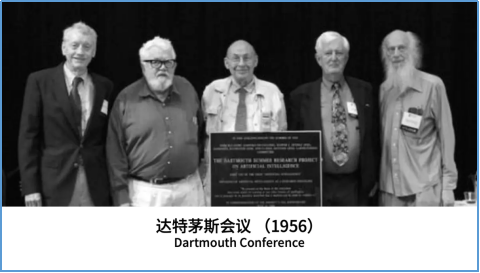
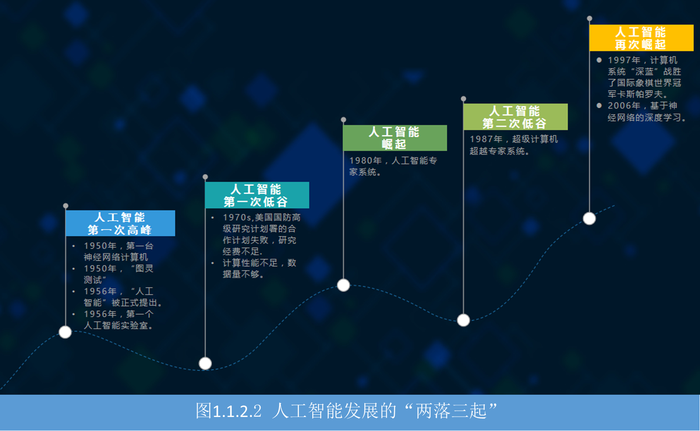
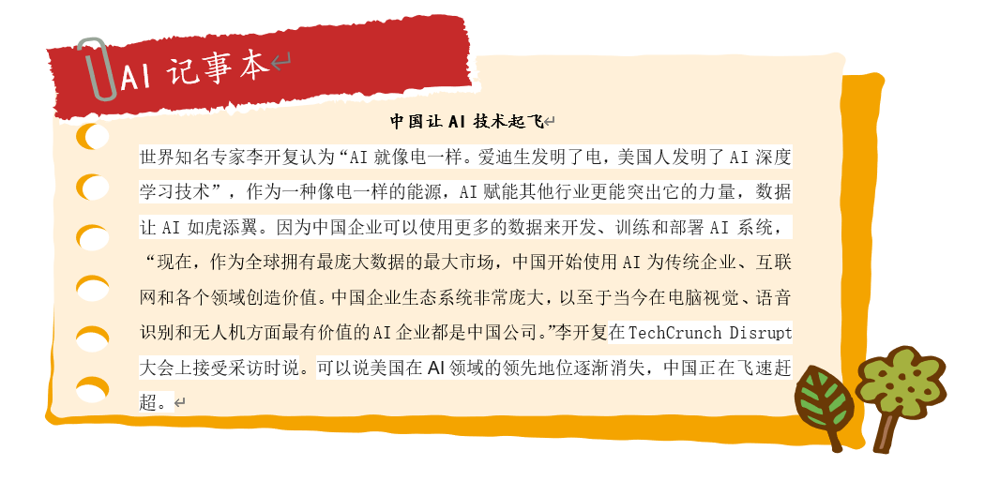
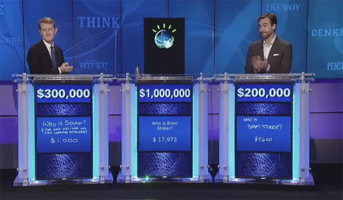

## 任务1.1.2 人工智能技术发展历程探究

### 任务描述

&nbsp;&nbsp;&nbsp;&nbsp;&nbsp;&nbsp;&nbsp;1956年达特茅斯会议被广泛认为是人工智能诞生的标志，经过60多年的蜿蜒前行，时至今日，人工智能发展日新月异，此刻AI已经走出实验室，离开棋盘，已通过智能客服、智能医生、智能家电等服务场景在诸多行业进行深入而广泛的应用。可以说，AI正在全面进入我们的日常生活，属于未来的力量正席卷而来。但是人工智能是一门极富发展潜力和挑战性的学科，和大多数事物发展规律一样，该学科也呈“肯定－否定－否定之否定”的螺旋上升发展趋势。请同学查找资料，总结人工智能发展三次快速发展和两次低谷的原因，了解推动人工智能技术发展中优秀人物和实践，了解世界和我国的人工智能技术发展规划和AI新基建，思考人工智能技术对自己就业和未来从事行业的影响。
<!-- Configure and load Thebe !-->

<pre data-executable="true" data-language="python">
import pyaudio
import wave
def start_audio(time=3, save_file="test.wav"):
    CHUNK = 1024
    FORMAT = pyaudio.paInt16
    CHANNELS = 2
    RATE = 16000
    RECORD_SECONDS = time  # 需要录制的时间
    WAVE_OUTPUT_FILENAME = save_file  # 保存的文件名

    p = pyaudio.PyAudio()  # 初始化
    print("ON")

    stream = p.open(format=FORMAT,
                    channels=CHANNELS,
                    rate=RATE,
                    input=True,
                    frames_per_buffer=CHUNK)  # 创建录音文件
    frames = []

    for i in range(0, int(RATE / CHUNK * RECORD_SECONDS)):
        data = stream.read(CHUNK)
        frames.append(data)  # 开始录音

    print("OFF")

    stream.stop_stream()
    stream.close()
    p.terminate()

    wf = wave.open(WAVE_OUTPUT_FILENAME, 'wb')  # 保存
    wf.setnchannels(CHANNELS)
    wf.setsampwidth(p.get_sample_size(FORMAT))
    wf.setframerate(RATE)
    wf.writeframes(b''.join(frames))
    wf.close()

start_audio()
</pre>

<pre data-executable="true" data-language="python">
from playsound import playsound
playsound('test.wav')
</pre>

<pre data-executable="true" data-language="python">
%matplotlib inline
import numpy as np
import matplotlib.pyplot as plt
x = np.linspace(0,10)
plt.plot(x, np.sin(x))
plt.plot(x, np.cos(x))
</pre>
<pre data-executable="true" data-language="python">
！pip install -r requirements.txt
</pre>
### 学习目标

#### 1.知识目标

（1）了解世界人工智能技术发展的2落3起；

—————————————————————————————————————————————————————————
 
（2）了解我国人工智能技术发展的3个阶段。

—————————————————————————————————————————————————————————
 
#### 2.能力目标

&nbsp;&nbsp;&nbsp;&nbsp;&nbsp;&nbsp;&nbsp;能从技术发展历程中总结发展规律。

#### 3.素质素养目标

（1）培养学生正确对待曲折和困难的人生观；

—————————————————————————————————————————————————————————
 
（2）培养学生理解“前进性和曲折性相统一”的螺旋式上升发展规律的科学精神；

—————————————————————————————————————————————————————————
 
（3）培养学生的民族观和使命担当责任感；

—————————————————————————————————————————————————————————
 
（4）培养学生公共参与意识。

—————————————————————————————————————————————————————————
 
### 任务分析

#### 1.重点

（1）人工智能技术发展历程和背后的原因；

—————————————————————————————————————————————————————————
 
（2）我国人工智能发展现状；

—————————————————————————————————————————————————————————
 
（3）从技术发展历程中理解发展规律。

—————————————————————————————————————————————————————————
 
#### 2.难点

&nbsp;&nbsp;&nbsp;&nbsp;&nbsp;&nbsp;&nbsp;人工智能技术对自己就业和未来从事行业的影响。

### 知识链接

#### 一、人工智能“三起两落”发展之路

&nbsp;&nbsp;&nbsp;&nbsp;&nbsp;&nbsp;&nbsp;1956年达特茅斯会议被广泛认为是人工智能诞生的标志，经过60多年的蜿蜒前行，时至今日，人工智能发展日新月异，此刻AI已经走出实验室，离开棋盘，已通过智能客服、智能医生、智能家电等服务场景在诸多行业进行深入而广泛的应用。可以说，AI正在全面进入我们的日常生活，属于未来的力量正席卷而来。让我们来回顾下人工智能走过的曲折发展历程。

##### 1.人工智能的第一次高峰

&nbsp;&nbsp;&nbsp;&nbsp;&nbsp;&nbsp;&nbsp;1950年，一名在校大四学生马文·明斯基与他的同学邓恩·埃德蒙建造了世界上第一台神经网络计算机，这通常被认为是人工智能的起点，马文.明斯基也被世人称为“人工智能之父”。同年，“计算机之父”阿兰·图灵提出了一个举世瞩目的想法，即图灵测试。图灵当时大胆预言了真正具备智能机器的可行性。1956年，在达特茅斯学院举办的一次会议上，计算机专家约翰·麦卡锡提出了“人工智能”一词。这次会议后不久，约翰.麦卡锡和马文·明斯基先后搬到了麻省理工学院（Massachusetts Institute of Technology）一起开展人工智能相关研究，两人共同创建了世界上第一个人工智能实验室——MIT AI LAB实验室。达特茅斯会议上正式确立了人工智能这一术语，对人工智能的学术研究也正式拉开序幕，人工智能学者和技术开发者陆续涌现，成为第一批人工智能领域的研究实践者。在此后的10多年里，计算机被广泛应用于数学和自然语言领域，用来解决代数、几何和英语等问题，这大大增加了研究学者们对机器人工智能化发展的信心，甚至不少研究者这认为：“二十年内，机器将能完成人能做到的一切。”

##### 2.人工智能第一次低谷

&nbsp;&nbsp;&nbsp;&nbsp;&nbsp;&nbsp;&nbsp;上个世纪70年代，人工智能进入了一段痛苦而艰难的岁月。由于科研人员在人工智能的研究中对项目难度预估不足，不仅导致与美国国防高级研究计划署的合作计划失败，还让大家对人工智能的前景蒙上了一层阴影。与此同时，社会舆论的压力也开始慢慢压向人工智能这边，导致很多研究经费被转移到了其他项目上。在当时，人工智能面临三个技术瓶颈，一是计算机性能不足，导致早期很多程序无法在人工智能领域得到应用；二是问题的复杂性，早期人工智能程序主要是解决特定的问题，因为特定的问题对象少，复杂性低，可一旦问题上升维度，程序立马就不堪重负了；三是数据量严重不足，在当时不可能找到足够大的数据库来支撑程序进行深度学习，这很容易导致机器无法读取足够量的数据进行智能化。 

##### 3.人工智能的崛起

&nbsp;&nbsp;&nbsp;&nbsp;&nbsp;&nbsp;&nbsp;1980年，卡内基梅隆大学为数字设备公司设计了一套名为XCON的“专家系统”。这是一种采用人工智能程序的系统，具有完整专业知识和经验的计算机智能系统，可以简单地理解为“知识库+推理机”的组合。这套系统在1986年之前能为公司每年节省下来超过四千美元经费。有了这种商业模式后，衍生出了像Symbolics、Lisp Machines等和IntelliCorp、Aion等这样的硬件，软件公司。在这个时期，仅专家系统产业的价值就高达5亿美元，人工智能应用进入繁荣期。 

##### 4.人工智能第二次低谷

&nbsp;&nbsp;&nbsp;&nbsp;&nbsp;&nbsp;&nbsp;1987年，苹果和IBM公司生产的台式机性能都超过了Symbolics等厂商生产的专家系统通用计算机，从此，专家系统风光不再，曾经轰动一时的人工智能系统就此宣告结束历史进程，人工智能应用进入低谷期。

##### 5.人工智能再次崛起

&nbsp;&nbsp;&nbsp;&nbsp;&nbsp;&nbsp;&nbsp;上世纪九十年代中期开始，随着AI技术尤其是神经网络技术的逐步发展，以及人们对AI开始抱有客观理性的认知，人工智能技术开始进入平稳发展时期。1997年5月11日，IBM的计算机系统“深蓝”战胜了国际象棋世界冠军卡斯帕罗夫，又一次在公众领域引发了现象级的AI话题讨论，成为人工智能发展的一个重要里程。2006年，Hinton在神经网络的深度学习领域取得突破，人类又一次看到机器赶超人类的希望，也是标志性的技术进步。2009年，IBM首席执行官彭明盛首次提出“智慧地球”这一概念，"智慧的地球"战略的主要内容是把新一代IT技术充分运用在各行各业之中。即把感应器嵌入和装备到电网、铁路、桥梁、隧道、公路、建筑、供水系统、大坝、油气管道等各种物体中，实现万物互联，形成"物联网"的物理系统，然后基于超级计算机和云计算技术实现与物理系统交互，从而帮助人类更加精细和动态的管理生产和生活，最终达到“智慧”状态。

&nbsp;&nbsp;&nbsp;&nbsp;&nbsp;&nbsp;&nbsp;唯物辩证法认为，无论是自然界、人类，还是人的思维都在不断地运动、变化和发展，事物的发展具有普遍性和客观性。事物发展的方向是前进的、上升的；事物前进的道路是曲折的、迁回的。人工智能技术的发展也是这样曲折前进，经历了“两落三起”的人工智能技术已经掀起第四次商业革命，谷歌、微软、百度等互联网巨头以及众多的初创科技公司，纷纷加入人工智能技术应用的战场，掀起又一轮的智能化狂潮，随着技术的日趋成熟和大众的广泛接受，这次狂潮也许可以推动现代文明进入未来文明。

#### 二、我国人工智能发展之路

&nbsp;&nbsp;&nbsp;&nbsp;&nbsp;&nbsp;&nbsp;与国际上人工智能的发展情况相比，我国人工智能研究不仅起步较晚，而且发展道路曲折坎坷，历经了质疑、批评，甚至打压得十分艰难的发展历程，但是改革开放之后，我国人工智能开启了快速发展之路。我国人工智能经历了科研起步和产业快速发展阶段，现在已经进入国家战略规范发展阶段。

##### 1. 科研起步阶段

&nbsp;&nbsp;&nbsp;&nbsp;&nbsp;&nbsp;&nbsp;1978年3月，邓小平发表了“科学技术是生产力”的重要讲话，提出“向科学技术现代化进军”的战略决策，打开解放思想的先河，促进中国科学事业的发展，使中国科技事业迎来了科学的春天。广大科技人员出现了思想大解放，人工智能也在酝酿着进一步地解禁。吴文俊凭借几何定理的机器证明成果，获得1978年全国科学大会重大科技成果奖，成为国际自动推理界的领军人物，他所开创的数学机械化也在国际上被誉为“吴方法”。
 
&nbsp;&nbsp;&nbsp;&nbsp;&nbsp;&nbsp;&nbsp;20世纪70年代末至80年代前期，一些人工智能相关项目已被纳入国家科研计划。例如，在1978年召开的中国自动化学会年会上，报告了光学文字识别系统、手写体数字识别、生物控制论和模糊集合等研究成果，表明中国人工智能在生物控制和模式识别等方向的研究已开始起步。1986年起把智能计算机系统、智能机器人和智能信息处理等重大项目列入国家高技术研究发展计划（863计划）。人工智能研究已经成为国家重点支持的科研领域。

##### 2. 产业快速发展阶段

&nbsp;&nbsp;&nbsp;&nbsp;&nbsp;&nbsp;&nbsp;2003年西安电子科技大学雷达信号处理国家重点实验室和北京大学智能科学系共同提出成立智能科学与技术专业，智能科学与技术面向前沿高新技术的基础性本科专业，覆盖面很广。专业涉及机器人技术，以新一代网络计算为基础的智能系统，微机电系统（MEMS），与国民经济、工业生产及日常生活密切相关的各类智能技术与系统，新一代的人－机系统技术等。全国共有36所本科院校开展智能科学与技术专业的人才培养，为我国人工智能从科研实验进入产业应用提供了源源不断的智力支持，开始进入快速发展期。浪潮天梭在2006 年8月以3胜5平2负击败柳大华等5位中国象棋大师组成的联盟。科大讯飞语音识别技术已经处于国际领先地位，其语音识别和理解的准确率均达到了世界第一，自2006年首次参加国际权威的BlizzardChallenge大赛以来，一直保持冠军地位。百度推出了度秘和自动驾驶汽车。腾讯推出了机器人记者Dreamwriter 和图像识别产品腾讯优图。阿里巴巴推出了人工智能平台DTPAI和机器人客服平台。清华大学研发成功的人脸识别系统以及智能问答技术都已经获得了应用。中科院自动化所研发成功了“寒武纪”芯片并建成了类脑智能研究平台。华为也推出了MoKA人工智能系统。

##### 3. 国家战略规划发展阶段

&nbsp;&nbsp;&nbsp;&nbsp;&nbsp;&nbsp;&nbsp;世界各国已经认识到人工智能是未来国家之间竞争的关键赛场，因而纷纷开始部署人工智能发展战略，以期占领新一轮科技革命的历史高点，我国也不例外。2017年3月，“人工智能”首次被写入政府工作报告。2017年7月，国务院发布《新一代人工智能发展规划》。2017年10月，人工智能被写入十九大报告。2018年3月，人工智能再度被写入政府工作报告。2018年12月的中央经济工作会议上，人工智能被列入“新基建”的核心板块。2019年3月，人工智能第三次出现在政府工作报告中，并升级为“人工智能+”。2020年3月，中共中央政治局常务委员会召开会议，提出要发力于科技端的基础设施建设，人工智能再次成为“新基建”七大板块中的重要一项。

&nbsp;&nbsp;&nbsp;&nbsp;&nbsp;&nbsp;&nbsp;**新技术推动学科建设和催生新职业。**2018年4月，教育部正在研究制定《高等学校引领人工智能创新行动计划》时确定设立人工智能专业，进一步完善中国高校人工智能学科体系，旨在培养中国人工智能产业的应用型人才，推动人工智能一级学科建设。2019年3月，全国共有35所高校获首批**人工智能新专业建设**资格。教育部确定2019年度增补**人工智能技术服务专业**，自2020年起执行，首批共有171所高职院校获批新专业人才培养资格。2019年4月，中华人民共和国人力资源保障部（以下简称人社部）等部门发布13个新职业，包括**人工智能工程技术人员**等。2020年2月，人社部再次向社会发布了未来急需的16个新职业，**人工智能训练师**、智能制造工程技术人员等名列其中。
在人工智能领域，无论是从理论研究、技术研发方面，还是从产业基础方面来看，应该说我国的研究积累与发达国家相比差距不大，目前很多方面已经处于世界领先水平。已经成为我国战略规划部署重点的人工智能，未来空间无限。

#### 三、人工智能发展史上大事件

&nbsp;&nbsp;&nbsp;&nbsp;&nbsp;&nbsp;&nbsp;“人工智能”会“取代”人类吗？相信对它有所了解的人都想过这个问题。对于人工智能可以取代人类工作这件事，已经在现实生活中显而易见了，比如：无人车间、指纹锁、脸部识别等，但是人工智能“取代”人类去思考、创作乃至学习成长，这真的可以吗？我们一起来看看人工智能近70年发生的重大事件。

##### 1.“机器，能思考吗？”

&nbsp;&nbsp;&nbsp;&nbsp;&nbsp;&nbsp;&nbsp;1950年阿兰.图灵在他的论文《计算机器与智能》中，开篇的第一句话就是：“机器，能思考吗？”。如果一台机器能够与人类对话，而不被辨别出其机器的身份，那么这台机器就具备智能—这就是著名的“图灵测试”。自此以后，科学家开始不断思考这个问题，在不断摸索中，开始寻找“人工智能”的金钥匙。

##### 2.达特茅斯会议

&nbsp;&nbsp;&nbsp;&nbsp;&nbsp;&nbsp;&nbsp;1956年，美国汉诺弗小镇的达特茅斯学院中聚集了一群踌躇满志的天才，他们主要讨论机器如何来模仿智能的特征，比如像人类一样思考；使用语言；形成抽象概念；解决人类现存的问题。这次会议被命名为“人工智能夏季研讨会”，这也是人类历史上首次提出“人工智能”的概念；达特茅斯会议就这样拉开了“人工智能”的序幕。

##### 3.人机大战—“深蓝”

&nbsp;&nbsp;&nbsp;&nbsp;&nbsp;&nbsp;&nbsp;1997年，IBM的超级计算机“深蓝”挑战世界第一象棋冠军盖瑞•卡斯帕洛夫，人工智能又再次出现在人们的视野中。卡斯帕洛夫一分钟可以思考3步棋，而“深蓝”存储了一百年来几乎所有顶级大师的棋谱，一秒钟可以思考两亿步棋。在最后的决胜局中，卡斯帕洛夫仅仅走了十九步便失去了耐心离开现场，这场人机大战以机器完胜人类代表而结束，人工智能顿时声名大噪。

##### 4.智力问答——“沃森”

&nbsp;&nbsp;&nbsp;&nbsp;&nbsp;&nbsp;&nbsp;2011年，IBM人工智能系统“沃森”决定向北美热播的智力问答节目《危险边缘》宣战，能从节目中胜出的都是上知天文下知地理的学霸级人物，很多人并不看好“沃森”。“沃森”的大脑中虽然已经输入全套百科全书，数百万份的资料，强大的处理器由90台服务器和360个计算机芯片驱动，但是问题的难点并不是储存丰富知识和快速的检索，更重要的是需要让“沃森”理解出题者的问话，对！就是像人类一样“理解”；于是“沃森”像人一样疯狂的“训练”，通过155场模拟赛，8000次以上实验，“沃森”在挑战两位史上获得奖金最多的两位人类选手时，再一次完胜。

##### 5.世纪大战——“AIphaGo”

&nbsp;&nbsp;&nbsp;&nbsp;&nbsp;&nbsp;&nbsp;2016年3月，世界顶尖围棋高手李世石九段接受了谷歌人工智能“AlphaGo”的挑战；众所周知，围棋千古不同局，万千变化多达10的172次方。麻省理工学院大脑与认识科学系教授托马斯•波吉奥表示：围棋的走法比宇宙中的原子数还多，与“深蓝”不同的是，“AlphaGo”不能仅仅依靠“蛮力”的编程，也不可能将所有走法的可能性都存储起来，它应用的是允许机器被训练，并不断学习成长的算法，这个算法称之为：深度学习。在第二局37手“AlphaGo”走出了天马行空的一幕，让很多围观的人汗毛直立，这一步棋让李世石整整想了15分钟，但已经回天无力了，最终“AlphaGo”完胜人类代表李世石；我们在“AlphaGo”身上仿佛已经看到人类的很多特质，比如创造力、直觉和复杂的思考。

##### 6.第一台聊天机器人Eliza

&nbsp;&nbsp;&nbsp;&nbsp;&nbsp;&nbsp;&nbsp;在1964年至1966年间，麻省理工学院人工智能实验室的德裔美国计算机科学家约瑟夫·维森鲍姆（Joseph Weizenbaum）开发了历史上第一个聊天机器人—Eliza。Eliza的名字源于爱尔兰剧作家萧伯纳的戏剧作品《卖花女》中的角色，剧中出身贫寒的卖花女Eliza 通过学习与上流社会沟通的方式，变成大使馆舞会上人人艳羡的“匈牙利王家公主”。作为世界上第一个聊天机器人，Eliza被其作者赋予了充满戏剧性的内涵。

##### 7. 第一例专家系统DENDRAL

&nbsp;&nbsp;&nbsp;&nbsp;&nbsp;&nbsp;&nbsp;1968年，美国斯坦福大学研发成功专家系统DENDRAL，DENDRAL是世界上第一例成功的专家系统，它的出现标志着人工智能的一个新领域——专家系统的诞生。

##### 8. CNN夺冠ImageNet

&nbsp;&nbsp;&nbsp;&nbsp;&nbsp;&nbsp;&nbsp;2012年，Hinton的学生Alex依靠8层深的卷积神经网络（Convolutional Neural Network，CNN）一举获得了ILSVRC 2012比赛的冠军，瞬间点燃了卷积神经网络研究的热潮。AlexNet成功应用了ReLU激活函数、Dropout、最大覆盖池化、LRN层、GPU加速等新技术，并启发了后续更多的技术创新。自AlexNet于2012年提出后，深度学习领域的研究发展极其迅速，基本上每年甚至每几个月都会出现新一代的技术。

##### 9. DeepID算法人脸识别率首次超过人眼识别

&nbsp;&nbsp;&nbsp;&nbsp;&nbsp;&nbsp;&nbsp;2014年香港中文大学的汤晓鸥、王晓刚及其研究团队宣布，他们所研发的DeepID人脸识别技术比肉眼识别更精准，准确率超过99%，该计算机视觉研究组所研发的深度学习模型DeepID，在LFW（Labeled Faces in the Wild）数据库上获得了99.15%的识别率，而LFW是人脸识别领域使用最广泛的测试基准。实验发现，如果仅给出人脸的中心区域，肉眼在LFW上的识别率97.52%。这也是计算机自动识别算法的识别率首次超过肉眼。

##### 10. 谷歌发布Cloud AutoML

&nbsp;&nbsp;&nbsp;&nbsp;&nbsp;&nbsp;&nbsp;2018年1月，谷歌发布Cloud AutoML 系统，Cloud AutoML基于监督学习，开发者只需要通过鼠标拖拽的方式上传一组图片、导入标签，不需要编写一行代码，几乎不需要任何人为的干预，谷歌系统就能自动生成一个定制化的机器学习模型。我们用户只需要通过在网页上选定需求，比如“我要一个能够识别客厅的AI模型”，那我只要再上传少量（100张左右）的客厅照片，系统就可以自动生成一个可以识别客厅的AI模型。简而言之，即便你不懂机器学习的专业知识，也可以借此来从事一些人工智能领域的工作！这就大大降低了人工智能领域的进入门槛，从而推动人工智能技术更加广泛的应用。

&nbsp;&nbsp;&nbsp;&nbsp;&nbsp;&nbsp;&nbsp;人工智能作为新一轮产业革命的核心驱动力，将进一步释放历次科技革命和产业革命积蓄的巨大能量，创造新的强大引擎，重构生产、分配、交换、消费等经济活动各环节，形成从宏观到微观各领域的智能化新需求，催生新技术、新产品、新产业、新业态、新模式，引发经济结构重大变革，深刻改变人类生产方式和思维模式，实现社会生产力的整体跃升。

### 素质素养养成

(1)	从技术发展中理解“螺旋式”上升的曲折前进发展规律。
(2)	从大事件分享中理解各学科之间的关联，培养“以科学的眼光看待事物的产生”的历史思维和辩证思维能力。
(3)	吴文俊等华人故事引导树立国家观、民族观。
(4)	疫情期间人工智能训练师的事迹帮助学生理解爱岗敬业、追求卓越的职业精神，引导学生热爱劳动、做优秀的劳动者。
(5)	通过百度、华为、科大讯飞等小程序体验视觉技术等AI应用体验激发学生的使命当担和AI技术服务人类的意识。

### 任务分组

#### 学生任务分配表

[学生任务分配表](https://docs.qq.com/sheet/DWVpHVlFySlRGc1dC)

### 任务实施

#### 任务工作单1：探究世界人工智能技术发展之路

组号：__________           姓名：__________           学号：__________            检索号：__________
               
#### 引导问题：

（1）查找资料总结人工智能发展三次快速发展和两次低谷的原因。

—————————————————————————————————————————————————————————
                                                                           

（2）查找资料世界各国人工智能发展战略政策，总结各国人工智能技术发展的重点（至少一个国家）。

—————————————————————————————————————————————————————————
 
                                                                            
（3）查找、整理一些人工智能技术带来的现代文明案例，最好有图像或视频。

—————————————————————————————————————————————————————————
 
                                                                            

#### 任务工作单2：探究我国人工智能技术发展历程

组号：__________           姓名：__________           学号：__________            检索号：__________                   
               
#### 引导问题：

（1）收集我国人工智能国家战略规划政策

—————————————————————————————————————————————————————————
                                                                            
（2）收集本地区人工智能发展规划政策
 
—————————————————————————————————————————————————————————
                                                                            
（3）新基建和AI新基建是什么？
  
—————————————————————————————————————————————————————————
                                                                           
（4）简述人工智能规划政策会如何影响你的就业选择。
                                                                            

#### 任务工作单3：探究人工智能发展中的大事件

组号：__________           姓名：__________           学号：__________            检索号：__________                   
               
#### 引导问题：

（1）收集整理人工智能发展历程中的人物事迹。
 
—————————————————————————————————————————————————————————
                                                                            
（2）收集整理人工智能发展历程中优秀中华儿女事迹。
  
—————————————————————————————————————————————————————————
                                                                           

#### 任务工作单4：人工智能技术发展历程讨论总结

组号：__________           姓名：__________           学号：__________            检索号：__________                   
               
#### 引导问题：

（1）各组选择有关世界人工智能发展历程和案例资料、我国以及本地区人工智能发展规划政策和人工智能发展中的大事件和优秀人物中选择一个进行汇总，讨论后分工，完成分享汇报PPT。
  
—————————————————————————————————————————————————————————
                                                                           
（2）人工智能会学习、会行动到能思考、能应变，两种不同的智能水平可能带来的人类工作、生活的巨大变化。各组结合自己的生活和未来的工作，探讨我们和机器怎么协同共处呢？
 
—————————————————————————————————————————————————————————
                                                                            

#### 任务工作单5：人工智能技术发展历程探究展示汇报

组号：__________           姓名：__________           学号：__________            检索号：__________               
               
#### 引导问题：

小组长推选汇报同学对任务工单4的PPT进行汇报，分享和机器怎么协同共处的讨论结果。
                                                                            

#### 任务工作单6：人工智能技术发展历程探究反思

组号：__________           姓名：__________           学号：__________            检索号：__________               
               
#### 引导问题：

自查、分析小组在探究人工智能技术发展历程过程中存在的不足及改进方法，并填写下表。 

|不足之处|具体体现|改进措施|
| :---: | :---: | :---: |
|		|		|		|
|		|		|		|

### 评价反馈

#### 个人评价表

组号：__________           姓名：__________           学号：__________            检索号：__________  

[个人评价表](https://docs.qq.com/sheet/DWU9yclpISXdIeVhj)

#### 小组内互评表

组号：__________           姓名：__________           学号：__________            检索号：__________  

[小组内互评表](https://docs.qq.com/sheet/DWWpXU3drTlBzSlBC)

#### 小组间互评表

被评组号：__________            检索号：__________  

[小组间互评表](https://docs.qq.com/sheet/DWUxXRkhJaVFJeUJU)

#### 教师评价表
                                                                        
组号：__________           姓名：__________           学号：__________            检索号：__________  

[教师评价表](https://docs.qq.com/sheet/DWXJqak1xTUJkaGJK)
