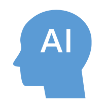
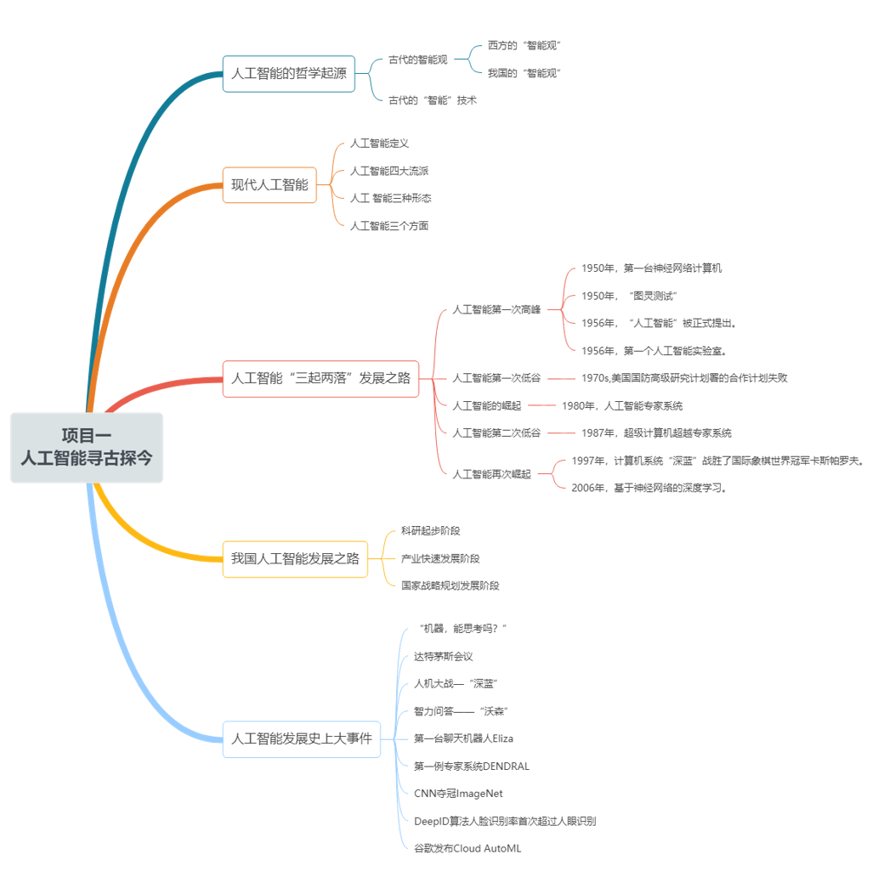
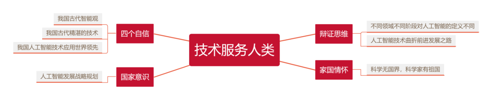

# 模块一  人工智能知识认知

## 项目1.1 人工智能寻古探今

### 项目情景

&nbsp;&nbsp;&nbsp;&nbsp;&nbsp;&nbsp;&nbsp;2016年AlphaGo 战胜两代棋王，震惊世界。从无人工厂到无人驾驶，从智慧城市到智能娱乐，从能跳舞又能送盒饭的机器牛到手机里人人都用的“今日头条”和“美图秀秀”等，人工智能已经从象牙塔飞入了寻常百姓家，推进了生产、便捷了生活。我国国务院于 2017年7月印发了《新一代人工智能发展规划》，指导人工智能学科的发展，以求成为世界的人工智能研究中心，引领人工智能的发展。其他国家如美国、英国、德国和日本等都提出了自己雄心勃勃的人工智能发展战略。2019年2月，美国总统特朗普签署行政命令启动“美国人工智能计划”，更是推动了国家层面上人工智能技术的竞争。那人工智能是什么呢？我们一起来探寻它的过去、探究它的现在。

### 项目导览

### 项目目标

* 了解古代智能观和古代“人工智能”技术
* 理解现代人工智能及分类
* 了解人工智能发展历程
* 了解我国人工智能发展现状和战略规划
* 思考人工智能时代社会需求

### 思政聚焦

