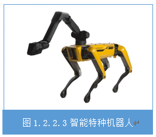
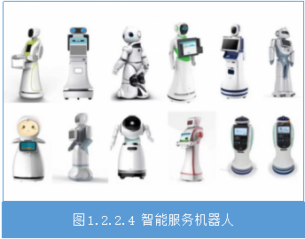
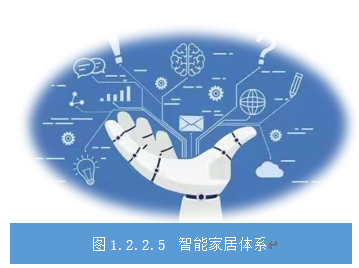
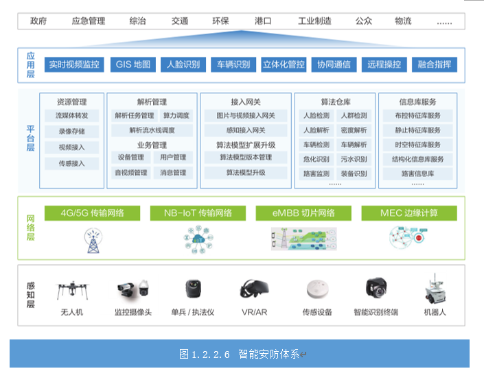

## 任务1.2.2人工智能应用行业探究

### 【任务描述】

&nbsp;&nbsp;&nbsp;&nbsp;会聊天的智能音箱、无所不知的机器人玩伴、平安好医生的“一分钟诊所”、自动化点单配菜的智能餐厅、自动送餐机器人、消毒液喷洒机器人以及人工智能追溯传染病传播路径……曾在科幻影片中出现的人工智能场景，如今在人们生活中变得无处不在。人工智能正变得愈发聪明。人工智能也变得更加温暖。人工智能新技术已经融入生产生活的方方面面，各行各业正快速实现智能化，智能经济方兴未艾。未来已来，这是一个更加崭新和精彩的世界！人工智能与行业领域的深度融合将改变甚至重新塑造传统行业，通过阅读材料、搜素网络资源、查找书籍，讨论人工智能在制造、家居、安防、医疗、智能机器人等行业的应用，从主要产品、核心技术和相关的典型企业三个方面进行总结和汇报。

### 【学习目标】

&nbsp;&nbsp;&nbsp;&nbsp;**1.知识目标**

&nbsp;&nbsp;&nbsp;&nbsp;(1)	了解人工智能技术在智能制造、智能家居、智慧医疗等行业的应用；

&nbsp;&nbsp;&nbsp;&nbsp;(2)	了解各个行业中人工智能应用的主要产品、核心技术和典型企业。

&nbsp;&nbsp;&nbsp;&nbsp;**2.能力目标**

&nbsp;&nbsp;&nbsp;&nbsp;(1)	能够感受人工智能技术为各行各业带来的影响；；

&nbsp;&nbsp;&nbsp;&nbsp;(2)	能从人工智能技术行业应用中总结未来职业岗位的新要求。

&nbsp;&nbsp;&nbsp;&nbsp;**3.素质素养目标**

&nbsp;&nbsp;&nbsp;&nbsp;(1)	培养学生“以人为本”的技术服务情怀

&nbsp;&nbsp;&nbsp;&nbsp;(2)	坚定学生“科技报国”的理想信念。

### 【任务分析】

&nbsp;&nbsp;&nbsp;&nbsp;**1.重点**

&nbsp;&nbsp;&nbsp;&nbsp;(1)	各个行业中人工智能应用的主要产品、核心技术和典型企业数据对人工智能应用的支撑作用；

&nbsp;&nbsp;&nbsp;&nbsp;(2)	能够感受人工智能技术为各行各业带来的影响。

&nbsp;&nbsp;&nbsp;&nbsp;**2.难点**

&nbsp;&nbsp;&nbsp;&nbsp;能从人工智能技术行业应用中总结未来职业岗位的新要求。

### 【知识链接】

#### 一、 智能制造

&nbsp;&nbsp;&nbsp;&nbsp;三一重工的18号厂房，位于湖南长沙产业园的一个总装车间，总面积约十万平方米，有混凝土机械、路面机械、港口机械等多条装配线，是工程机械行业内颇负盛名的智能工厂，成为了行业内最先进的智能化制造车间之一，被业界称之为“最聪明的厂房”。这间厂房像是一个大型的智能计算系统加上传统的操作工具和大型生产设备的智慧体。装配区、高精机加区、结构件区、仓储物区等几大主要功能区域都实现了全方位自动化，都是智能化、数字化模式的产物。18号厂房的厂区旁边有两块电视屏幕，不熟悉装配作业的工人，通过电子屏幕里的数字仿真和三维作业指导，可以学习和了解整个装配工艺——它们是一线工人的“老师”。每一台设备的生产状况、每一次的生产过程、每一产品的质量检测、每一个工人的劳动量都被记录在案。18号厂房经智能化车间改造后，生产效率大大提升，成为引领行业智能制造的“新灯塔”。美国《华尔街日报》评价三一集团18号厂房说“这里藏有中国工业未来的蓝图”。那什么是智能制造？智能制造究竟“智能”在哪？智能制造中应用了哪些人工智能技术呢？。

#### 1.什么是智能制造

&nbsp;&nbsp;&nbsp;&nbsp;智能制造是基于新一代信息通信技术与先进制造技术深度融合，贯穿于设计、生产、管理、服务等制造活动的各个环节，具有自感知、自学习、自决策、自执行、自适应等功能的新型生产方式，如图1.2.2.1所示。

#### 2.人工智能核心技术在智能制造行业的应用

&nbsp;&nbsp;&nbsp;&nbsp;人工智能技术是实现智能制造的核心技术之一。人工智能技术对智能制造行业的支持主要表现在一是智能装备，二是智能生产，三是智能服务。智能装备主要是将自动识别设备、工业机器人、数控机床等设备以及人机交互系统通过信息处理技术、人工智能技术等关键技术的集成和深度融合，形成具有感知、分析、推理、决策、执行功能的智能生产系统。智能装备涉及到图像识别、分析推理、自然语言处理、虚拟现实、智能建模及自主无人系统等人工智能关键技术。智能生产的核心是智能工厂，智能工厂也称之为数字化车间，包括智能设计、智能生产、智能管理以及集成优化等具体内容，涉及到跨媒体分析推理、大数据智能、机器学习等关键技术。智能服务包括涉及到跨媒体分析推理、自然语言处理、大数据智能、高级机器学习等人工智能关键技术。。

#### 3.智能制造领域的典型企业

&nbsp;&nbsp;&nbsp;&nbsp;广汽集团作为世界级智能制造的标杆工厂，充分贯彻“工业4.0”理念，实现生产自动化、信息数字化、管理智能化、智造生态化有机融合，并以质量和效能为中心，提升生产要素效率，生产线极限速度可达到52秒下线一辆新车，是行业领先的汽车生产线。华为松山湖生产基地，从智能车间、智能工厂开始，通过智能制造实现高效、柔性的大规模客户定制，全球领先的生产工艺、手机品控的领先标准淋漓尽致地展现在这里。海尔集团深耕制造业三十余年，是世界第四大白色家电制造商，正在以构建"互联工厂"的核心思想，尝试从大规模"制造"发展为大规模"定制"的智能制造企业，将家电定制化这一美好畅想变为现实。海尔互联工厂创新人工智能检测等多项行业领先技术，实现全流程数据链贯通，真正做到用户定单驱动生产。富士康主要聚焦于工业互联网平台构建、云计算及高效能运算平台、高效运算数据中心、通信网络及云服务设备、5G及物联网互联互通解决方案、智能制造新技术研发应用、智能制造产业升级、智能制造产能扩建等项目。  
2019年10月1日，70周年国庆阅兵仪式上，我国向全世界展示了英姿飒爽的人民军队，海、陆、空三军最前沿的作战装备。当三列无人装备阵次缓缓向我们前进时，令人眼前一亮，面对着这一架架的无人装备，满满的科技感与神秘感。目前军事无人机作为现代战争必不可少的一环，不仅可以完成侦察、打击、干扰等多种任务，还能避免人员伤亡，不愧是新一代的国之利器！

#### 二、智能机器人

&nbsp;&nbsp;&nbsp;&nbsp;2018年，德勤财务机器人“小勤人”的上岗刷爆了整个朋友圈：国际四大会计师事务所之一的德勤会计师事务所将集人工智能技术为一体的财务机器人“小勤人”引入会计、税务、审计等工作中。“小勤人”可以快速“阅读”并分析数千份复杂文件，替代了财务流程中的手工操作，特别是高重复的工作，工作效率超过三个全职员工，三个小时就完成一个会计一天的工作量，并且解决了基础操作大量的人力和时间、大大增强了数据的准确性。重点是“小勤人”还是全天24小时上班，并且全年无休！“小勤人”只是众多智能机器人中的一员，“小勤人”为什么可以这么能干呢？我们要从智能机器人说起。

#### 1.智能机器人的定义及分类

&nbsp;&nbsp;&nbsp;&nbsp;智能机器人是指具备不同程度的智能，可实现“感知-决策-行为-反馈”闭环工作流程，可协助人类生产、服务人类生活，可自动执行工作的各类机器装置。智能机器人可分为智能工业机器人、智能服务机器人和智能特种机器人。

[表格](https://docs.qq.com/doc/DSEV5a1FPZmJ4Y3VW)

####2.智能机器人行业的人工智能核心技术

&nbsp;&nbsp;&nbsp;&nbsp;1智能机器人的核心技术主要聚焦在智能感知、智能认知和人机交互技术。同时依据应用领域的不同，智能机器人也存在着大量带有典型行业特征的特色关键技术。智能家用服务机器人重点应用移动定位技术和智能交互技术，达到服务范围全覆盖及家用陪护的目的；智能公共服务机器人重点运用智能感知认知技术、多模态人机交互技术、机械控制和移动定位技术等，实现应用场景的标准化功能的呈现和完成；智能特种机器人运用仿生材料结构、复杂环境动力学控制、微纳系统等前沿技术，替代人类完成高危环境和特种工况作业。智能工业机器人运用传感技术和机器视觉技术，具备触觉和简单的视觉系统，更进一步运用人机协作、多模式网络化交互、自主编程等技术增加自适应、自学习功能，引导工业机器人完成定位、检测、识别等更为复杂的工作，替代人工视觉运用于不适合人工作业的危险工作环境或人工视觉难以满足要求的场合；智能医疗服务机器人重点突破介入感知建模、微纳技术和生肌电一体化技术，以达到提升手术精度、加速患者康复的目的。

#### 3.智能机器人行业的典型企业

&nbsp;&nbsp;&nbsp;&nbsp;在智能工业机器人领域，有国际四大巨头之称的日本发那科和安川、德国库卡、瑞士ABB仍占据较高市场份额，日本发那科和安川、德国库卡、瑞士ABB、意大利柯马侧重具有分拣和装配能力的智能工业机器人，而英国Meta、德国Scansonic、日本安川则主要在激光视觉焊缝跟踪系统。国内智能工业机器人三巨头是沈阳新松、云南昆船和北京机科。沈阳新松主要是提供自动化装配与检测生产线、物流与仓储自动化成套设备；云南昆船侧重烟草行业服务，北京机科主要应用于印钞造币、轮胎及军工领域。  

  

&nbsp;&nbsp;&nbsp;&nbsp;在智能服务机器人领域，美国iRobot、中国科沃斯主要聚集在卫生清洁扫地机器人方面，美国IntuitiveSurgica是一家专注生产手术机器人的公司，达芬奇外科手术系统是该公司的代表产品，以色列Rewalk是一家生产康复医疗机器人的公司，荷兰Hot-Cheers则聚焦于智能分拣等细分领域。

&nbsp;&nbsp;&nbsp;&nbsp;在智能特种机器人领域，波士顿动力公司是一家专注于研发四足、六足和类人动力机器人的公司，该公司围绕着拥有液压驱动核心技术的“大狗”机器人，不断构筑技术壁垒；深圳大疆是全球领先的无人飞行器控制系统及无人机解决方案的研发和生产商，在国内消费级无人机领域占有率达75%，成为估值超百亿美元的“独角兽”企业；美国Howeand Howe Techonologies则专注生产消防机器人，应用于应急救援场景。

#### 三、智能家居

&nbsp;&nbsp;&nbsp;&nbsp;早晨七点钟，轻柔的音乐缓缓响起，电动窗帘慢慢开启，温暖的阳光洒满卧室。智能系统为你播报今日的天气以及分享晨间新闻资讯，小厨师已在餐厅里为你准备好美味的早餐、暖暖的咖啡……就这样轻松开启新的一天。当你离开家时，家里的电器，窗帘，灯光自动关闭，"安防模式"开启，智能摄像机、智能门锁、煤气、漏水检测器等开始工作，扫地机器人同时开启清扫模式。智能门锁一旦面临非法入侵，会发出本地报警，还能将报警信息发送至你手机上，你出门在外再也不必担心家里的安全状况了。在这种环境中生活，你将会变得无比安心。这就是你未来的家--会思考的房子。

#### 1.什么是智能家居

&nbsp;&nbsp;&nbsp;&nbsp;智能家居以家庭住宅为平台，基于人工智能技术和物联网技术及云计算平台构建的家居生态圈，涵盖智能冰箱、智能电视、智能空调等智能家电，智能音箱、智能手表等智能硬件，智能窗帘、智能衣柜、智能卫浴等智能家居，智能家居环境管理等诸多方面，可实现远程控制设备、设备间互联互通、设备自我学习等功能，并通过收集、分析用户行为数据，为用户提供个性化生活服务，使家居生活安全、舒适、节能、高效、便捷。

&nbsp;&nbsp;&nbsp;&nbsp;例如，借助智能语音技术，用户应用自然语言实现对家居系统各设备的操控，如开关窗帘（窗户）、操控家用电器和照明系统、打扫卫生等操作；借助机器学习技术，智能电视可以从用户看电视的历史数据中分析其兴趣和爱好，并将相关的节目推荐给用户。通过应用声纹识别、脸部识别、指纹识别等技术进行开锁等；通过大数据技术可以使智能家电实现对自身状态及环境的自我感知，具有故障诊断能力。通过收集产品运行数据，发现产品异常，主动提供服务，降低故障率。还可以通过大数据分析、远程监控和诊断，快速发现问题、解决问题及提高效率

#### 2.智能家居行业的人工智能核心技术

&nbsp;&nbsp;&nbsp;&nbsp;随着移动互联网技术的大规模普及应用，为人们精细化掌控人居环境质量与模式提供了基础支撑，人工智能技术的持续发展，又进一步促使人居环境中的管理、辅助、通信、服务、信息获取等功能再次实现智能化的组合优化，以达到借助科技手段管理生活方式的目的。在此背景下，传感器技术、无线及近场通讯设备、物联网技术、深度学习、大数据及云计算技术得到较多应用。传感器和通讯设备对人居环境进行监测形成的数据流，会通过云计算和深度学习建立相应模型，再依托家用物联网对室内的电器设备乃至整个建筑的实时控制，将模型对应的参数和状态优化方案反馈到人居环境中，为人居生活的计划、管理、服务、支付等方面提供支持。

#### 3.智能家居行业的典型企业

&nbsp;&nbsp;&nbsp;&nbsp;具备智能人居解决方案提供能力的龙头企业众多，可大致分为传统家电厂商、智能硬件厂商、互联网电商及创新企业。海尔、美的聚焦智能家居终端，小米侧重于面向众多开发者提供硬件开放式接口，华为致力于提供软硬件一体化楼宇级解决方案，京东通过轻资产、互联网化的运营模式号召合作伙伴加入其线上平台和供应链，国安瑞通过数据挖掘提供覆盖操作终端硬件、系统智能云平台、建筑智能设备的闭环解决方案提升室内人居感受。

#### 四、智能安防

&nbsp;&nbsp;&nbsp;&nbsp;人来人往的海关，身姿小巧的海关无人智能巡检查验车灵活穿行，提供智慧安防服务；相对宁静的城市地下综合管廊里，机器人来回检测，这是城市操作系统在新型城市基础设施建设中的应用体现；在大自然中，智慧水立方平台为江河湖泊全流域水环境管理和治理提供跟踪监测、实时预警。这是谁在佑护我们的安全？让我们一起走进人工智能在安防领域的应用。

####1.智能安防的定义及与传统安防的区别

&nbsp;&nbsp;&nbsp;&nbsp;智能安防技术是一种利用人工智能对视频、图像进行存储和分析，从中识别安全隐患并对其进行处理的技术。智能安防与传统安防的最大区别在于智能化，传统安防对人的依赖性比较强，非常耗费人力，而智能安防能够通过机器实现智能判断，从而尽可能实现实时的安全防范和处理。

&nbsp;&nbsp;&nbsp;&nbsp;当前，高清视频、智能分析等技术的发展，使得安防从传统的被动防御向主动判断和预警发展，行业也从单一的安全领域向多行业应用发展，进而提升生产效率并提高生活智能化程度，为更多的行业和人群提供可视化及智能化方案。用户面对海量的视频数据，已无法简单利用人海战术进行检索和分析，需要采用人工智能技术作专家系统或辅助手段，实时分析视频内容，探测异常信息，进行风险预测。从技术方面来讲，目前智能安防分析技术主要集中在两大类：一类是采用画面分割前景提取等方法对视频画面中的目标进行提取检测，通过不同的规则来区分不同的事件，从而实现不同的判断并产生相应的报警联动等，例如：区域入侵分析、打架检测、人员聚集分析、交通事件检测等；另一类是利用模式识别技术，对画面中特定的物体进行建模，并通过大量样本进行训练，从而达到对视频画面中的特定物体进行识别，如车辆检测、人脸检测、人头检测（人流统计）等应用。

&nbsp;&nbsp;&nbsp;&nbsp;智能安防目前涵盖众多的领域，如街道社区、道路、楼宇建筑、机动车辆的监控，移动物体监测等。今后智能安防还要解决海量视频数据分析、存储控制及传输问题，将智能视频分析技术、云计算及云存储技术结合起来，构建智慧城市下的安防体系。

#### 2.智能安防中的人工智能核心技术

&nbsp;&nbsp;&nbsp;&nbsp;随着平安城市建设的不断推进，监控点位越来越多，从最初的几千路到几万路甚至于到现在几十万路的规模，依托视频和卡口产生的海量数据，智能安防已经延展到事后追查、事中防范响应、事前预防的全生命周期。目标检测、目标跟踪和目标属性提取等视频结构化技术，以及海量数据管理、大规模分布式计算和数据挖掘等大数据技术已经取代传统的人海战术，实时分析视频内容，探测异常信息，进行风险预测。视频结构化技术可以通过识别目标并持续跟踪生成图片结果，提取目标属性归纳可视化特征；大数据技术则用于采集、存储人工智能应用所涉及的全方位数据资源，并基于时间轴进行数据累积，开展特征匹配和模型仿真，辅助安防部门更快、更准地找到有效的资源，进行风险预测和评估。

####3.智能安防领域的典型企业

&nbsp;&nbsp;&nbsp;&nbsp;从提供的产品类型来看，智能安防领域的企业主要分为人工智能芯片、硬件和系统、软件算法三大类别。在芯片领域，跨国巨头企业占较高市场份额，如美国英伟达和英特尔。在硬件和系统领域，各国均以采购本国产品为主，国内主要采购对象为海康威视、大华集团，海康具有深厚的技术积累和成规模的研发团队，大华持续构建广泛的营销网络；美国则有ADT、DSC、OPTEX等高端品牌占据了安防市场大部分份额。在软件算法领域，美国谷歌、Facebook、微软开源代码并提供整体解决方案，中国旷视科技、商汤科技、云从科技等企业也在专注于技术创新研发。

####五、智能医疗

&nbsp;&nbsp;&nbsp;&nbsp;在2020年疫情期间，搭载腾讯AI医学影像产品——腾讯觅影AI和腾讯云技术的人工智能CT设备，部署在湖北多家医院，帮助医护人员进行诊疗。患者做完CT检查后，设备只需几秒钟就可完成AI识别，快速检出和判别疑似新冠肺炎，自动勾勒病灶，通过自动化的统计和直方图显示，为医生快速挑出需要重点审阅的疑点，第一时间进行准确的诊断，大幅缩短医生读片时间，提升工作效率并且降低误诊率，有效缓解了疫情初期医疗资源严重不足的问题。基于“腾讯觅影”在AI+医疗探索上取得的突破，国家卫计委和国家工信部联合授予了其互联网医疗健康行业“墨提斯奖”，该奖被誉为医疗健康行业的“图灵奖”，代表着中国智能终端产业的最高荣誉。我们一起来看看人工智能在医疗领域的应用吧。

#### 1.什么是智能医疗
&nbsp;&nbsp;&nbsp;&nbsp;智能医疗是以医疗信息平台为基础，利用最先进的人工智能技术、物联网技术，实现患者与医务人员、医疗机构、医疗设备之间的互动，逐步达到信息化。人工智能的快速发展，为医疗健康领域向更高的智能化方向发展提供了非常有利的技术条件。智能医疗的核心目标是运用人工智能技术对医疗案例和经验数据进行深度学习和决策判断，显著提高医疗机构和人员的工作效率并大幅降低医疗成本，同时，通过人工智能的引导和约束，促使患者自觉自查、加强预防，更早发现和更好管理潜在疾病，这也是智能医疗在未来的重要发展方向。

#### 2.智能医疗领域的核心技术
&nbsp;&nbsp;&nbsp;&nbsp;智能医疗是以医疗信息平台为基础，利用最先进的人工图像识别、语音语义识别、深度学习技术在医疗领域得到广泛应用。在辅助诊疗方面，通过人工智能技术可以有效提高医护人员工作效率，提升一线全科医生的诊断治疗水平。如利用智能语音技术可以实现电子病历的智能语音录入；利用智能影像识别技术，可以实现医学图像自动读片；利用智能技术和大数据平台，构建辅助诊疗系统。在疾病预测方面，人工智能借助大数据技术可以进行疫情监测，及时有效地预测并防止疫情的进一步扩散和发展。在医疗影像辅助诊断方面，通过医学影像对特征进行提取和分析，为患者预前和预后的诊断和治疗提供评估方法和精准诊疗决策。这在很大程度上简化了人工智能技术的应用流程，节约了人力成本。

#### 3.智能医疗领域的典型企业
&nbsp;&nbsp;&nbsp;&nbsp;腾讯觅影AI辅诊开放平台是腾讯公司是腾讯首款将人工智能技术运用到医学领域的产品。它聚合了腾讯公司内部包括AI Lab、优图实验室、架构平台部等多个顶尖人工智能团队的能力，构建的由医疗机构、科研团体、器械厂商、AI创业公司、信息化厂商、高等院校、公益组织等多方参与的医疗影像开放创新平台。“AI医学影像”和“AI辅助诊断”是腾讯觅影AI辅诊开放平台的两项核心能力，其通过模拟医生的成长学习来积累医学诊断能力，可辅助医生诊断、预测700多种疾病，涵盖了医院门诊90%的高频诊断，其遵循与人类医生类似的学习过程，主要分为三个阶段：首先，其运用自然语言处理和深度学习等人工智能技术，学习、理解和归纳权威医学书籍文献、诊疗指南和病历等医疗信息，自动构建出一张“医学知识图谱”；然后，基于病历检索推理和知识图谱推理知识，建立诊断模型；最后，在人类医学专家的校验下，优化诊断模型。

&nbsp;&nbsp;&nbsp;&nbsp;微医云是国际首个专注于智能医疗的云平台，致力于打造医疗健康产业数字化、智能化基础设施，场景连接和医疗数据基础上，微医云将通过大数据、云计算、机器学习等技术，开发医学人工智能辅助诊疗系统，让家庭通过健康终端，可以享受到医疗健康服务，为政府、医疗机构、医生、医疗健康企业等提供包含互联网医院、互联网医联体、家庭医生签约、智能分级诊疗、医学人工智能辅助诊疗、云药房、数字化医药集采、智能医保控费等在内的数十种智能医疗云和医学人工智能解决方案，提升中国医疗健康服务体系整体效能。

&nbsp;&nbsp;&nbsp;&nbsp;北京康夫子科技有限公司是一家专注于人工智能技术在医疗健康领域应用研发的技术驱动型公司，凭借国际领先的知识抽取和知识推理、表示等知识图谱构建技术，康夫子成功打造了“医疗大脑”知识内核（知识图谱）。康夫子医疗大脑以数万本医学书籍、千万篇医疗论文、数十万份临床病历为基础以保证数据的科学性，同时基于千万篇医疗问答将普通公众对症状的描述和对疾病的理解准确地映射在严肃医疗平面。因此，康夫子“医疗大脑”被业界广泛评价为“接地气”的临床辅助决策和循证医学产品。

&nbsp;&nbsp;&nbsp;&nbsp;由中国平安健康医疗科技有限公司打造的 “平安好医生”以医生资源为核心，利用移动互联网平台进行医患实时沟通，包括预防保健、导医初诊、预约挂号等诊前服务，以及复诊随访、康复指导、慢病管理、用药提醒等诊后服务。自主研发的国内首个中医"智能闻诊"系统融合AI医疗科技和传统中医理论精髓，通过采集用户声音并进行AI分析，识别其是否属于气郁、气虚、阳虚等中医体质，实现听音辨病。

### 【素质素养养成】

&nbsp;&nbsp;&nbsp;&nbsp;1.通过“更聪明更懂你”、“一键开启精致生活”、雪亮工程、智能医疗服务疫情诊疗等应用案例培养学生“以人为本”的技术服务意识。

&nbsp;&nbsp;&nbsp;&nbsp;2.通过中国制造2025、超级装备书写强国传奇、国庆阅兵70周年阅兵智能装备展示视频、新一代国之利器等资料坚定学生“科技报国”的理想信念。

### 【任务分组】
[分组](https://docs.qq.com/doc/DSGdwWHdjUGFVbEJL)

### 【任务实施】
&nbsp;&nbsp;&nbsp;&nbsp;&nbsp;&nbsp;&nbsp;&nbsp;&nbsp;&nbsp;&nbsp;&nbsp;&nbsp;&nbsp;&nbsp;&nbsp;&nbsp;&nbsp;&nbsp;&nbsp;&nbsp;&nbsp;&nbsp;&nbsp;&nbsp;&nbsp;&nbsp;&nbsp;**任务工作单1：人工智能行业应用认知**

组号：_______ 姓名：______ 学号：______ 检索号:_____

**引导问题**   
（1）通过阅读材料、搜素网络资源、查找书籍，了解人工智能在制造、家居、安防、医疗等行业的应用，完成下表。

[下表](https://docs.qq.com/doc/DSGptRmRmeXFLanZi)

（2）为什么AI芯片比CPU更适合人工智能的运算？
________________________________________________
                                                                         
（3）查找资料总结目前常用的AI芯片有哪几种？每一种对应的应用场景以及生产厂家。
________________________________________________

&nbsp;&nbsp;&nbsp;&nbsp;&nbsp;&nbsp;&nbsp;&nbsp;&nbsp;&nbsp;&nbsp;&nbsp;&nbsp;&nbsp;&nbsp;&nbsp;&nbsp;&nbsp;&nbsp;&nbsp;&nbsp;&nbsp;&nbsp;&nbsp;&nbsp;&nbsp;&nbsp;&nbsp;**任务工作单2：人工智能行业应用讨论**

组号：_______ 姓名：______ 学号：______ 检索号:_____

**引导问题**

（1）各组从以下主题中选择1个，小组长组织讨论，教师参与引导。

[主题](https://docs.qq.com/doc/DSHZsQ1FTeGppbkdz)

（2）各组对讨论结果进行分工写作完成总结汇报PPT。
________________________________________________
      

&nbsp;&nbsp;&nbsp;&nbsp;&nbsp;&nbsp;&nbsp;&nbsp;&nbsp;&nbsp;&nbsp;&nbsp;&nbsp;&nbsp;&nbsp;&nbsp;&nbsp;&nbsp;&nbsp;&nbsp;&nbsp;&nbsp;&nbsp;&nbsp;&nbsp;&nbsp;&nbsp;&nbsp;**任务工作单3：人工智能行业应用展示汇报**

组号：_______ 姓名：______ 学号：______ 检索号:_____

**引导问题**

各组在完成任务工作单2的基础上，选派代表对本组的主题进行展示汇报。
________________________________________________

&nbsp;&nbsp;&nbsp;&nbsp;&nbsp;&nbsp;&nbsp;&nbsp;&nbsp;&nbsp;&nbsp;&nbsp;&nbsp;&nbsp;&nbsp;&nbsp;&nbsp;&nbsp;&nbsp;&nbsp;&nbsp;&nbsp;&nbsp;&nbsp;&nbsp;&nbsp;&nbsp;&nbsp;**任务工作单4：人工智能行业应用探究反思**

组号：_______ 姓名：______ 学号：______ 检索号:_____

**引导问题**

（1）自查、分析小组在探究人工智能行业应用的过程中存在的不足及改进方法，并填写下表。
 
[不足](https://docs.qq.com/doc/DSExXbEFUbkd4QU9D)

**评价反馈**     
 
[四个表](https://docs.qq.com/doc/DSEhya3NFcFZSTFBx)
