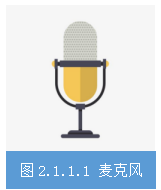
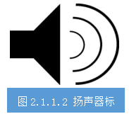
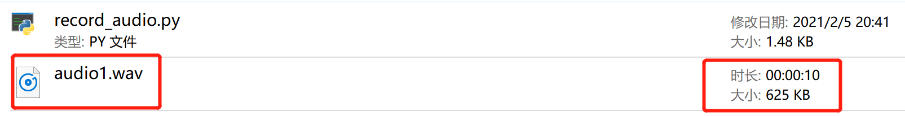

## 任务2.1.1 语音数据采集
### 任务描述

&nbsp;&nbsp;&nbsp;&nbsp;利用麦克风分别用普通话和粤语录制“强国有我，请党放心！我是XXX”（重复两遍）并保存到本地，文件格式为WAV，录音时间持续10秒。
### 学习目标
&nbsp;&nbsp;&nbsp;&nbsp;**1.知识目标**

&nbsp;&nbsp;&nbsp;&nbsp;（1）掌握声音文件格式的相关知识；

&nbsp;&nbsp;&nbsp;&nbsp;（2）掌握用python中进行声音文件采集储存的过程和方法。

&nbsp;&nbsp;&nbsp;&nbsp;**2.能力目标**

&nbsp;&nbsp;&nbsp;&nbsp;（1）能采集语音数据；

&nbsp;&nbsp;&nbsp;&nbsp;（2）会存储声音文件。

&nbsp;&nbsp;&nbsp;&nbsp;**3.素质素养目标**

&nbsp;&nbsp;&nbsp;&nbsp;（1）培养精益求精、专心细致的工作作风；

&nbsp;&nbsp;&nbsp;&nbsp;（2）培养数据保护意识；

&nbsp;&nbsp;&nbsp;&nbsp;（3）培养遵守规范的意识；

&nbsp;&nbsp;&nbsp;&nbsp;（4）培养热爱劳动的意识。
### 任务分析
&nbsp;&nbsp;&nbsp;&nbsp;**1.重点**

&nbsp;&nbsp;&nbsp;&nbsp;语音数据采集的方法。

&nbsp;&nbsp;&nbsp;&nbsp;**2.难点**

&nbsp;&nbsp;&nbsp;&nbsp;将声音存储为WAV格式。
### 知识链接
#### 一、语音信号文件WAV格式
&nbsp;&nbsp;&nbsp;&nbsp;wav格式，是微软开发的一种文件格式规范，整个文件分为两部分。第一部分是“总文件头”，就包括两个信息，chunkID，其值为“RIFF”，占四个字节；ChunkSize，其值是整个wav文件除去chunkID和ChunkSize，后面所有文件大小的字节数，占四个字节。第二部分是Format，其值为“wave”，占四个字节。它包括两个子chunk，分别是“fmt”和“data”。在fmt子chunk中定义了该文件格式的参数信息，对于音频而言，包括：采样率、通道数、位宽、编码等等；data部分是“数据块”，即一帧一帧的二进制数据，对于音频而言，就是原始的PCM数据。从语音识别的原理可以知道，我们语音数据文件存储为WAV格式是最好的。
#### 二、Python语音识别库
&nbsp;&nbsp;&nbsp;&nbsp;对于 Python 使用者而言，一些语音识别服务可通过各大平台提供的开源 API 在线使用，且其中大部分也提供了Python SDK。我们不需要从头开始构建任何机器学习模型，PyPI中有一些现成的语音识别软件包，包括：

&nbsp;&nbsp;&nbsp;&nbsp;**•apiai**
	
&nbsp;&nbsp;&nbsp;&nbsp;**•google-cloud-speech**
	
&nbsp;&nbsp;&nbsp;&nbsp;**•pocketsphinx**
	
&nbsp;&nbsp;&nbsp;&nbsp;**•SpeechRcognition**
	
&nbsp;&nbsp;&nbsp;&nbsp;**•watson-developer-cloud**
	
&nbsp;&nbsp;&nbsp;&nbsp;**•wit**

&nbsp;&nbsp;&nbsp;&nbsp;一些软件包（如wit和apiai）提供了一些超出基本语音识别的内置功能，如识别讲话者意图的自然语言处理功能。其他软件包，如谷歌云语音，则专注于语音向文本的转换，其中SpeechRecognition 就因便于使用脱颖而出。

&nbsp;&nbsp;&nbsp;&nbsp;pyaudio库可以进行录音，播放，生成wav文件等等。PyAudio提供了PortAudio的 Python语言版本，这是一个跨平台的音频I/O 库，使用PyAudio你可以在Python程序中播放和录制音频。为PoTaTudio提供Python绑定，跨平台音频I/O库。使用PyAudio可以轻松地使用Python在各种平台上播放和录制音频，例如GNU/Linux、微软Windows和苹果Mac OS X/MACOS。
#### 三、语音识别中的硬件
&nbsp;&nbsp;&nbsp;&nbsp;**传声器**：通常称为麦克风（如图2-1-4所示），是一种将声音转换成电子信号的换能器，即把声信号转成电信号，其核心参数是灵敏度、指向性、频率响应、阻抗、动态范围、信噪比、最大声压级（或AOP，声学过载点）、一致性等。传声器是语音识别的核心器件，决定了语音数据的基本质量。
  

&nbsp;&nbsp;&nbsp;&nbsp;**扬声器**：通常称为喇叭（一般用图2-1-5所示的图标表示），是一种把电信号转变为声信号的换能器件，扬声器的性能优劣对音质的影响很大，其核心指标是TS参数。语音识别中由于涉及到回声抵消，对扬声器的总谐波失真要求稍高。
  
&nbsp;&nbsp;&nbsp;&nbsp;**激光拾声**：这是主动拾声的一种方式，可以通过激光的反射等方法拾取远处的振动信息，从而还原成为声音，这种方法以前主要应用在窃听领域，但是目前来看这种方法应用到语音识别还比较困难。
微波拾声：微波是指波长介于红外线和无线电波之间的电磁波，频率范围大约在300MHz至300GHz之间，同激光拾声的原理类似，只是微波对于玻璃、塑料和瓷器几乎是穿越而不被吸收。

&nbsp;&nbsp;&nbsp;&nbsp;**高速摄像头拾声**：利用高速摄像机来拾取振动从而还原声音，这种方式需要可视范围和高速摄像机，一般只在一些特定场景里面应用。
#### 四、语音数据采集实现
在了解了语音数据的相关知识后，我们使用Python语音识别库中的pyaudio和即插即用的PC端麦克风来采集一段10秒的语音并以WAV格式保存到本地。

 **步骤1**: 安装pyaudion、wave依赖库。我们采用pip install命令方式，参考如下：

```shell
pip install PyAudio 
pip install wave 
```

**步骤2**: 新建一个Python文件，通过import pyaudio创建PyAudio对象，打开声卡，创建缓存空间，完整代码参考：


```python
import pyaudio
import wave

CHUCK = 256                      #设置底层缓存的块大小为256
FORMAT = pyaudio.paInt16         #设置采样深度为16位
CHANNELS = 2                     #设置声道数为2
RATE = 16000                     #设置采样率为16k
RECORD_SECONDS = 10              #设置 录音时长为10s
p = pyaudio.PyAudio()           #实例化一个PyAudio对象
stream = p.open(format = FORMAT,     
                channels = CHANNELS,
                rate = RATE,
                input=True,
                frames_per_buffer=CHUCK)  # 打开声卡
```

**步骤3**: 录音10秒，并且将音频数据存储到列表，完成代码参考:

```python

record_buf = []        #创建列表用来存储采样的音频数据
print("*****开始录音：请在10s内输入语音***")
for i in range(0,int(RATE/CHUNK*RECORD_SECONDS)):
    data = stream.read(CHUNK) #读取声卡缓冲区的音频数据
    record_buf.addpen(data)   #将读取的音频数据追加到列表

print('***录音结束***')
```

**步骤4**: 通过wave将音频数据写到wav文件中，参考代码：

```python
wf = wave.open('audio1.wav', 'wb')          # 一读写模式创建一个音频文件，名字为“audio1.wav"
wf.setnchannels(CHANNELS)                   # 设置声道数为
wf.setsampwidth(p.get_sample_size(FORMAT))  # 设置采样深度

wf.writeframes(b"".join(record_buf))       wf.setframerate(RATE)                       # 设置采样率    # 将数据写入创建的音频文件

```

**步骤5** :录音结束后，停止并关闭声卡，参考代码所示。不管是从数据安全还是资源管理方面，这一步操作都是必须的。

```python
wf.close()              # 关闭文件
stream.stop_stream()    # 停止声卡
stream.close()          # 关闭声卡
pa.terminate()          # 终止pyaudio
```


&nbsp;&nbsp;&nbsp;&nbsp;经过以上5个步骤，运行程序，当出现提示后开始录音，10秒后录音自动结束，程序文件所在目录下新增“audio1.wav”文件。播放audio1.wav，听听看是不是刚刚录制的声音吧。


<!-- <iframe 
    width="800" 
    height="600" 
    src="http://aistudio.smartyg.com:12302/"
    frameborder="0" 
    loading="lazy"
    allowfullscreen>
</iframe> -->


### 素质素养养成
1.在数据采集过程中，严格根据录制声音设置对应的参数，养成遵守规范的意识。

2.在录制声音过程，多测试几次，选择音质效果最好的作为数据样本，养成精益求精的工作作风。

3.在实践过程中，了解语料数据的重要性，注意数据样本的保护。

4.用完录音耳机请放回原处，要养成热爱劳动的意识。

### 任务分组
**学生任务分配表**

&nbsp;&nbsp;&nbsp;&nbsp;[学生任务分配表](https://docs.qq.com/sheet/DTU1DY0RlYUt3bWhx)

### 任务实施
#### 1.工作准备
##### 任务工作单1：语音采集工作环境准备
 
组号：__________           姓名：__________            学号：__________             检索号：__________
           
### 引导问题：

（1）python语言录制声音和保存WAV文件的库文件是什么？

—————————————————————————————————————————————————————————                                                                      

（2）检查本机是否已经按照到录制声音和保存WAV文件用到的包，如果没有请安装。请将检测结果截图粘贴。

—————————————————————————————————————————————————————————                                                                        

（3）（3）简述你是怎么检查或者安装这两个库文件的。

—————————————————————————————————————————————————————————

##### 任务工作单2：语音采集流程确定

组号：__________            姓名：__________            学号：__________             检索号：__________
              
##### 引导问题：

（1）Python语言进行录音采集的流程哪些？

—————————————————————————————————————————————————————————
                                                                         
（2）语音数据采集每个环节的实现代码。 

—————————————————————————————————————————————————————————
                                                                        
#### 2.优化利用电脑麦克风进行语音数据采集流程
##### 任务工作单3：语音采集流程优化（讨论）

组号：__________            姓名：__________            学号：__________             检索号：__________
              
##### 引导问题：

（1）小组交流讨论，确定正确语音数据采集流程和每个环节的实现方法。

—————————————————————————————————————————————————————————
                                                                         
（2）请记录自己在语音录制过程中出现的问题。

—————————————————————————————————————————————————————————  
##### 任务工作单4：语音采集流程优化（展示）

组号：__________            姓名：__________            学号：__________             检索号：__________
              
##### 引导问题：

（1）每小组推荐一位小组长，汇报实现过程，借鉴各组分享的经验，进一步优化实现的步骤。

—————————————————————————————————————————————————————————
                                                                         
（2）检查自己不足的地方。

—————————————————————————————————————————————————————————                   
##### 任务工作单5：语音数据采集实施

组号：__________            姓名：__________            学号：__________             检索号：__________
              
##### 引导问题：

（1）按照正确的流程和实现方法，完成录制声音并保存到本地电脑硬盘。

—————————————————————————————————————————————————————————
                                                                         
（2）自查语音数据采集过程中出现的错误原因。

—————————————————————————————————————————————————————————     
### 评价反馈

#### 个人评价表

组号：__________           姓名：__________           学号：__________            检索号：__________  

[个人评价表](https://docs.qq.com/sheet/DTUthVHZPcnBmZmFD)

#### 小组内互评表

组号：__________           姓名：__________           学号：__________            检索号：__________  

[小组内互评表](https://docs.qq.com/sheet/DTUtMTmZmRVRXY3Zz)

#### 小组间互评表

被评组号：__________            检索号：__________  

[小组间互评表](https://docs.qq.com/sheet/DTU1td21PQ3hERHJw)

#### 教师评价表
                                                                        
组号：__________           姓名：__________           学号：__________            检索号：__________  

[教师评价表](https://docs.qq.com/sheet/DTVNEYUREUnZjUURG)
                  