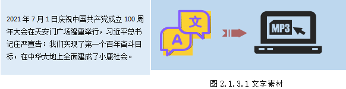
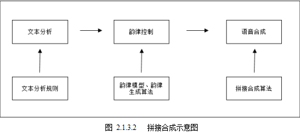
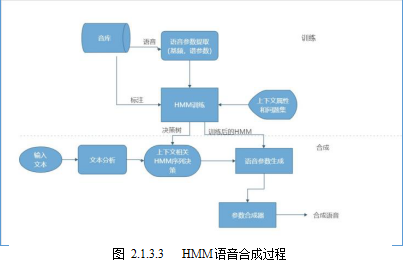
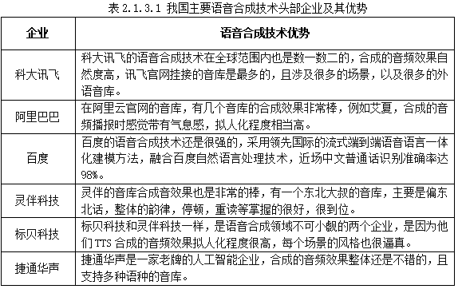
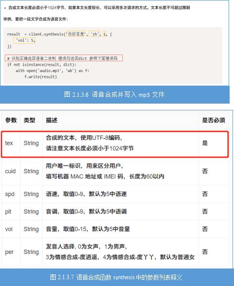
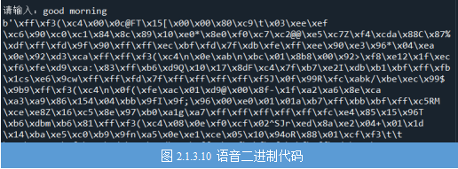
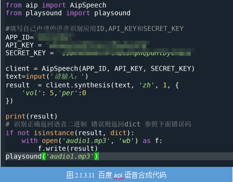

# 任务2.1.3 语音合成-语音助手

### 任务描述

&nbsp;&nbsp;&nbsp;&nbsp;“把文字转换成声音，让你的应用开口说话”就是利用语音合成技术将文本转换成音频。请你从键盘输入图2.1.3.1中的文字，调用百度API将输入的中文转换成mp3音频文件同时播报这段音频。




### 学习目标
**1.知识目标**

&nbsp;&nbsp;&nbsp;&nbsp;（1）掌握语音合成技术的原理；

&nbsp;&nbsp;&nbsp;&nbsp;（2）熟悉我国语音合成技术API服务的企业；

&nbsp;&nbsp;&nbsp;&nbsp;（3）理解语音合方法中的参数的含义；

&nbsp;&nbsp;&nbsp;&nbsp;（4）了解语音合成技术的应用场景。

**2.能力目标**

&nbsp;&nbsp;&nbsp;&nbsp;（1）能将文字转换成语音文件并存储；

&nbsp;&nbsp;&nbsp;&nbsp;（2）能正确播放语音文件。

**3.素质素养目标**

&nbsp;&nbsp;&nbsp;&nbsp;（1）培养学生技术服务人类的意识；

&nbsp;&nbsp;&nbsp;&nbsp;（2）培养学生职业认同感；

&nbsp;&nbsp;&nbsp;&nbsp;（3）培养遵守规范的意识；

&nbsp;&nbsp;&nbsp;&nbsp;（4）培养学生政治认同意识。

### 任务分析
**1.重点**

&nbsp;&nbsp;&nbsp;&nbsp;调用百度语音应用中的synthesis方法将文本转换成音频

**2.难点**

&nbsp;&nbsp;&nbsp;&nbsp;朗读Word文档中的文字。	

### 知识链接
&nbsp;&nbsp;&nbsp;&nbsp;文字与音频的互相转换是自然语言处理中很关键的技术点。语音就是人说的话，它的记录形式是一段一段的波形，是最自然便捷的沟通方式，在信息播报、人机交互上有着大量刚性需求。

**1.语音**

语音包括三大关键部分—语音信息、语音音色和语音韵律。语音信息是指说话的内容，是进行语音合成的文本信息的内容。语音音色是指说话者，俗话说的“未见其人先闻其声”说明音色的重要性，对于语音合成音色的选择与内容要匹配，比如播报新闻联播的声音用动漫里面的“娃娃音”就不合适。韵律就是说话的方式，即说话时声音的高低、快慢等，为什么说赵宗祥老师的《动物世界》解说无人超越，声音比赵老师好的人比比皆是，但是没人比他‘说的好’，就是因为他的音律控制的好。声音的惯性和魅力是无穷的，未来优质的声音IP将会作为重要的内容生产能力，受到重视和追捧，将语音从信息获取升级为艺术享受。

**2.语音合成技术原理**

语音合成又称文语转换(Text To Speech, TTS)，是一种通过电子方法产生人造语音的技术，将给定文字转换成对应的人类语言声音。语音合成过程是是通过计算机的数字信号去模拟生成一个连续的语音波形信号，类似于人说话，将想要表达的内容用对应的音色、韵律进行发声。
语音合成技术按照工作过程主要分为语言分析部分和声学系统部分，也称为前端部分和后端部分。前端部分通过对输入的文字信息进行分析生成对应的语言学规格书，策划好怎么读；后端部分通过语音分析部分生成语音学规格书，完成对应的音频，实现发声的功能。

**1）语言分析部分**

语言分析部分包括文本结构与语种判断、文本标准化、文本转音素、句读韵律预测四个部分。

**文本结构与语种判断：**当需要合成的文本输入后，先要判断是什么语种，例如中文，英文，藏语，维语等，再根据对应语种的语法规则，把整段文字切分为单个的句子，并将切分好的句子传到后面的处理模块。

**文本标准化：**在输入需要合成的文本中，有阿拉伯数字或字母，需要转化为文字。根据设置好的规则，使合成文本标准化。例如， “请问您是尾号为8967的机主吗？” “8967”为阿拉伯数字，需要转化为汉字“八九六七”，这样便于进行文字标音等后续的工作；再如，对于数字的读法，刚才的“8967“为什么没有转化为”八千九百六十七“呢？因为在文本标准化的规则中，设定了”尾号为+数字“的格式规则，这种情况下数字按照这种方式播报。这就是文本标准化中设置的规则。

**文本转音素：**在汉语的语音合成中，基本上是以拼音对文字标注的，所以我们需要把文字转化为相对应的拼音，但是有些字是多音字，怎么区分当前是哪个读音，就需要通过分词，词性句法分析，判断当前是哪个读音，并且是几声的音调。例如，“南京市长 江大桥”为“nan2jing1shi4zhang3jiang1da4qiao2”或者“南京市 长江大桥”“nan2jing1shi4chang2jiang1da4qiao3”。

**句读韵律预测：**人类在语言表达的时候总是附带着语气与感情，TTS合成的音频是为了模仿真实的人声，所以需要对文本进行韵律预测，什么地方需要停顿，停顿多久，哪个字或者词语需要重读，哪个词需要轻读等，实现声音的高低曲折，抑扬顿挫。

**2）声学系统部分**

语音合成技术中的声学系统合成从最初只能合成元音和单音到现在已经与真人发声无异的效果，科学家们经过了长期的努力，根据其技术实现方式大致可以分为以下六类。

 （1）机械模拟阶段：18到19世纪，科学家们通过制作精巧的气囊和风箱等机械装置来模拟人的发声，这种发声系统只能合成一些元音和单音。

（2）电子合成器阶段：20世纪初，科学家们利用电子合成器来模拟人的发声。最具代表性的就是贝尔实验室推出的名为“VODER”电子发声器，通过电子器件来模拟声音的谐振从而实现模拟人的声音。

（3）共振峰合成器阶段：20世纪80年代，随着集成电路技术的发展，出现了比较复杂的组合型的电子发生器，科学家们利用组合型的电子发生器来合成人的声音。比较代表性的KLATT在1980年发布的串/并联混合共振峰合成器。

（4）单元挑选拼接合成阶段：20世纪80、90年代，随着基音同步叠加（PSOLA）算法的提出和计算机能力的发展，单元挑选和波形拼接技术逐渐走向成熟，图2就是一个典型拼接方法语音合成过程。90年代末刘庆峰博士提出听感量化思想，首次将中文语音合成技术做到了实用化地步。单元挑选和波形拼接的关键技术是语料库设计及标注、目标代价计算和连接代价计算。



（5）基于HMM参数合成阶段：20世纪末期，基于HMM的参数合成技术开始应用于语音合成领域，通过数学方法对已有录音进行频谱特性参数建模，构建文本序列映射到语音特征的映射关系，生成参数合成器。输入文本后，先要将文本序列映射出对应的音频特征，再通过声学模型（声码器）将音频特征转化为人类的声音。整个工作流程包括训练流程和合成流程两个部分，关键技术有高质量语音声码器，以及基于上下文的决策树模型。

·训练流程：将录制好的音库，提取出相应的语音参数，然后将标注数据和声学提取数据一同构建HMM的训练模型，通过上下文属性和问题集的决策树模型，构建训练后的HMM模型。

·合成流程：输入文本的分析，来进行上下文相关HMM训练的序列决策，再将生成后的语音送入参数合成器中，最后输出合成之后的语音。



**⑥基于深度学习的语音合成**

随着AI技术不断发展，DNN/CNN/RNN等各种神经网络模型开始用来做语音合成系统的训练，也是当前主流的语音合成技术。深度学习算法可以更好地模拟人声变化规律，实现直接输入文本或者注音字符 ，中间为黑盒部分，然后输出合成音频，对复杂的语言分析部分得到了极大的简化。基于深度学习的语音合成技术大大降低了对语言学知识的要求，且可以实现多种语言的语音合成，不再受语言学知识的限制。Deepmind提出的波形点建模方法，在整个语音合成技术发展史上都是具有里程碑意义的。

**3.语音合成技术API服务**

现在我国各大AI企业都有对应的免费开放API为开发者提供应用服务。例如，百度2108年6月份就发布了百度语音识别无限量使用，下表2.1.3.1列举了部分我国提供语音合成技术API的企业和语音合成技术优势。



# 四、语音合成实现
&nbsp;&nbsp;&nbsp;&nbsp;下面我们使用任务2.1.2中已经申请的百度账号调用百度api实现语音合成功能，在进行以下操作之前请先领取语音合成的免费资源额度。

**步骤1：**与任务2.1.2中一样，导入AipSpeech，再利用百度应用账号创建一个client对象。代码参考图2.1.3.34,其中APP_ID、API_KEY 和SECRET_KEY的值为任务2创建的应用中的信息。


**步骤2:**定义变量text，用来存储从键盘输入的文本内容，也就是我们需要转换为语音的文本内容。代码如图2.1.3.5。

```python
text = input('请输入：')
```

**步骤3:** 参考官网技术文档中“接口说明”，调用synthesis方法将text转换成音频并以mp3文件保存到本地，代码编写可参考图2.1.3.6，将图中的‘你好百度’修改为text即可。Sysntheis()函数中的参数详见图2.1.3.7，“per”参数可以用来设置合成语音的不同声音模式，“spd”用来设置语速，“vol”用来设置语调，这些参数虽然是可选设置，但是可以根据不同内容设置多样化的语音表达，赶紧试试吧。



**步骤4** 利用playsound播报MP3音频文件。

4-1：使用pip install命令安装playsound

* 安装playsound

```python
pip install playsound
```

4-2： 导入playsound并调用playsound播放mp3声音文件，参考代码如下。这里的audio.mp3就是文本进行语音合成后的语音文件。

* 使用playsound播放mp3的方法

```python
from  playsound import playsound
playsound('audio.mp3')
```

&nbsp;&nbsp;&nbsp;&nbsp;本任务中result存储的是文字合成语音的二进制代码，可以用在result  = client.synthesis（）之后增加一句print(result)语句，运行出现类似图2.1.3.10中的二进制码则表明文本合成语音成功了。

调用百度api实现语音合成功能完整参考代码如图2.1.3.11：






### 完整流程
**步骤1：**安装api、playsound(注：<font color='red'> 因playsound不稳定，已优化掉 </font>)依赖库(<font color='red'>baidu-aip不是 Anaconda 默认的 channel 中可用的。要尝试在conda-forge channel中寻找，这个channel包含了更多的第三方库</font>)。我们采用conda install命令方式(<font color='red'>教室机使用pip很大概率无法安装，除非换源，所以推荐使用conda</font>)，参考如下(<font color='red'>安装库建议使用Anaconda Prompt，同时记得使用管理员模式打开，避免安装错误</font>)
```shell
conda config --add channels conda-forge
conda install baidu-aip
```
<!-- Configure and load Thebe !-->
<script type="text/x-thebe-config">
  {
    requestKernel: true,
    mountActivateWidget: true,
    mountStatusWidget: true,
    kernelOptions: {
      name: "python3",
      serverSettings: {
        baseUrl: "http://localhost:8000/user/cosoff/",
        token: "e3c5197ff4814a93bc26b19f60eb68e6"
      }
    }
  }
</script>

<script src="https://unpkg.com/thebe@latest/lib/index.js"></script>

<div class="thebe-activate"></div>
<div class="thebe-status"></div>


**步骤2：**运行代码（<font color='red'>已对图片里的代码进行优化，复制下列代码，在APP_ID、API_KEY和SECRET_KEY处填入你通过上述操作活动的字符串即可</font>），完整代码如下：
<pre data-executable="true" data-language="python">
from aip import AipSpeech
from IPython.display import Audio
import os

# 填写自己申请的语音识别应用ID，API KEY和SECRET KEY
APP_ID = '33168629'
API_KEY = 'T8ouP5wInuHIzgYLDLq72H6w'
SECRET_KEY = 'Yjk7SzVxtcnq4A1Q4wad0UqIi3nZsk0F'

client = AipSpeech(APP_ID, API_KEY, SECRET_KEY)

text = input('请输入要转换成语音的文本：')
result = client.synthesis(text, 'zh', 1, {'vol': 5, 'per': 0})

if not isinstance(result, dict):
    with open('audiol.mp3', 'wb') as f:
        f.write(result)
    display(Audio('audiol.mp3'))
else:
    print(result)
</pre>

### 素质素养养成
&nbsp;&nbsp;&nbsp;&nbsp;（1）在完成朗读Word文档中了解服务三农的“有声书屋”的应用，培养学生技术服务人类的意识；

&nbsp;&nbsp;&nbsp;&nbsp;（2）在了解和总结语音合成技术应用场景中培养学生职业认同感；

&nbsp;&nbsp;&nbsp;&nbsp;（3）在调用百度api要设置合适的参数才能出现满意的语音合成效果中培养遵守规范的意识；

&nbsp;&nbsp;&nbsp;&nbsp;（4）通过将党史等内容融入学生实践项目中培养学生政治认同意识。  

### 任务分组

&nbsp;&nbsp;&nbsp;&nbsp;[学生任务分配表](https://docs.qq.com/sheet/DTU1DY0RlYUt3bWhx)

### 任务实施

#### 任务工作单1：语音合成工作准备

组号：__________           姓名：__________            学号：__________             检索号：__________
           
#### 引导问题：
（1）语音合成技术按照工作过程主要分为________和________两个部分。 

                                                                     

                                                                    
（2）百度语音合成技术用的什么技术？

—————————————————————————————————————————————————————————                                                                        

（3）除了百度，你还知道哪些提供语音合成技术api服务的企业及其优势吗？  

—————————————————————————————————————————————————————————

（4）请登录百度开发者账号，领取语音合成资源。 

—————————————————————————————————————————————————————————

#### 任务工作单2：认识百度语音合成方法

（1）组号：__________           姓名：__________            学号：__________             检索号：__________
           
#### 引导问题：
（2）创建一个你自己的百度语音应用AipSpeech对象，保存为client。

—————————————————————————————————————————————————————————                                                                        

                                                                    
（3）认识百度语音合成方法是什么？

—————————————————————————————————————————————————————————                                                                        

（4）百度语音合成方法中“per”、“spd”、“vol”分别具有什么功能？

—————————————————————————————————————————————————————————

（5）调用百度语音合成方法，试试将“强国有我，请党放心”这段文字进行语音合成并将返回的结果保存到result，输出result。将代码和运行结果截图。

—————————————————————————————————————————————————————————
####任务工作单3：语音合成结果保存和播放
（1）组号：__________           姓名：__________            学号：__________             检索号：__________  
                        
（1）将任务工作单2中的result保存为mp3。  

—————————————————————————————————————————————————————————                                           
（2）播放你保存的mp3。

————————————————————————————————————————————————————————— 
                                                                        
（3）请修改参数，试试将输入的文字合成一段方言语音并播放。
————————————————————————————————————————————————————————— 
                                                                        

#### 任务工作单3：朗读Word文档

组号：__________           姓名：__________            学号：__________             检索号：__________
           
#### 引导问题：
（1）python-docx库有什么功能？

—————————————————————————————————————————————————————————                                                                        

                                                                    
（2）安装Python-docx，填写你安装的版本信息。

—————————————————————————————————————————————————————————                                                                        

（3）下载“伟人故里中山.docx”文件保存到本地，编写python代码读取文档段落并保存到text。

—————————————————————————————————————————————————————————
（4）调用百度语音合成方法，设置参数，完成Word文档的朗读。将运行过程和效果录制
视频。

—————————————————————————————————————————————————————————

#### 任务工作单4：语音合成操作过程优化（讨论）

组号：__________           姓名：__________            学号：__________             检索号：__________
           
#### 引导问题：
（1）小组交流讨论，确定调用百度api进行语音合成的实现方法，合理设置参数的值。

—————————————————————————————————————————————————————————                                                                        

                                                                    
（2）小组交流讨论，利用python打开和读取本地文档的操作流程和方法。

—————————————————————————————————————————————————————————                                                                        

（4）请记录自己在进行语音合成实践过程的问题。

—————————————————————————————————————————————————————————
（5）请列举语音合成技术应用场景，最好将图文、视频等素材整理成PPT。你们小组有计划将语音合成技术应用到哪里？  

—————————————————————————————————————————————————————————

#### 任务工作单5：语音合成技术应用优化（展示）

组号：__________           姓名：__________            学号：__________             检索号：__________
           
#### 引导问题：
（1）每小组推荐一位小组长，汇报从键盘输入和文档获取文本进行语音合成并播报的实现过程，展示语音合成技术应用场景和本小组的规划。互相借鉴经验优化自己的实现步骤，激发语音合计技术应用创新思维。

—————————————————————————————————————————————————————————                                                                        

                                                                    
（2）检查自己不足的地方。

—————————————————————————————————————————————————————————                                                                        

#### 任务工作单6：语音合成应用实施

组号：__________           姓名：__________            学号：__________             检索号：__________
           
#### 引导问题：
（1）根据优化后的步骤和方法，完成从键盘输入和文档获取文本进行语音合成并播报。

—————————————————————————————————————————————————————————                                                                        

                                                                    
（2）自查语音合成技术应用过程中出错的原因。

—————————————————————————————————————————————————————————  

### 个人评价表
组号：__________           姓名：__________           学号：__________            检索号：__________  


[个人评价表](https://docs.qq.com/sheet/DTUthVHZPcnBmZmFD)

#### 小组内互评表

组号：__________           姓名：__________           学号：__________            检索号：__________  

[小组内互评表](https://docs.qq.com/sheet/DTVVGaGhuT2lsZnJa)  

#### 小组间互评表

组号：__________           姓名：__________           学号：__________            检索号：__________  

[小组间互评表](https://docs.qq.com/sheet/DTVdwQWF4c1NXU2p2)

#### 教师评价表-任务工作单4

组号：__________           姓名：__________           学号：__________            检索号：__________  


[教师评价表](https://docs.qq.com/sheet/DTVNEYUREUnZjUURG)