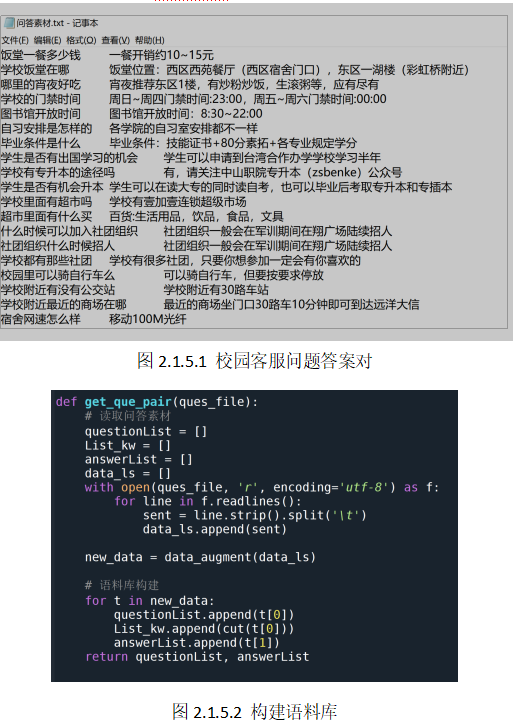
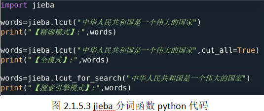
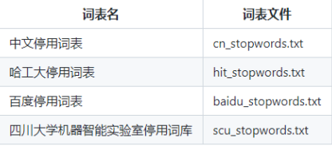
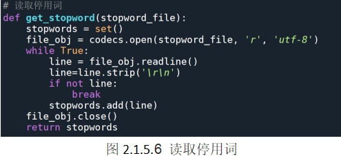
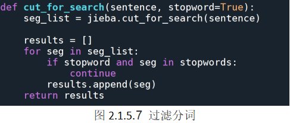
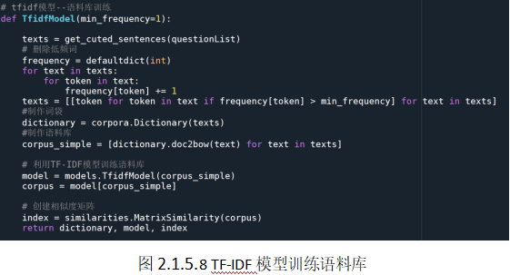
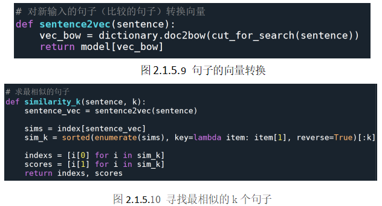
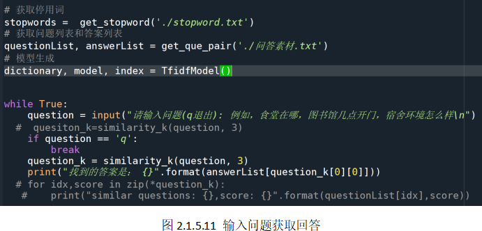

##任务2.1.5 校园智能客服

### 任务描述

&nbsp;&nbsp;&nbsp;&nbsp;在智能客服的业务场景中，对于用户频繁问到的业务知识类问题的自动解答（以下简称为FAQ）是一个非常关键的需求，可以说是智能客服最为核心的用户场景，可以显著地降低人工客服的数量与成本。请各小组收集整理新生入校常见问题和解答并整理成语料库，编写代码实现用文字或者语音输入问题，系统给出文字或语音回答的简易校园智能客服。

###学习目标
**1.知识目标**

&nbsp;&nbsp;&nbsp;&nbsp;（1）掌握建立语料库的规则和方法；

&nbsp;&nbsp;&nbsp;&nbsp;（2）理解停用词（stopwod）的含义和使用方法；

&nbsp;&nbsp;&nbsp;&nbsp;（3）了解jieba结巴分词处理原理；

&nbsp;&nbsp;&nbsp;&nbsp;（4）掌握语言训练库的原理和用法。

**2.能力目标**

&nbsp;&nbsp;&nbsp;&nbsp;（1）能调用api实现简易校园智能客服的功能。

&nbsp;&nbsp;&nbsp;&nbsp;（2）能利用Python代码进行分词处理、调用语言训练库实现简易校园客服功能。
**3.素质素养目标**

&nbsp;&nbsp;&nbsp;&nbsp;（1）培养遵守规范的意识；

&nbsp;&nbsp;&nbsp;&nbsp;（2）培养关注我国的语言文化；

&nbsp;&nbsp;&nbsp;&nbsp;（3）培养学生人文关怀的意识；

&nbsp;&nbsp;&nbsp;&nbsp;（4）培养学生技术服务的意识。

###任务分析
**1.重点**

&nbsp;&nbsp;&nbsp;&nbsp;（1）建立语料库；

&nbsp;&nbsp;&nbsp;&nbsp;（2）编写代码训练模型实现简易校园客服功能。

**2.难点**

&nbsp;&nbsp;&nbsp;&nbsp;利用Python代码进行分词处理、调用语言训练库实现简易校园客服功能

###知识链接
&nbsp;&nbsp;&nbsp;&nbsp;智能客服机器人是指用电脑代替人工执行客服的任务，在如今的在线客服系统中日渐成为不可或缺的存在。随着互联网技术、人工智能、大数据的发展，智能客服机器人经历了很多技术革新，功能不断完善，已经广泛应用于我们的工作生活。智能客服系统一般包含语音识别、自然语言理解、对话管理、自然语言生成、语音转换等五个主要的功能模块，智能客服系统最大的优势是能降低企业客服运营成本、提升用户体验。影响智能客服的智能化水平主要有以下三个要素：

**（1）基于问题集的语料库：**通过人工经验总结构建问题集，依据此问题集建立一个高质量、高扩展性的语料库，并在此基础上通过各种渠道获取尽可能多的行业或相关主题的问答知识。语料库是客服机器人寻找答案的来源，语料库覆盖面越广机器人可以回答的问题就越多。

**（2）问题归一化处理：**语言文化博大精深，用户表达问题的方式通常都是非标准化的，同一问题的问法表达方式多样，因此必须扩展问题的表达形式，进行问题归一化，使其能匹配知识库中的标准问法。

**（3）问题检索方法：**在大型语料库中快速高效地检索出正确的答案是一个技术关键。
这三个方面不仅需要如机器学习、自然语言处理、搜索技术等技术支持，同样需要工作量巨大如语料库建设、语义知识库等基础性建设。当前技术已相对成熟，反而这些基础性类库的规模和质量成了决定客服机器人的智能水平的关键因素。

**1.构建语料库**

**1）建立问答库**

&nbsp;&nbsp;&nbsp;&nbsp;FAQ（Frequently Asked Questions）指常见问题的解答，具体形式是问题和与问题相关的答案组成的问答对（QA pair）。下面我们基于中山职业技术学院新生常见问题集合构建校园客服的问答库。新建一个txt文件，输入问题答案对，问题和答案之间用Tab键隔开，一行一个问题答案对，期间不要手动换行。图2.1.5.1为校园客服机器人的初始问答库的部分问题答案对。利用他2.1.5.2中的方法获取问题列表questionList[]、分词处理后的问题列表list_kw[]和对应问题的回答列表answerList[]从而构建语料库。

**2）分词处理—jieba库**

自然语言处理技术很多算法来源于国外，在英文中每个单词都是一个词，单个字母没有含义而单词可以准确表达出一定含义，一般是以词为单位进行分析，因此在中文文本处理中，一般也要用词来作为最小单位进行文本分析。英文中每个单词间本来就是隔开的，但是中文的词与词之间是没有任何符号标志的，所以在分词处理方面中文比英文难度大很多，比如“已经婚的和尚未结婚的同志都要计划生育。”，这句话分词不同可以产生以下两种不同的断句，这样含义也就完全不同了。

断句1：已经结婚/的/和/尚未/结婚/的/同志/都/要/计划/生育。

断句2：已经结婚/的/和尚/未结婚/的/同志/都/要/计划/生育。

**jieba库简介**

中文自然语言处理分词处理最简单实用的就是jieba库，是完全“made in china”的一个分词处理技术。jieba分词属于概率语言模型分词，利用一个中文词库来确定汉字之间的关联概率，将汉字间关联概率大的组成词组从而形成分词结果，另外除了分词，用户还可以添加自定义的词组。

**jieba库使用**

jieba支持三种分词模式，分别是全模式、精确模式和搜索引擎模式。全模式是把句子中所有的可以成词的词语都扫描出来, 速度非常快，但是不能解决歧义。精确模式是试图将句子最精确地切开，非常适合文本分析。搜索引擎模式是在精确模式的基础上，对长词再次切分，从而提高召回率。表2.1.5.1为jieba分词常用函数和及其功能，推荐使用返回列表类型的切分函数。

jieba库是第三方库使用前需要先安装，推荐使用“ pip install jieba”或者 pip3 install jieba进行安装，安装完成后在Python代码中通过 import jieba 来引用。下面以“中华人民共和国是一个伟大的国家”来演示jieba分词三种模式的结果，图2.1.5.3是调用jieba分词函数三种模式的Python代码，图2.1.5.4是对应的分词结果。

**3）分词过滤—停用词**

停用词是指在信息检索中，为节省存储空间和提高搜索效率，在处理自然语言数据（或文本）之前或之后会自动过滤掉某些字或词，这些字或词即被称为Stop Words（停用词）。人类语言中包含的语气助词、副词、介词、连接词等，通常自身并无明确的意义，只有将其放入一个完整的句子中才有一定作用的词，如常见的“的”、“在”、“啊”之类。因此在进行中文自然语言处理时候,分词是必不可少的环节,没有实际意义的词语我们必须在分词环节后进行过滤，即过滤停用词。可以根据主观判断来选择一些分类能力弱的词或针对某一领域选择该领域常用词来构造停用词表，中文的停用词表我们可以直接用公开的，目前网络上公开的使用比较多的有中文停用词表、哈工大停用词表、百度停用词表、四川大学机器智能实验室停用词库，大家可以到https://github.com/goto456/stopwords下载，名称和链接对应如图2.1.5.5所示。

有了中文停用词表后，我们首先读取停用词，这里我们定义了一个函数（如图2.1.5.6所示）来完成这个功能，函数中stopword_file参数指的就是本地停用词表文件。读取完停用词就可以用于过滤分词，使用方法参考图2.1.5.7，代码中stopwords就是读取停用词get_stopword函数返回的结果。

**2.语料库训练**

基于信息检索是智能问答系统的经典方法，TF-IDF（term frequency–inverse document frequency）是一种用于信息检索与数据挖掘的常用加权技术，是经典的信息检索算法，算法简单高效，工业领域常用它进行最开始的文本数据清洗。TF-IDF是一种针对关键词的统计分析方法，用于评估一个词对一个文件集或者一个语料库的重要程度。一个词的重要程度跟它在文章中出现的次数成正比，跟它在语料库出现的次数成反比。这种计算方式能有效避免常用词对关键词的影响，提高了关键词与文章之间的相关性。TF-IDF有两层含义，一层是“词频”（Term Frequency,缩写为TF）,另一层是“逆文档频率”（Inverse Document Frequency,缩写为IDF）。词频TF指的是某词在文章中出现的总次数，通常会进行"词频"标准化定义为TF=（某词在文档中出现的次数/文档的总词量），这样可以防止结果偏向过长的文档（即同一个词语在长文档里通常会具有比短文档更高的词频）。逆向文档频率IDF指包含某词语的文档越少IDF值越大，就说明该词语具有很强的区分能力，通过log（语料库中文档总数/包含该词的文档数+1）来计算IDF的值。计算完TF和IDF后，将两个数相乘就可以获得TF-IDF的值（即TF_IDF=TFxIDF），TF-IDF值越大表示该特征词在文档中越重要。所以通过计算文档中的TF-IDF并进行排序，排在前面的几个词就是该文档中的关键词。图2.1.5.8就是利用TF-IDF模型进行语料库训练的方法。

**3.句子相似度计算**

句子相似度–指的是两个句子之间相似的程度，在自然语言处理中有很大的用处，譬如对话系统，文本分类、信息检索、语义分析等，它可以为我们提供检索信息更快的方式，并且得到的信息更加准确。我们要快速为输入的问题找到对应的回答，就需要计算输入的句子与语料库中句子的相似度，找出相似度最高的几个句子从而为解答做准备。这里我们利用词袋模型来实现。词袋模型（Bag-of-words model）是在自然语言处理和信息检索(IR)下被简化的表达模型，在此模型下句子可以像用一个袋子装着组成句子词一样的方式来表现，这种表现方式不考虑文法以及词的顺序。首先结合语料训练后的语料库字典，建立输入的句子转换为向量，实现的代码如图2.1.5.9所示，其中的dictionary就是图2.1.5.8中返回的值。接下来，利用刚才得到的词袋模型来计算相似度，找出相似度最大的前k个句子及其得分，我们封装到similarity_k函数中，具体代码如图2.1.5.10。

**4.输入问题获取答案**

在完成以上三个步骤后，我们就可以输入问题，计算句子的相似度，从而从语料库中搜索到最匹配的回答，参考代码如图2.1.5.11所示，其中这里是找出来相似度值排名前三的回答，最终输出相似度最高（即排名第一）的回答。

###素质素养养成
（1）在整理问题和回答集合、编写代码的过程中培养学生遵守规范的意识；

（2）在中文分词处理中培养学生关注我国语言的博大精深；

（3）在问题和回答集合整理、构建语料库和测试的过程培养学生语言文化上的人文关怀意识；

（4）在了解智能客服对人类生产生活的意义中培养学生技术服务的意识。

###任务分组
**学生任务分配表**

&nbsp;&nbsp;&nbsp;&nbsp;[学生任务分配表](https://docs.qq.com/sheet/DTU1DY0RlYUt3bWhx)

### 任务实施

####任务工作单1：智能客服知识认知

组号：__________           姓名：__________            学号：__________             检索号：__________
           
####引导问题：
（1）智能客服主要分为几类？分别应用于哪些场景？

—————————————————————————————————————————————————————————                                                                        

                                                                    
（2）分享你碰到过的智能客服或智能问答系统。

—————————————————————————————————————————————————————————                                                                        

（3）为什么智能客服能明白你的意思并做出应答？

—————————————————————————————————————————————————————————

####任务工作单2：确定校园智能客服开发流程

组号：__________           姓名：__________            学号：__________             检索号：__________
           
####引导问题：
（1）影响智能客服智能水平的因素有哪些？

—————————————————————————————————————————————————————————                                                                        

                                                                    
（2）实现智能客服的流程有哪些？

—————————————————————————————————————————————————————————                                                                        

（3）每个流程对应的Python库文件是哪个？

—————————————————————————————————————————————————————————
（4）检查你的电脑是否已经安装所需要的库文件，如果没有请安装。

—————————————————————————————————————————————————————————

####任务工作单3：构建校园智能客服语料库

组号：__________           姓名：__________            学号：__________             检索号：__________
           
####引导问题：
（1）问题答案集合txt文件的规则是什么？

—————————————————————————————————————————————————————————                                                                        

                                                                    
（2）小组讨论，在现有的问答集合中增加新的问答对，提交 txt文件。

—————————————————————————————————————————————————————————                                                                        
（3）jieba分词以哪几种模式？试试将问答集合中的问题如“学校有专升本的途径吗”进行分词处理，截图保存所有模式的分词结果。

—————————————————————————————————————————————————————————
（4）说说停用词的作用，请下载一个公开的中文停用词。

—————————————————————————————————————————————————————————
（5）利用下载的停用词过滤（3）中的分词处理结果，截图保存过滤前后的结果。

—————————————————————————————————————————————————————————

####任务工作单4：校园智能客服模型训练和问题检索

组号：__________           姓名：__________            学号：__________             检索号：__________
           
####引导问题：
（1）简述TF-IDF算法的作用和原理？

—————————————————————————————————————————————————————————                                                                        

                                                                    
（2）编写Python代码利用TF-IDF模型完成语料库训练。

—————————————————————————————————————————————————————————                                                                        
（3）简述词袋模型的原理。

—————————————————————————————————————————————————————————
（4）编写Python代码基于词袋模型和完成的语料库对输入的问题计算相似度，找出匹配的问题和答案。

—————————————————————————————————————————————————————————
（5）编写main函数，输入问题获取答案。

—————————————————————————————————————————————————————————

####任务工作单5：校园智能客服开发流程优化

组号：__________           姓名：__________            学号：__________             检索号：__________
           
####引导问题：
（1）每小组推荐一位小组长，汇报本组的问题集合、语料库的构建方法和过程、句子相似度的计算方法，借鉴各组分享的经验，进一步优化实现的步骤。

—————————————————————————————————————————————————————————                                                                        

                                                                    
（2）检查自己不足的地方，从哪个组找到了优化的方法。

—————————————————————————————————————————————————————————                                                                        
（3）针对同一问题的不同表述，对语料库进行扩展。

—————————————————————————————————————————————————————————

####任务工作单6：校园智能客服开发实施

组号：__________           姓名：__________            学号：__________             检索号：__________
           
####引导问题：
（1）按照正确的流程和实现方法，完成本地版校园智能客服的调试。

—————————————————————————————————————————————————————————                                                                        

                                                                    
（2）自查实现过程中的错误。

—————————————————————————————————————————————————————————                                                                        
（3）调试校园客服机器人，运行测试问20个以上问题，统计正确回答率。

—————————————————————————————————————————————————————————

####评价反馈

###个人评价表
组号：__________           姓名：__________           学号：__________            检索号：__________  

[个人评价表](https://docs.qq.com/sheet/DTUthVHZPcnBmZmFD)

####小组内互评表

组号：__________           姓名：__________           学号：__________            检索号：__________  

[小组内互评表](https://docs.qq.com/sheet/DTWVLTWFRVWN0cXd3)

####小组间互评表

组号：__________           姓名：__________           学号：__________            检索号：__________  

[小组间互评表](https://docs.qq.com/sheet/DTUdpdVVmaUtoWHhBP)

####教师评价表-任务工作单4

组号：__________           姓名：__________           学号：__________            检索号：__________  

[教师评价表](https://docs.qq.com/sheet/DTVNEYUREUnZjUURG)
