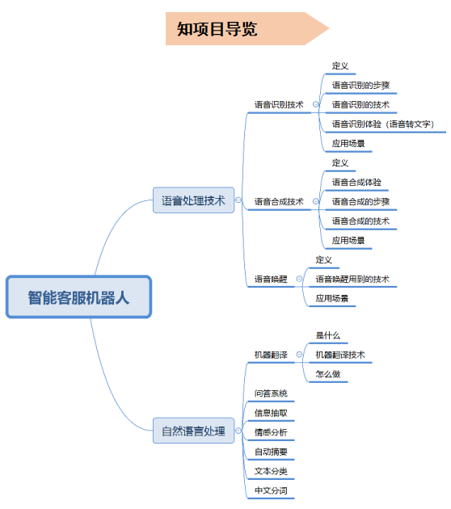
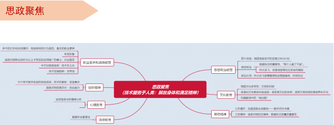

# 项目2.1 语音识别技术应用-开发校园智能客服机器人

## 项目情景

&nbsp;&nbsp;&nbsp;&nbsp;智能客服机器人是指用电脑代替人工执行客服的任务，在如今的在线客服系统中日渐成为不可或缺的存在。得益于互联网技术、人工智能、大数据的发展，从最初代的智能客服机器人到如今经历了很多技术革新，功能也不断完善，在机器人语言处理、语义识别、关键词匹配、知识库建设乃至自主学习等方面都有了很大改进，越来越多地被运用于如今人们的工作生活。

&nbsp;&nbsp;&nbsp;&nbsp;某高校针对新生整理了一些问答（Q&A）集合放在了学校微信公众号和官网页面，但是学生和家长觉得问题不够全面而且需要从问答列表中找自己要问的问题，体验感不好。希望对现有的问答集合进行智能化升级为智能校园客服，新生或者新生家长可以语音提问，客服机器人进行语音回答。

## 项目导览

## 项目目标

1. 理解语音识别原理
2. 了解语音识别技术应用
3. 掌握语音采集和处理的方法
4. 了解自然语言处理关键技术
5. 能调用API进行语音识别的应用开发

## 知识导览

