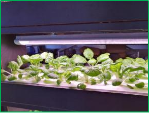
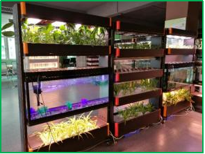
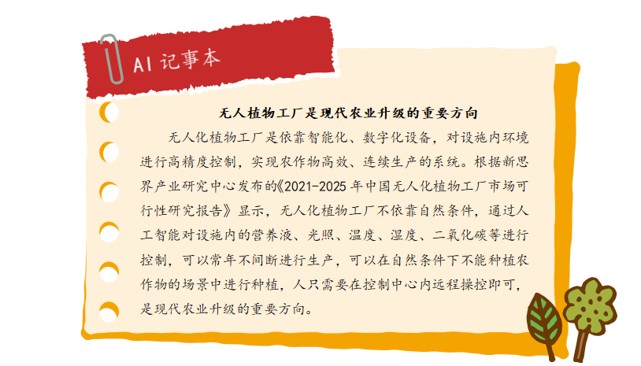
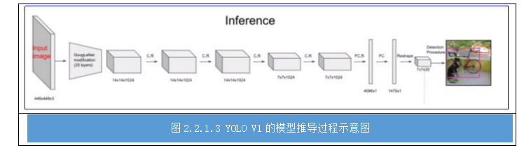
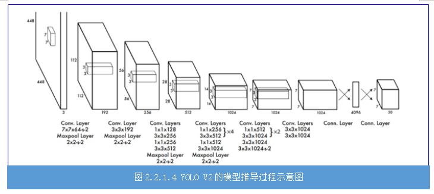
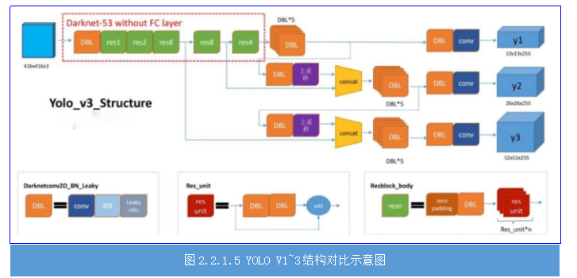
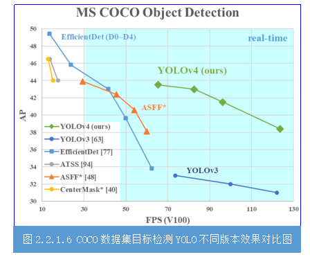
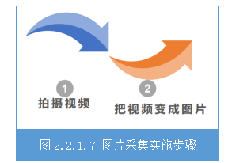
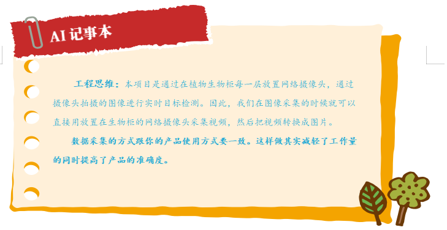

## 任务2.2.1 植物图像资源采集


### 任务描述

&nbsp;&nbsp;&nbsp;&nbsp;获取四类植物（上海青、生菜、色拉菜、苦棘菜）的图片（JPEG格式），每一类植物图片不少于1000张，图片中可以只含有一种植物，也可以含有多种植物。

  
图2.2.1.1 采集的植物图像列表

### 学习目标
&nbsp;&nbsp;&nbsp;&nbsp;1.知识目标  
&nbsp;&nbsp;&nbsp;&nbsp;&nbsp;&nbsp;&nbsp;&nbsp;（1）掌握常用数据采集的方法；  
&nbsp;&nbsp;&nbsp;&nbsp;&nbsp;&nbsp;&nbsp;&nbsp;（2）掌握数据采集的注意事项。  
&nbsp;&nbsp;&nbsp;&nbsp;2.能力目标  
&nbsp;&nbsp;&nbsp;&nbsp;&nbsp;&nbsp;&nbsp;&nbsp;（1）能根据项目需求采用合理方法进行数据采集；  
&nbsp;&nbsp;&nbsp;&nbsp;&nbsp;&nbsp;&nbsp;&nbsp;（2）会对采集后的数据进行简单处理。  
&nbsp;&nbsp;&nbsp;&nbsp;3.素质素养目标  
&nbsp;&nbsp;&nbsp;&nbsp;&nbsp;&nbsp;&nbsp;&nbsp;（1）培养耐性、细致的工作作风；  
&nbsp;&nbsp;&nbsp;&nbsp;&nbsp;&nbsp;&nbsp;&nbsp;（2）培养工程思维方式；  
&nbsp;&nbsp;&nbsp;&nbsp;&nbsp;&nbsp;&nbsp;&nbsp;（3）培养技术服务人类的意识；  
&nbsp;&nbsp;&nbsp;&nbsp;&nbsp;&nbsp;&nbsp;&nbsp;（4）培养学生开拓思维习惯。  


### 任务分析  
&nbsp;&nbsp;&nbsp;&nbsp;1.重点  
&nbsp;&nbsp;&nbsp;&nbsp;数据采集的方法。  
&nbsp;&nbsp;&nbsp;&nbsp;2.难点   
&nbsp;&nbsp;&nbsp;&nbsp;根据工程需求选择合理方法进行数据采集。
	  
### 知识链接  
&nbsp;&nbsp;&nbsp;&nbsp;随着现代化工业的不断发展，土地资源匮乏和环境污染已成为现代农业面临的重大问题。植物生长柜使用LED灯代替自然光，采用营养液栽培技术，对植物生长发育过程中所需的温度、湿度、光照等进行智能调控，图2.2.1.2就是这种LED智能植物生长柜，这是一种高效无污染的新型农业生产方式。  

  

  
  
图2.2.1.2 LED智能植物生长柜

&nbsp;&nbsp;&nbsp;&nbsp;目前，市场上常见的植物生长柜大多处于于人工现场检测阶段，无法实现对植物生长柜中植物实时检测，从而智能调节。因此给植物的监控与生长环境调节带来极大的不便。为了实现对生长柜的智能升级，实时检测植物种类，记录植物生长全周期，及时作出相应的处理。本章将带大家一起完成植物生长柜智能升级的其中一个重要环节—植物检测




### 一、目标检测算法—YOLO
&nbsp;&nbsp;&nbsp;&nbsp;植物检测是属于目标检测范畴，它是属于机器学习中的监督学习。因此需要告诉机器有答案的数据，我们通过采集植物图片，进行数据标注，从而获得有答案的数据。目标检测有很多成熟的算法、框架，我们不需要自己搭建神经网络，可以选择目前效果比较好的YOLO实例，进行我们自己的植物种类学习，实现检测功能。  
&nbsp;&nbsp;&nbsp;&nbsp;YOLO 算法也是one-stage目标检测算法中的一员。它通过一个网络就可以输出类别、置信度、坐标位置等信息。目标检测是计算机视觉中比较简单的任务，目标检测不仅要求我们识别这些物体的种类，同时要求我们标出这些物体的位置。  
&nbsp;&nbsp;&nbsp;&nbsp;YOLO的全称是you only look once，指只需要浏览一次就可以识别出图中的物体的类别和位置。YOLO 的预测是基于整个图片的，并且它会一次性输出所有检测到的目标信息，包括类别和位置。YOLO在2016年被提出，陆续出了4个版本，每一个版本都是对上一版本的优化。它们分别为YOLOV1  
### 1.YOLOV1
&nbsp;&nbsp;&nbsp;&nbsp;YOLOV1是YOLO系列的第一个版本，将图像resize到448x448作为输入，输出7x7x30，即将图片划分为7x7，每个单元格独立检测。这里需要注意，不是那种滑动窗口将每个单元格都输入到网络中进行预测，这里的划分只是物体中心点位置的划分之用（划分越多越准确），物体的中心落在哪个单元格，就由那个单元格负责预测。说完7x7我们再说下另一个维度30，30=（2*5=20），其中“2：每个单元格预测数量（box数量）”，“5：（x,y,w,h,score）”,“20：模型可以预测20个种类”。



&nbsp;&nbsp;&nbsp;&nbsp;模型首先会将ImageNet作为训练集预训练模型，最终达到88%精度，然后使用迁移学习将预训练的模型应用到当前标注的训练集进行训练。模型输出5维信息（x,y,w,h,score），使用Leaky Relu作为激活函数，全连接层后添加Dropout层防止过拟合。在得到输出值之后，我们需要计算每个box与ground true的Iou值，然后通过非极大值抑制筛选box。
### 2.YOLOV2
&nbsp;&nbsp;&nbsp;&nbsp;YOLOV2是YOLO系列的第一个改进版本，它首次提出了以DarkNet19作为backbone,并使用全卷积代替了全连接，解决了V1全连接的问题。还使用了批量标准化替代了随机失活（dropout），提升模型的泛化能力。YOLOV2舍弃了直接预测BBOX的位置和大小，而是受faster-rcnn的启发，有了anchor的概念，直接预测BBOX相对于anchor boxes的偏移量。图2.2.1.4是YOLOV2的模型推到过程示意图。



### 3.YOLOV3
&nbsp;&nbsp;&nbsp;&nbsp;YOLOV3是YOLO系列的第二个改进版本，它将V2中的DarkNet19改为特征提出能力更强的DarkNet53。YOLOV3开始使用多尺度输出来预测数据，这大大增强了YOLO检测小目标的性能。林外YOLOV3还使用特征金字塔结构，加强特征的提取。图2.2.1.5 是YOLOV3与YOLOV1模型结构对比图。  



### 4.YOLOV4
&nbsp;&nbsp;&nbsp;&nbsp;YOLOV4是YOLO系列的第三个改进版本,它将V3中的算法和目前主流的算法做了实验进行整合，例如：使用SPP增大感受野、引入注意力机制，使用Mosaics数据增强等。正是这些修改，使得YOLOV4号称最好用的目标检测框架，具体体现在“比它快的没它准，比他准的没它快”。图2.2.1.6是针对coco数据集下不同YOLO模型不同版本的目标检测效果对比图，从图中可以看出YOLOV4是目标检测效果最好的




### 二、植物检测中的数据采集
&nbsp;&nbsp;&nbsp;&nbsp;我们要实现目标检测就需要有答案的目标图片进行学习。植物检测项目需要检测四类植物，分别是上海青、生菜、色拉菜和苦棘菜，因此我们需要大量采集这四类植物不同生长状态、不同角度的图像数据，为后续数据标注、机器学习做准备。  
&nbsp;&nbsp;&nbsp;&nbsp;目前图像数据采集的方式有很多种，比如有：  
&nbsp;&nbsp;&nbsp;&nbsp;（1）手机（相机）拍摄照片；  
&nbsp;&nbsp;&nbsp;&nbsp;（2）手机（相机）拍摄视频，然后转换为图像；  
&nbsp;&nbsp;&nbsp;&nbsp;（3）爬虫从网络上获取。             
&nbsp;&nbsp;&nbsp;&nbsp;基于工程思维的方式，我们数据采集的方式应该与产品使用方式一致，不仅可以提高目标检测的准确度，这样训练的模型也最符合应用场景，而且这样也大大减轻工作时间，提高工作效率。所以本项目通过在植物生物柜每一层放置网络摄像头，通过摄像头拍摄的图像进行实时目标检测。我们通过植物生长柜中安装的网络摄像头采集视频，然后把视频转换成图片的方式进行图像数据采集。  




&nbsp;&nbsp;&nbsp;&nbsp;把视频变成图片方式也有多样，我们可以用截图软件一张张的截图，也可以使用现成的一些视频转图片的软件，还可以利用opencv自行写python脚本进行按帧数截图。显然利用opencv自行写python脚本进行按帧数截图的方法是最方便快捷的，具体实现的参考代码如下：  

```python
import cv2  
cap = cv2.VideoCapture("C:\\video2img\\veg.mp4")  
success, frame = cap.read()  
i = 0  
while success :  
    i = i + 1  
    cv2.imwrite("c:\\test\\frames%d.jpg" % i, frame)  
    print('save image:',i)  
    success, frame = cap.read()
```


&nbsp;&nbsp;&nbsp;&nbsp;最后我们需要重命名图片，因为数据集要求我们对图片进行规范命名。图片重命名为VOC数据集的“000001.jpg”形式。可以写python代码完成，参考代码如下：
  
```python
import os  
path = r"D:\VOC2007\JPEGImages"#路径根据实际修改  
filelist = os.listdir(path) #该文件夹下所有的文件（包括文件夹）  
count=0  
for file in filelist:  
    print(file)  
for file in filelist:   #遍历所有文件  
    Olddir=os.path.join(path,file)   #原来的文件路径  
    if os.path.isdir(Olddir):   #如果是文件夹则跳过  
        continue  
    filename=os.path.splitext(file)[0]   #文件名  
    filetype=‘.jpg’   #文件扩展名  
    Newdir=os.path.join(path,str(count).zfill(6)+filetype)  #  用字符串函数zfill 以0补全所需位数  
    os.rename(Olddir,Newdir)#重命名  
    count+=1  
```

&nbsp;&nbsp;&nbsp;&nbsp;此步骤结束后，应该所有图片的格式都为JPG，并且以“00000*.jpg”格式命名好放在同一个文件夹里。



### 素质素养养成
&nbsp;&nbsp;&nbsp;&nbsp;1.在数据采集过程，引导学生充分利用网络资源，实用多种方法进行数据采集，并进行对比分析，开拓思维方式。  
&nbsp;&nbsp;&nbsp;&nbsp;2.在实践过程中，在重复采集数据的过程，养成有耐性、对待工作认真细致的工作作风。  
&nbsp;&nbsp;&nbsp;&nbsp;3.从智能植物生长系统应用价值，引导学生关注三农问题和智慧农业，培养技术服务人类的意识。  
&nbsp;&nbsp;&nbsp;&nbsp;4.在实践过程中，以项目需求为导向进行采集符合项目的图像数据，逐渐培养工程思维的职业素养。  

### 任务分组 
#### 学生任务分配表

[学生任务分配表](https://docs.qq.com/doc/DTmp5T05BZE1CTUhH)

### 任务实施
#### 任务工作单1：图像数据采集方法探究
组号:__________姓名：___________学号：___________检索号：___________  

**引导问题**           
（1）通过个人思考或者网上查阅，找出图片数据采集的三种或以上的方法，对比优缺点。

[表](https://docs.qq.com/doc/DTmxadG5xclhTYXRP)            

（2）针对本项目特点，在（1）中选取一种最优方案，并指出理由。

 _________________________________________________________

#### 任务工作单2：制定植物图像数据采集方案     
组号:__________姓名：___________学号：___________检索号：___________ 

**引导问题：**            
（1）根据2.2.1.7推荐的方法，制定出植物图片数据采集的具体方案步骤。  
步骤一：__________________________________________________________

步骤二：__________________________________________________________

步骤三：
_________________________________________________________

步骤四：__________________________________________________________

步骤五：__________________________________________________________

步骤六：__________________________________________________________
      


#### 任务工作单3：植物图像数据采集方案（讨论）  
组号:__________姓名：___________学号：___________检索号：___________  

**引导问题：**           
（1）小组交流讨论2.2.1.8的各种方案，教师参与，形成本项目最合适的图像数据采集方案。 
_________________________________________________________

（2）小组讨论，得出上述方案的注意事项。
_________________________________________________________

#### 任务工作单4：植物图像采集 
组号:__________姓名：___________学号：___________检索号：___________  

**引导问题：**             
（1）分组完成四种植物的图片采集。       
__________________________________________________________

（2）描述图片采集完成后的基本处理。         
__________________________________________________________


### 评价反馈  
个人自评表  
组号:__________姓名：___________学号：___________检索号：___________ 
 
[个人自评表](https://docs.qq.com/doc/DTmtYWktYWW1GQXZU)

小组内互评表  
组号:__________姓名：___________学号：___________检索号：___________  
  
[小组内互评表](https://docs.qq.com/doc/DTmdJcEpySGROV1Zh)  

小组间互评表 
被评组号：___________ 检索号：___________  

[小组间互评表](https://docs.qq.com/doc/DTk9UWG1JUWNJelVu)  

教师评价表
组号:__________姓名：___________学号：___________检索号：___________  
  
[教师评价表](https://docs.qq.com/doc/DTkdrZERYdnZuVFd2)