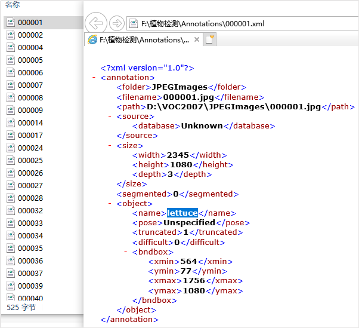
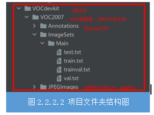
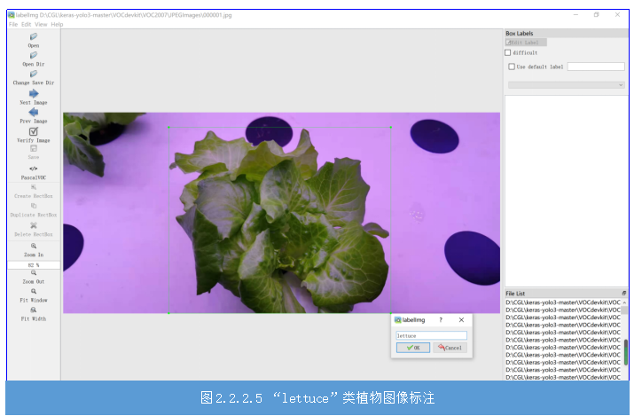
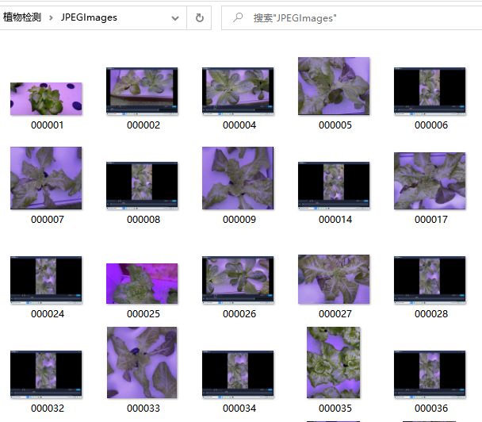
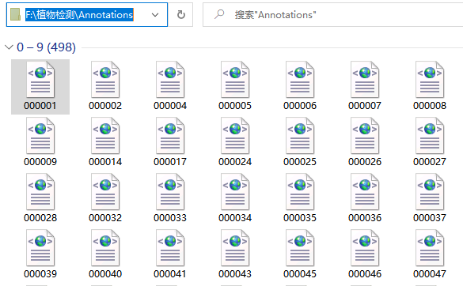
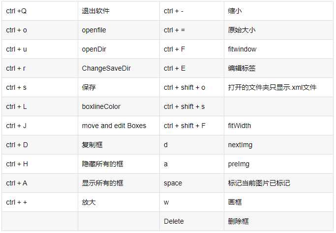

## 任务2.2.2 图像数据标注

### 任务描述

&nbsp;&nbsp;&nbsp;&nbsp;通过任务1我们获取了大量的目标植物图片，我们也知道监督学习，是需要我们告诉机器数据的信息，正确的、错误的。因此我们要对任务1采集的图片进行标注，这样就让图片有目标种类、目标位置的信息，供机器学习使用。使用LabelImg工具对任务1采集的图像数据进行目标检测训练的数据标注—将图像中四种菜分别框选并加上对应的标签并保存为xml格式，完成后的效果参考图2.2.2.1。

  
图2.2.2.1标注后的图像数据

### 学习目标
#### 1.知识目标  
&nbsp;&nbsp;&nbsp;&nbsp;（1）掌握图像标注常用工具及图片标注方法；  
&nbsp;&nbsp;&nbsp;&nbsp;（2）掌握图像标注规则。  
#### 2.能力目标  
&nbsp;&nbsp;&nbsp;&nbsp;（1）会使用LabelImage软件对图像进行数据标注。  
&nbsp;&nbsp;&nbsp;&nbsp;（2）能制作达到项目要求的数据集。  
#### 3.素质素养目标  
&nbsp;&nbsp;&nbsp;&nbsp;（1）培养重复性劳动的耐性及认真态度；  
&nbsp;&nbsp;&nbsp;&nbsp;（2）培养严谨的工作态度；  
&nbsp;&nbsp;&nbsp;&nbsp;（3）培养遵守规范的意识。  
### 任务分析  
### &nbsp;&nbsp;&nbsp;&nbsp;1.重点  
&nbsp;&nbsp;&nbsp;&nbsp;图像标注的方法。  
### &nbsp;&nbsp;&nbsp;&nbsp;2.难点  
&nbsp;&nbsp;&nbsp;&nbsp;VOC数据集的概念、LabelImage的安装。      

### 知识链接 
#### 一、目标检测中的公开数据集  
&nbsp;&nbsp;&nbsp;&nbsp;在目标检测中，近年来许多知名的数据集免费公开供开发者进行人工智能实验，包括PASCAL VOC Challenges（例如VOC2007,VOC2012）,ImageNet Large Scale Visual Recognition Challenge（例如ILSVRC2014），MS-COCO Detection Challenge等。
  
##### 1.VOC数据集  
&nbsp;&nbsp;&nbsp;&nbsp;VOC数据集实际上是一个名为PASCAL VOC的世界级的计算机视觉挑战赛中的数据集，很多模型都基于此数据集推出。比如目标检测领域的yolo，ssd等。PASCAL VOC挑战赛 （The PASCAL Visual Object Classes ）是一个世界级的计算机视觉挑战赛，PASCAL全称：Pattern Analysis, Statical Modeling and Computational Learning，是一个由欧盟资助的网络组织，它是一套检测和识别标准化的数据集。我们通常不用它的数据集，而是按照它的格式来准备自己的数据集。此数据集的格式如下：JPEGImages里面存放的是我们已经采集好并统一规范命名的图像文件（即要进行标注的图像文件），Annotations里面存放的是我们标注好的图像XML文件，而ImageSets里面存放的是我们后面会切分的训练集、测试集、验证集的图片命名，其中test.txt是测试集，train.txt是训练集，val.txt是验证集，trainval.txt是训练和验证集。图2.2.2.2是基于VOC数据集进行目标检测的项目文件结构。

##### 2.COCO数据集
&nbsp;&nbsp;&nbsp;&nbsp;MS COCO的全称是Microsoft Common Objects in Context，起源于微软于2014年出资标注的Microsoft COCO数据集，与ImageNet竞赛一样，被视为是计算机视觉领域最受关注和最权威的比赛之一。 COCO数据集是一个大型的、丰富的物体检测，分割和字幕数据集。这个数据集以scene understanding为目标，主要从复杂的日常场景中截取，图像中的目标通过精确的segmentation进行位置的标定。图像包括91类目标，328,000影像和2,500,000个label。目前为止有语义分割的最大数据集，提供的类别有80 类，有超过33 万张图片，其中20 万张有标注，整个数据集中个体的数目超过150 万个。

#### 二、数据标注  
&nbsp;&nbsp;&nbsp;&nbsp;Labelmage 是一个图形界面的图像标注软件。它是用 Python 语言编写的，图形界面使用的是 Qt（PyQt）。它是一个可视化的图像标定工具。使用该工具前需配置环境python + lxml。Faster R-CNN，YOLO，SSD等目标检测网络所需要的数据集，均需要借此工具标定图像中的目标。生成的 XML 文件是遵循 PASCAL VOC 的格式的。  
##### 1.安装LabelImg工具
在使用LabelImg进行数据标注之前，我们需要先安装。在anaconda 中安装和启动LabelImg工具的方法如下：  
&nbsp;&nbsp;&nbsp;&nbsp;步骤1：打开Anaconda prompt，输入命令pip instal labelimg 进行安装。  
&nbsp;&nbsp;&nbsp;&nbsp;步骤2：安装成功后，直接输入命令labelimg，即可以打开labelimg标注工具。软件界面如图2.2.2.3所示。 

  
图2.2.2.3 图像标注工具LabelImg界面

##### 2.使用LabelImg进行标注，制作植物检测的数据集
&nbsp;&nbsp;&nbsp;&nbsp;（1）准备两个文件夹JPEGImages和Annotations，将你要进行标注的图片全部放到JPEGImages里面，Annotations用来保存你将标注好的图像信息xml文件。  
&nbsp;&nbsp;&nbsp;&nbsp;（2）选择数据集格式：点击图2.2.2.3中工具栏中的第8个图标可以切换yolo格式标注和pascal-voc格式的标注。这里我们选择pascal voc格式。  
&nbsp;&nbsp;&nbsp;&nbsp;（3）加载数据和确定数据保存文件夹：点击Open Dir选择JPEGImages文件夹，点击Change Save Dir选择Annotations文件夹。“Open Dir”会自动打开第一张图片，在file List会显示JPEGImages文件下的所有文件，如图2.2.2.4所示。  
  
图2.2.2.4 通过Open dir 加载JPEGImages文件后的效果

&nbsp;&nbsp;&nbsp;&nbsp;（4）打开了要标注的图像文件后，使用工具栏中使用“Create RectBox”开始画框，将图像中的植物尽量靠近边缘进行框选，松开鼠标后在出现的对话框里面输入框选部分的植物的名称（本次项目有生菜、色拉菜、上海青、苦苣菜四类标签），比如笔者的第一张图是生菜，我就输入lettuce作为本次款选目标的标签，效果参考图2.2.2.5。然后点击左侧工具栏的“Save”，此时XML文件已经保存到本地Annotations文件夹了。  
&nbsp;&nbsp;&nbsp;&nbsp;（5）点击左侧工具栏“Next Image”转到下一张图片。重复(4）就可以完成对所有图像文件的标注。标注过程中可随时返回进行修改，后保存的文件会覆盖之前的。  
&nbsp;&nbsp;&nbsp;&nbsp;**注意：**每个图片和标注得到的xml文件，JPEGImages文件夹里面的一个训练图片，对应Annotations里面的一个同名XML文件，一一对应，命名一致，效果参考图2.2.2.6。标注自己的图片的时候，类别名称请用小写字母，比如上海青使用shanghai green，不要用Shang Green。
 
   
   
  
图 2.2.2.6 JPEGImages文件夹内文件名与annotations文件夹内的文件名一致  

LabelImg提供了快捷键，辅助使用者提高工作效率，表2.2.2.1是LabelImg快捷键汇总。
表2.2.1.1LabelImg快捷键汇总表  
    

## 素质素养养成
&nbsp;&nbsp;&nbsp;&nbsp;1.在数据采集过程，让学生明白，机器是不会思考的，能思考的是机器的设计者和开发者。要让机器做出正确的计算，就需要数据标注人员在标注等开发环节注重细节，培养学生对人工智能训练师新职业的认知和职业认同感。
&nbsp;&nbsp;&nbsp;&nbsp;2.通过了解数据标注与人工智能的应用之间的关系，认识到“不积跬步无以至千里”的道理，培养学生脚踏实地的职业素养。
&nbsp;&nbsp;&nbsp;&nbsp;3.引导学生理解数据标注的社会意义，重复的劳动是创造智能的基础，培养学生热爱劳动。

### 任务分组 
学生任务分配表 
[学生任务分配表](https://docs.qq.com/doc/DTmp5T05BZE1CTUhH)

### 任务实施       
#### 任务工作单1：植物图像标注方法探究
组号:__________姓名：___________学号：___________检索号：___________  

**引导问题：**  

（1）通过网上查阅，找出图像标注的常用软件，对比分析优缺点。     
[表](https://docs.qq.com/doc/DTmxoallLcmVnSlNQ)

（2）针对本项目特点，在（1）中选取一种最优方案，并指出理由。  
________________________________________________________  

#### 任务工作单2：植物图像标注方案确定（讨论）    
组号:__________姓名：___________学号：___________检索号：___________ 

**引导问题：**    

（1）小组交流讨论2.2.2.7的各种方案，教师参与，形成本项目最合适的图像图像标注方案。
________________________________________________________  

（2）讨论得出图像标注软件安装流程。
________________________________________________________  
 
#### 任务工作单3：植物图像标注方案（展示）  
组号:__________姓名：___________学号：___________检索号：___________  

**引导问题：**   

（1）每小组推荐一位小组长，汇报实现过程，总结图像标注软件的安装流程，使用方法及注意事项。
________________________________________________________

（2）借鉴各组分享的经验，进一步优化图像标注方案。
________________________________________________________

（3）检查自己不足的地方。
________________________________________________________

#### 任务工作单4：植物图像标注
组号:__________姓名：___________学号：___________检索号：___________  

**引导问题：**          

（1）完成所有采集图片的图像标注。
________________________________________________________

（2）形成VOC格式的数据集。
________________________________________________________

### 评价反馈       
#### 个人自评表       
组号:__________姓名：___________学号：___________检索号：___________ 

[个人自评表](https://docs.qq.com/doc/DTmJ0bWNsYlhEc2hN)

#### 小组内互评表       
组号:__________姓名：___________学号：___________检索号：___________  

[小组内互评表](https://docs.qq.com/doc/DTmZtRm12dkR5YnF2)

#### 小组间互评表        
被评组号：___________ 检索号：___________  

[小组间互评表](https://docs.qq.com/doc/DTkVhYkpkeXBKS0hQ)

#### 教师评价表           
组号:__________姓名：___________学号：___________检索号：___________  

[教师评价表](https://docs.qq.com/doc/DTlpOdHlBQWJURVl0)

