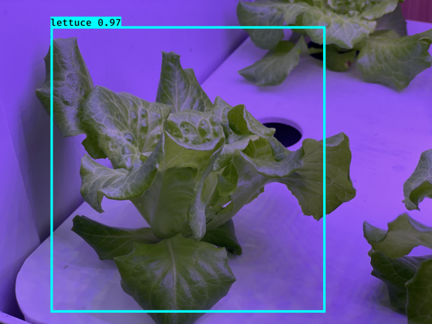
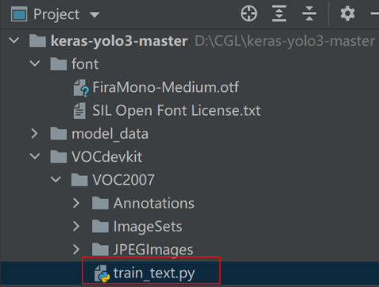
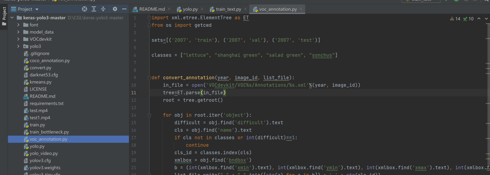
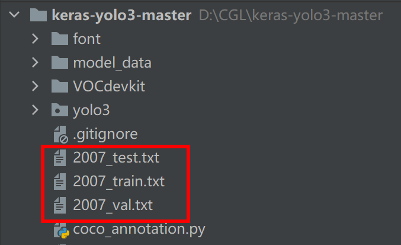
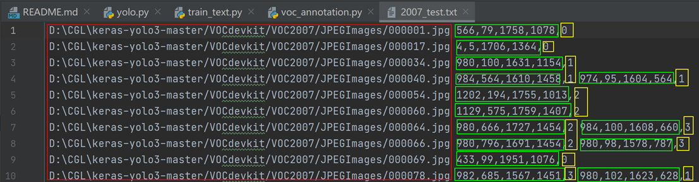
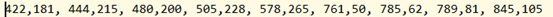
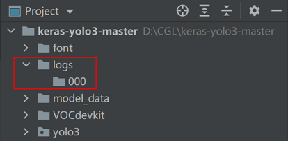
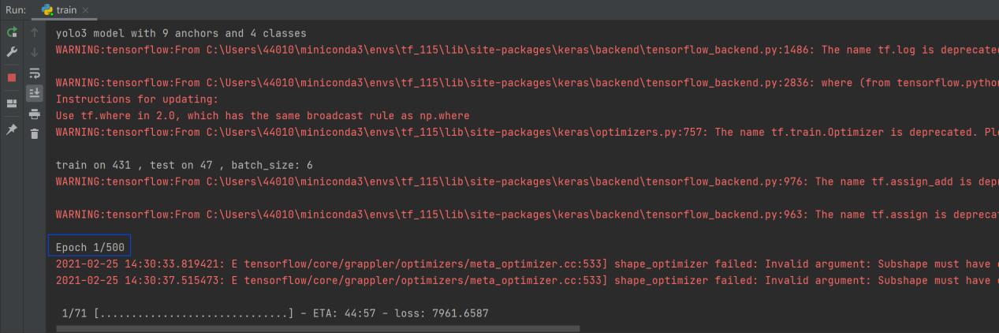
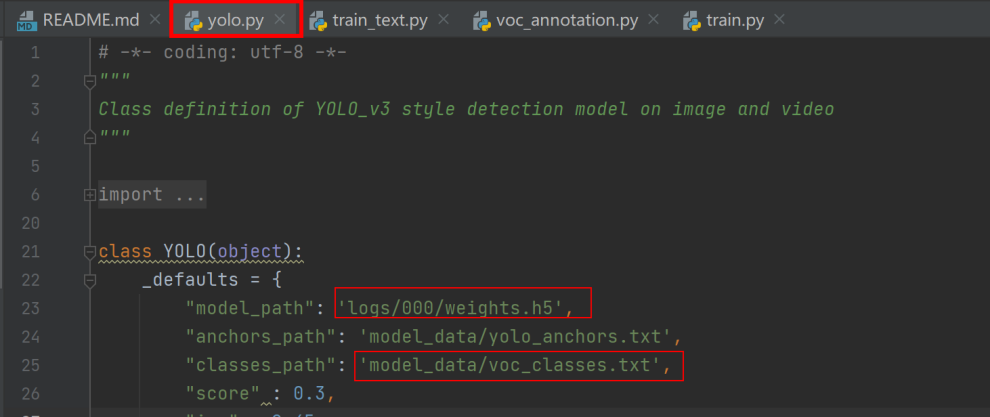
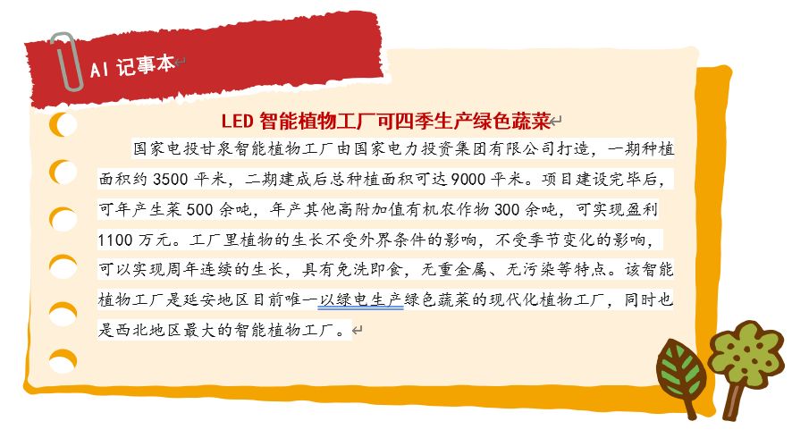

## 任务2.2.5训练植物数据集

### 任务描述

&nbsp;&nbsp;&nbsp;&nbsp;&nbsp;&nbsp;&nbsp;利用Keras-yolov3，基于任务2完成的植物数据集训练针对上海青、生菜、色拉菜、苦苣菜四类植物的目标检测模型，完成后的模型检测效果参考图2.2.5.1。
 


图2.2.5.1 植物检测效果

### 学习目标

##### 1.知识目标

&nbsp;&nbsp;&nbsp;&nbsp;&nbsp;&nbsp;&nbsp;（1）掌握训练模型时数据集划分的方法及依据。

&nbsp;&nbsp;&nbsp;&nbsp;&nbsp;&nbsp;&nbsp;（2）掌握复用keras-yolo3官方案例训练自己数据集的方法。

##### 2.能力目标

&nbsp;&nbsp;&nbsp;&nbsp;&nbsp;&nbsp;&nbsp;（1）能复用keras-yolo3官方案例训练自己数据集并进行测试。

##### 3.素质素养目标

&nbsp;&nbsp;&nbsp;&nbsp;&nbsp;&nbsp;&nbsp;（1）培养人工智能训练师的职业认同感，体验智能改变生活；

&nbsp;&nbsp;&nbsp;&nbsp;&nbsp;&nbsp;&nbsp;（2）培养工程思维意识；

&nbsp;&nbsp;&nbsp;&nbsp;&nbsp;&nbsp;&nbsp;（3）培养遵守规范的意识。

### 任务分析

&nbsp;&nbsp;&nbsp;&nbsp;&nbsp;&nbsp;&nbsp;**1.重点**

&nbsp;&nbsp;&nbsp;&nbsp;&nbsp;&nbsp;&nbsp;数据集划分概念以及yolo模型训练参数的调整。

&nbsp;&nbsp;&nbsp;&nbsp;&nbsp;&nbsp;&nbsp;**2.难点**

&nbsp;&nbsp;&nbsp;&nbsp;&nbsp;&nbsp;&nbsp;用keras-yolo3训练植物检测模型。	

### 知识链接

#### 一、数据集知识

&nbsp;&nbsp;&nbsp;&nbsp;&nbsp;&nbsp;&nbsp;深度学习中需要将数据集划分为训练集(training set),验证集(development set/validation set)和测试集(test set)。
训练集：顾名思义指的是用于训练的样本集合，主要用来训练神经网络中的参数。

&nbsp;&nbsp;&nbsp;&nbsp;&nbsp;&nbsp;&nbsp;验证集：从字面意思理解即为用于验证模型性能的样本集合。不同神经网络在训练集上训练结束后，通过验证集来比较判断各个模型的性能。这里的不同模型主要是指对应不同超参数的神经网络，也可以指完全不同结构的神经网络。

&nbsp;&nbsp;&nbsp;&nbsp;&nbsp;&nbsp;&nbsp;测试集：对于训练完成的神经网络,测试集用于客观的评价神经网络的性能。

&nbsp;&nbsp;&nbsp;&nbsp;&nbsp;&nbsp;&nbsp;我们可以简单的这么来理解三个数据集之间的关系：训练集就好像平时老师给你们上课举的每一个例子，带同学们做的每一个练习，让同学们巩固掌握知识；验证集就好像这个学期的小测，通过小测，老师及时调整教学内容和教学方法；测试集就是期末考试，期末考试的内容通常是同学们没见过的题目，但是确在知识范围里面，用来检查同学们这个学期的学习效果。

#### 二、制作数据集

&nbsp;&nbsp;&nbsp;&nbsp;&nbsp;&nbsp;&nbsp;在进行模型训练之前，我们需要将标注好的数据集划分为训练集、测试集。一般测试集和训练集的比例为2:8,当数据规模比较小的时候，也可以调整为1:9，让训练数据尽可能多一些。

&nbsp;&nbsp;&nbsp;&nbsp;&nbsp;&nbsp;&nbsp;**步骤1：**把数据集文件夹放在项目文件夹的根目录下，完成后如图2.2.5.2所示。
  


图2.2.5.2 数据集文件夹

&nbsp;&nbsp;&nbsp;&nbsp;&nbsp;&nbsp;&nbsp;**步骤2：**我们需要回到pycharm中，在VOC2007文件夹中**新建**train_text.py，写入如下代码。目的是对我们的xml文件切分为训练集和测试集，这里设置的两者比例是8:2。
train_text.py代码如下：
```python
	import os
	import random
	#训练和测试的比值为8：2 当数据规模小的时候，可以调整为9：1
	trainval_percent = 0.2
	train_percent = 0.8
	xmlfilepath = 'Annotations'
	txtsavepath = 'ImageSets\Main'
	total_xml = os.listdir(xmlfilepath)
	num = len(total_xml)
	list = range(num)
	tv = int(num * trainval_percent)
	tr = int(tv * train_percent)
	trainval = random.sample(list, tv)
	train = random.sample(trainval, tr)
	#分别写入如下文件
	ftrainval = open('ImageSets/Main/trainval.txt', 'w')
	ftest = open('ImageSets/Main/test.txt', 'w')
	ftrain = open('ImageSets/Main/train.txt', 'w')
	fval = open('ImageSets/Main/val.txt', 'w')
	for i in list:
	    name = total_xml[i][:-4] + '\n'
	    if i in trainval:
	        ftrainval.write(name)
	        if i in train:
	            ftest.write(name)
	        else:
	            fval.write(name)
	    else:
	        ftrain.write(name)
	ftrainval.close()
	ftrain.close()
	fval.close()
	ftest.close()
```
&nbsp;&nbsp;&nbsp;&nbsp;&nbsp;&nbsp;&nbsp;**步骤3：**此时，这几个文件并不能直接被yolov3读取，需要我们再做一次转换。修改voc_annotation.py 文件，将 classes 修改成自己的类别，如图2.2.5.3所示。

	sets=[('2007', 'train'), ('2007', 'val'), ('2007', 'test')]
	classes = ["lettuce","shanghai green","salad green","sonchus"]



图2.2.5.3 voc_annotation.py 中classes列表

&nbsp;&nbsp;&nbsp;&nbsp;&nbsp;&nbsp;&nbsp;**步骤4：**然后运行voc_annotation.py，会得到下面3个后缀为.txt文件（如图2.2.5.4所示）他们对应的是训练集、测试集，验证集的图片。这3个文件都记录着 3 个信息：图像文件地址，标注的坐标，以及标注名称的索引 （与步骤3中修改的 voc_annotation.py 文件中的 classes 相对应）。
  


如图2.2.5.4 划分数据集成功效果
  


图2.2.5.5 划分后数据集文件信息：图像文件地址、标注的坐标和标注名称的索引 

&nbsp;&nbsp;&nbsp;&nbsp;&nbsp;&nbsp;&nbsp;**步骤5：**接着，我们修改model_data文件夹下的voc_classes.txt，将类别修改为植物检测中的如下四类标注信息：

	lettuce
	shanghai green
	salad green
	sonchus

&nbsp;&nbsp;&nbsp;&nbsp;&nbsp;&nbsp;&nbsp;这样，我们的数据集就制作好啦。在程序运行的时候，会分别读取txt文件中的路径信息和标注信息。

#### 三、使用Kmeans算法获得先验框anchor_box

&nbsp;&nbsp;&nbsp;&nbsp;&nbsp;&nbsp;&nbsp;事实上，制作完数据集我们就可以进行训练了。但是由于当前的anchor_box是原作者在coco数据集上使用Kmeans得到的，并不一定适合我们现在的植物检测数据集。所以我们需要在植物检测数据上使用Kmeans得到9个适合当前数据集的anchor_box，以得到最好的检测框。新建kmeans.py写入如下代码:
```python
	import numpy as np
	
	class YOLO_Kmeans:
	    def __init__(self, cluster_number, filename):
	        self.cluster_number = cluster_number
	        self.filename = filename
	
	    # 获得iou
	    def iou(self, boxes, clusters):  # 1 box -> k clusters
	        '''
	        boxes:[[weight,height],]
	        clusters:k个中心点
	        '''
	        n = boxes.shape[0]
	        k = self.cluster_number
	
	        # 获得每个标注框的面积
	        box_area = boxes[:, 0] * boxes[:, 1]
	        box_area = box_area.repeat(k)
	        box_area = np.reshape(box_area, (n, k))
	
	        # 获得9个标注框的面积，并将2个数组填充为维度一样的数组
	        cluster_area = clusters[:, 0] * clusters[:, 1]
	        cluster_area = np.tile(cluster_area, [1, n])
	        cluster_area = np.reshape(cluster_area, (n, k))
	
	        # 对2个数组进行匹配，取出小的那个边长
	        box_w_matrix = np.reshape(boxes[:, 0].repeat(k), (n, k))
	        cluster_w_matrix = np.reshape(np.tile(clusters[:, 0], (1, n)), (n, k))
	        min_w_matrix = np.minimum(cluster_w_matrix, box_w_matrix)
	
	        box_h_matrix = np.reshape(boxes[:, 1].repeat(k), (n, k))
	        cluster_h_matrix = np.reshape(np.tile(clusters[:, 1], (1, n)), (n, k))
	        min_h_matrix = np.minimum(cluster_h_matrix, box_h_matrix)
	        # 计算小边长的面积
	        inter_area = np.multiply(min_w_matrix, min_h_matrix)
	        # 计算iou
	        result = inter_area / (box_area + cluster_area - inter_area)
	        print(result.shape)
	        return result
	    # 计算准确率
	    def avg_iou(self, boxes, clusters):
	        accuracy = np.mean([np.max(self.iou(boxes, clusters), axis=1)])
	        return accuracy
	
	    def kmeans(self, boxes, k, dist=np.median):
	        '''
	        boxes:标注框的宽高
	        k：需要取到的中心个数
	        '''
	        # shape : (标注框个数，2)
	        box_number = boxes.shape[0]
	        last_nearest = np.zeros((box_number,))
	        np.random.seed()
	        # 随机在标注框中取出k个点作为中心
	        clusters = boxes[np.random.choice(
	            box_number, k, replace=False)]  # init k clusters
	        while True:
	            # 由于iou是越大越好，而聚类到中心的距离又是越小越好，所以
	            # 在论文中，作者使用使用1-iou 可以保证距离越小，iou越大
	            distances = 1 - self.iou(boxes, clusters)
	
	            current_nearest = np.argmin(distances, axis=1)
	            if (last_nearest == current_nearest).all():
	                break  # clusters won't change
	            for cluster in range(k):
	                clusters[cluster] = dist(  # update clusters
	                    boxes[current_nearest == cluster], axis=0)
	
	            last_nearest = current_nearest
	
	        return clusters
	    # 将anchors写入txt文件
	    def result2txt(self, data):
	        f = open("model_data/anchors.txt", 'w')
	        row = np.shape(data)[0]
	        for i in range(row):
	            if i == 0:
	                x_y = "%d,%d" % (data[i][0], data[i][1])
	            else:
	                x_y = ", %d,%d" % (data[i][0], data[i][1])
	            f.write(x_y)
	        f.close()
	    # 加载图片路径得到标注框的宽高
	    def txt2boxes(self):
	        f = open(self.filename, 'r')
	        dataSet = []
	        for line in f:
	            infos = line.split(" ")
	            length = len(infos)
	            for i in range(1, length):
	                # 标注框的四个坐标为 xmin,ymin,xmax,ymax
	                # width=xmax-xmin  height=ymax-ymin
	                width = int(infos[i].split(",")[2]) - \
	                    int(infos[i].split(",")[0])
	                height = int(infos[i].split(",")[3]) - \
	                    int(infos[i].split(",")[1])
	                dataSet.append([width, height])
	        result = np.array(dataSet)
	        f.close()
	        return result
	
	    def txt2clusters(self):
	        all_boxes = self.txt2boxes()
	        result = self.kmeans(all_boxes, k=self.cluster_number)
	        result = result[np.lexsort(result.T[0, None])]
	        self.result2txt(result)
	        print("K anchors:\n {}".format(result))
	        print("Accuracy: {:.2f}%".format(
	            self.avg_iou(all_boxes, result) * 100))
	
	if __name__ == "__main__":
	    cluster_number = 9
	    filename = "2007_train.txt"
	    kmeans = YOLO_Kmeans(cluster_number, filename)
	    kmeans.txt2clusters()
```
&nbsp;&nbsp;&nbsp;&nbsp;&nbsp;&nbsp;&nbsp;运行结果如下，我们得到了9个anchor_box,只需要修改一下train.py中的anchors_path的路径，即可开始训练了。
  


#### 四、模型训练

&nbsp;&nbsp;&nbsp;&nbsp;&nbsp;&nbsp;&nbsp;**步骤1：**制作生成器

&nbsp;&nbsp;&nbsp;&nbsp;&nbsp;&nbsp;&nbsp;在开始训练之前，需要我们把数据集制作成一个生成器的结构，以便我们一边训练，一边读取数据。这样可以大大减小内存的压力。我们将train.py中的代码删除，并添加如下的代码，用于制作生成器。
```python
		import numpy as np
		import keras.backend as K
		from keras.layers import  Input,Lambda
		from keras.models import Model
		from keras.callbacks import TensorBoard,ModelCheckpoint,ReduceLROnPlateau
		from yolo3.model import preprocess_true_boxes,yolo_body,yolo_loss
		from yolo3.utils import get_random_data
		import keras
		# 数据生成器
		def data_generator(annotation_lines,
		                   batch_size,input_shape,
		                   anchors,num_classes):
		    '''
		    annotation_lines:图片地址 区域，类别  
		    batch_size:批次大小
		    input_shape:模型输入大小
		    anchors:anchors_box
		    num_classes:类别数量
		    '''
		    while True:
		        image_data=[]
		        box_data=[]
		        for i in annotation_lines:
		            # 获得随机截取，图片增强，并且缩放到416*416的图片以及相应的标注框
		            image,box=get_random_data(i,input_shape,random=True)
		            image_data.append(image)
		            box_data.append(box)
		            # 数据达到一个批次时返回
		            if len(image_data)==batch_size:
		                image_data=np.array(image_data)
		                box_data=np.array(box_data)
		                y_true=preprocess_true_boxes(
		                    box_data,input_shape,
		                    anchors,num_classes)
		                # 组装数据
		                yield [image_data,*y_true],np.zeros(batch_size)
		                image_data=[]
		                box_data=[]
```
&nbsp;&nbsp;&nbsp;&nbsp;&nbsp;&nbsp;&nbsp;**步骤2：**接着编写其他函数用来读取txt文件中的数据以及构建训练模型。包括获取数据标注的标签名称、获取anchors_box、创建模型结构，参考代码如下：
```python	
	#获取标签名称
	def get_classes(path):
	    with open(path) as f:
	        class_names=f.readlines()
	    class_names=[c.strip() for c in class_names]
	    return class_names
	
	# 获取anchors_box
	def get_anchors(path):
	    with open(path) as f:
	        anchors=f.readline()
	    anchors=[float(x) for x in anchors.split(',')]
	    return np.array(anchors).reshape(-1,2)
	
	# 创建模型结构
	def create_model(input_shape,anchors,num_classes,
	     load_weight=False,weight_path='logs/000/wetghts.h5'):
	    K.clear_session()
	    image_input=Input(shape=(None,None,3))
	    h,w=input_shape #(416,416)
	    num_anchors=len(anchors)#9
	
	    # 分别对应yolov3 的3个输出 13*13   26*26  52*52
	    y_true=[Input(shape=(h//{0:32,1:16,2:8}[l],
	                         w//{0:32,1:16,2:8}[l],
	                         num_anchors//3,num_classes+5)) for l in range(3)]
	
	    model_body=yolo_body(image_input,num_anchors//3,num_classes)
	    print('yolo3 model with %s anchors and %s classes'%(num_anchors,num_classes))
	    # 是否加载权重
	    if load_weight:
	        model_body.load_weights(weight_path,by_name=True,
	                                skip_mismatch=True)
	    model_loss=Lambda(yolo_loss,output_shape=(1,),name='yolo_loss',
	                  arguments={'anchors':anchors,
	                             'num_classes':num_classes,
	                             'ignore_thresh':0.7})\
	    ([*model_body.output,*y_true])
	    model=Model([model_body.input,*y_true],model_loss)
	
	    return model
```
&nbsp;&nbsp;&nbsp;&nbsp;&nbsp;&nbsp;&nbsp;**步骤3：**然后编写训练函数，在训练的时候，我们还可以使用回调函数对训练过程进行控制。比如，使用ModelCheckpoint()函数可以自动保存最佳的模型，使用ReduceLR0nPlateau()函数可以控制学习自动率衰减。参考代码如下：
```python
	# 训练函数
	def train(model, annotation_path, test_path, input_shape, anchors, num_classes, log_dir='logs/'):
	    '''
	    model:模型
	    annotation_path,test_path:训练路径和测试路径
	    input_shape:模型输入
	    anchors:anchors_box
	    num_classes:类别个数
	    '''
	    # 编译模型
	    model.compile(optimizer=keras.optimizers.Adam(lr=3e-4),
	                  loss={'yolo_loss': lambda y_true, y_pred: y_pred})
	
	    # 定义自动保存最佳模型
	    checkpoint = ModelCheckpoint(log_dir +
	                                 'ep{epoch:03d}-loss{loss:.3f}-val_loss{val_loss:.3f}.h5',
	                                 monitor='val_loss', save_weights_only=True,
	                                 save_best_only=True, period=1)
	    # 学习率衰减 
	    reduce_lr = ReduceLROnPlateau(monitor='val_loss', factor=0.2, patience=10,
	                                  min_lr=1e-7, verbose=1)
	
	    # 批次大小，训练集和验证集的划分比例
	    batch_size = 6
	    val_split = 0.1
	    with open(annotation_path) as f:
	        train_lines = f.readlines()
	    with open(test_path) as f:
	        test_lines = f.readlines()
	
	    # 打乱数据
	    lines = train_lines + test_lines
	    np.random.shuffle(lines)
	    num_val = int(len(lines) * val_split)
	    num_train = len(lines) - num_val
	
	    print('train on %s , test on %s , batch_size: %s' % (num_train, num_val, batch_size))
	
	    # 训练
	
	    model.fit_generator(data_generator(lines[:num_train],
	                                       batch_size, input_shape,
	                                       anchors, num_classes),
	                        steps_per_epoch=num_train // batch_size,
	                        validation_data=data_generator(lines[num_train:],
	                                                       batch_size, input_shape,
	                                                       anchors, num_classes),
	                        validation_steps=num_val // batch_size,
	                        callbacks=[reduce_lr, checkpoint],
	                        epochs=500)
	    model.save_weights(log_dir + 'wetghts.h5')
```
&nbsp;&nbsp;&nbsp;&nbsp;&nbsp;&nbsp;&nbsp;**步骤4：**紧接着，我们只需要定义一个main函数，并调用到它。
```python
	def _main():
	
	    # 定义路径
	    annotation_path = '2007_train.txt'
	    test_path = '2007_test.txt'
	    log_dir = 'logs/000/'
	    classes_path = 'model_data/voc_classes.txt'
	    anchors_path = 'model_data/yolo_anchors.txt'
	    # 获取类别
	    class_names = get_classes(classes_path)
	    # 获取anchor_box
	    anchors = get_anchors(anchors_path)
	    input_shape = (416, 416)
	    # 搭建模型
	    model = create_model(input_shape, anchors, len(class_names))
	    # keras.utils.plot_model(model,'yolo.png',show_shapes=True)
	    # 训练
	    train(model, annotation_path, test_path, input_shape,
	          anchors, len(class_names), log_dir=log_dir)
	if __name__ == '__main__':
	    _main()
```
&nbsp;&nbsp;&nbsp;&nbsp;&nbsp;&nbsp;&nbsp;**步骤5：**最后，在keras-yolo3-master文件夹下建立文件夹目录：logs/000，如图2.2.5.6所示，用于保存训练生成的模型。运行train.py文件进入模型训练，设置训练500周期，如图2.2.5.7所示，训练结束后即可获得植物检测模型。
  


图2.2.5.6 创建保存模型的文件夹
  


图2.2.5.7 训练植物检测模型

#### 五、测试模型

&nbsp;&nbsp;&nbsp;&nbsp;&nbsp;&nbsp;&nbsp;植物检测模型训练完成后，我们就可以使用它来预测植物类型了。首先进入到yolo.py文件中，修改 _defaults 配置中的model_path,anchors_path,以及 classes_path 为自己项目的路径，本项目的设置参考图2.2.5.8。
  


图2.2.5.8 yolo.py文件配置

&nbsp;&nbsp;&nbsp;&nbsp;&nbsp;&nbsp;&nbsp;在yolo.py代码的最后面加上以下代码，进行植物检测，运行yolo.py 文件，结果见图2.2.5.9。
```python
	yolo=YOLO()
	img=Image.open('00407.jpg')
	img_obj=yolo.detect_image(img)
	img_obj.show()
```


&nbsp;&nbsp;&nbsp;&nbsp;&nbsp;&nbsp;&nbsp;使用视频进行检测其实也很简单，只需要写入如下2行代码即可，因为实际上视频是由一帧一帧的图片组成，所以检测视频本质上也是对图片的检测。
```python
	yolo=YOLO()
	detect_video(yolo,'test.mp4')
```
&nbsp;&nbsp;&nbsp;&nbsp;&nbsp;&nbsp;&nbsp;**Tips：**yolo中 loss值分为4个，分别是中心点位置、宽高、置信度、类别。在刚开始训练的时候，这些数据都是随机的。所以loss会很大，但是同时找到更接近实际值的参数也就更容易，所以loss就收敛得快，但到后面会收敛得很慢。一个正常训练得模型 ，loss曲线在后面收敛会比较慢，并且会伴随着波动。
 


### 素质素养养成

&nbsp;&nbsp;&nbsp;&nbsp;&nbsp;&nbsp;&nbsp;1.通过植物检测项目实践，培养学生服务农业现代化意识，服务乡村全面振兴的使命感和责任感，以及培养学生知农爱农的创新意识。

&nbsp;&nbsp;&nbsp;&nbsp;&nbsp;&nbsp;&nbsp;2.模型训练的过程中，引导学生学会举一反三，拓展思维方式，培养基于实际场景需求的技术服务素养。

### 任务分组

#### 学生任务分配表

链接:[学生任务分配表](https://docs.qq.com/sheet/DWUJFSWhhdXVpT3ls)

### 任务实施

#### 任务工作单1：训练自己的数据集环境准备

组号：__________           姓名：__________           学号：__________            检索号：__________                               


**引导问题：**

&nbsp;&nbsp;&nbsp;&nbsp;&nbsp;&nbsp;&nbsp;（1）请通过网络资料搜索，查找复用keras-yolo3官方案例训练自己的数据集所需要调整的参数？

链接:[表](https://docs.qq.com/sheet/DWW96Vm1nc3NyZXVl)

#### 任务工作单2：确定训练自己数据集的流程（讨论）

组号：__________           姓名：__________           学号：__________            检索号：__________   
                           
**引导问题：**

&nbsp;&nbsp;&nbsp;&nbsp;&nbsp;&nbsp;&nbsp;小组交流讨论，教师参与，确定训练自己数据集的流程。

—————————————————————————————————————————————————————————                                                                                 

#### 任务工作单3：训练自己的数据集并测试（展示）

组号：__________           姓名：__________           学号：__________            检索号：__________       
                 
**引导问题：**

&nbsp;&nbsp;&nbsp;&nbsp;&nbsp;&nbsp;&nbsp;（1）每组推荐一个代表，展示分享本组进行数据集划分、进行植物检测模型训练的步骤和测试模型的方法。

—————————————————————————————————————————————————————————
                                                                      
&nbsp;&nbsp;&nbsp;&nbsp;&nbsp;&nbsp;&nbsp;（2）自查本组的问题，学习别组正确或更好的方法。
  —————————————————————————————————————————————————————————                                                                    

#### 任务工作单4：植物检测实验和总结

组号：__________           姓名：__________           学号：__________            检索号：__________                
                 
**引导问题：**
&nbsp;&nbsp;&nbsp;&nbsp;&nbsp;&nbsp;&nbsp;（1）训练自己的数据集并测试，记录结果。

—————————————————————————————————————————————————————————
                                                                      
&nbsp;&nbsp;&nbsp;&nbsp;&nbsp;&nbsp;&nbsp;（2）记录调整的参数。

—————————————————————————————————————————————————————————
                                                                         
&nbsp;&nbsp;&nbsp;&nbsp;&nbsp;&nbsp;&nbsp;（3）总结训练的结果是否理想。

—————————————————————————————————————————————————————————                                                                      

### 评价反馈

#### 个人自评表

[个人自评表](https://docs.qq.com/sheet/DWXVZV1NUYXhDWWhU)

#### 小组内互评表

[小组内互评表](https://docs.qq.com/sheet/DWVJURVhxdndOWHN0)

#### 小组间互评表

[小组间互评表](https://docs.qq.com/sheet/DWVFTRFZpcGRadnBw)

#### 教师评价表
[教师评价表](https://docs.qq.com/sheet/DWVZDSkhzVHNxZmdB)