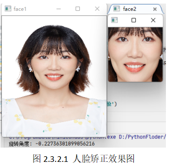
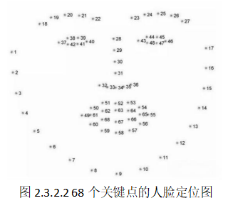
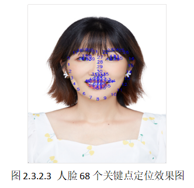
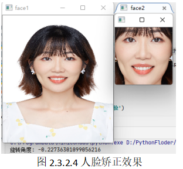

# <center>任务二 人脸矫正</center>

## 【任务描述】

&nbsp;&nbsp;&nbsp;&nbsp;大多数情况下，从视频中截取到的人脸是包含歪头和侧脸的现象，我们就需要进行人脸矫正操作来保证人脸识别的效果。读入一张歪头的人脸图像，请通过人脸矫正调整人脸的显示。效果参考图2.3.2.1。  



## 【学习目标】
&nbsp;&nbsp;&nbsp;&nbsp;**1.知识目标**  
&nbsp;&nbsp;&nbsp;&nbsp;（1）掌握用Dlib库进行人脸关键点检测的方法。  
&nbsp;&nbsp;&nbsp;&nbsp;（2）掌握采用人脸基准点进行人脸对齐的方法。

&nbsp;&nbsp;&nbsp;&nbsp;**2.能力目标**  
&nbsp;&nbsp;&nbsp;&nbsp;（1）能调用api进行人脸关键点检测。  
&nbsp;&nbsp;&nbsp;&nbsp;（2）能采用Python编程进行基于人脸基准点的人脸对齐。  
&nbsp;&nbsp;&nbsp;&nbsp;**3.素质素养目标**  
&nbsp;&nbsp;&nbsp;&nbsp;（1）培养学生关注工作质量和工作效率的职业素养；   
&nbsp;&nbsp;&nbsp;&nbsp;（2）培养学生树立正确的容貌观；  
&nbsp;&nbsp;&nbsp;&nbsp;（3）培养学生树立肖像保护意识。  
## 【任务分析】
&nbsp;&nbsp;&nbsp;&nbsp;**1.重点**  
&nbsp;&nbsp;&nbsp;&nbsp;调用api进行人脸关键点检测及人脸对齐。  
&nbsp;&nbsp;&nbsp;&nbsp;**2.难点**  
&nbsp;&nbsp;&nbsp;&nbsp;采用Python编程实现基于人脸基准点的人脸对齐。  
## 【知识链接】
&nbsp;&nbsp;&nbsp;&nbsp;我们进行人脸识别的时候正脸的效果是最好的，所以在人脸识别前还需要完成人脸矫正。人脸矫正是一个中间步骤，在人脸矫正之前需要先进行人脸检测，保存人脸区域后进行人脸对齐，然后基于人脸的关键点进行人脸矫正。人脸对齐的结果可以用于人脸识别、属性计算、表情识别等。  
**一、人脸关键点定位和检测**
&nbsp;&nbsp;&nbsp;&nbsp;人脸关键点定位(Facial landmark localization）是在人脸检测的基础上，根据输入的人脸图像自动定位出面部关键特征点。人脸关键点大致分三类：１）标记人脸上的器官，比如眼角、嘴角等；２）某个方向上的最高点或曲率极值点，比如嘴角；３）前两类点的插值点，比如脸颊轮廓中的点等。常用的人脸关键点数据库中标注的人脸关键点个数有5个点、49个点或68个点等，可以调用相应的工具包实现。  
&nbsp;&nbsp;&nbsp;&nbsp;人脸关键点检测方法大致分为三种，分别是：1）基于模板的传统方法；2）基于级联形状回归的方法；3）基于深度学习的方法。基于参数化形状模型的方法可依据其外观模型的不同，可进一步分为，基于局部的方法和基于全局的方法；对于非参数化进一步可分为基于样例的方法、基于图模型的方法、基于级联回归的方法和基于深度学习的方法。目前，应用最广的、精度最高的是基于深度学习的方法。  
&nbsp;&nbsp;&nbsp;&nbsp;我们常用的dilb库提供的正向人脸68个点特征的人脸检测模型就是一个10级的训练好的集成回归树算法模型，首先用标注好人脸图像特征点的训练集进行输入回归树模型进行训练。模型为级联的10个回归树，每个回归树中有500个弱回归器，每个树的深度为5，使用梯度提升算法，使用残差不断回归，拟合误差，得到最终的回归树模型。   
&nbsp;&nbsp;&nbsp;&nbsp;**二、人脸对齐（矫正）**  
&nbsp;&nbsp;&nbsp;&nbsp;人脸对齐是以人脸检测获得的人脸图像区域为输入，通过定位人脸上的基准点（例如眼睛，鼻子等），结合标准图上基准点的坐标建立一个特定的变换，然后将待测试人脸图像变换至标准的姿态。以降低人脸图像上的干扰因素，从而极大地提高后续识别任务的成功率。因此，人脸对齐是人脸识别系统中的关键环节。这里我们的人脸矫正就是实现人脸对齐。  
&nbsp;&nbsp;&nbsp;&nbsp;人脸矫正首先需要进行人脸关键点定位，然后利用定位信息计算旋转角度、进行坐标变换，最后通过人脸仿射变换完成矫正。  
&nbsp;&nbsp;&nbsp;&nbsp;**1.使用dlib进行人脸关键点定位**
&nbsp;&nbsp;&nbsp;&nbsp;一种比较简单的人脸检测的方法，就是使用Dlib进行人脸检测（dlib 可使用pip3 install dlib 安装）。Dlib 库是一个包含常用机器学习算法的开源工具包，Dlib库中内置了多种人脸检测器。这里我们使用Dlib已训练好的正向人脸 68 点特征的人脸检测模型：**shape_predictor_68_face_landmarks.dat**（百度网盘下载链接: https://pan.baidu.com/s/ 1JZm2p8ccKUbdAVGlSuebNg 提取码: wgun）。使用dlib进行人脸关键点定位的代码如下：     


```python
import cv2
import dlib

detector=dlib.get_frontal_face_detector()
predictor=dlib.shape_predictor('shape_predictor_68_face_landmarks.dat')

img=cv2.imread('opencv_image/lena.jpg')
print(img)
gray=cv2.cvtColor(img,cv2.COLOR_BGR2GRAY)
dets=detector(gray,1) #获得人脸个数
for k,d in enumerate(dets):
    shape=predictor(img,d)
    for i in range(68):
        cv2.circle(img,(shape.part(i).x,shape.part(i).y),
                   1,(0,255,0),-1,8)
        cv2.putText(img,str(i),(shape.part(i).x,shape.part(i).y),
                                cv2.FONT_HERSHEY_SIMPLEX,.5,(255,0,0),1)
cv2.imshow('face',img)
cv2.waitKey(0)

```

&nbsp;&nbsp;&nbsp;&nbsp;在dlib中，定义人脸有68特征,如图所示,我们可以通过循环，一个一个画出来。人脸的关键点如如同2.3.2.2所示，对图像进行68个特征点关键点定位效果如图：

<center></center>


&nbsp;&nbsp;&nbsp;&nbsp;程序运行结果如图2.3.2.3所示。

<center></center>  


&nbsp;&nbsp;&nbsp;&nbsp;**2.人脸矫正**

&nbsp;&nbsp;&nbsp;&nbsp;人脸矫正的前提是已经获得了人脸的关键点，我们将会使用人脸的关键点进行人脸矫正，具体包括以下下4个步骤。  

&nbsp;&nbsp;&nbsp;&nbsp;step1：人脸关键点检测  
&nbsp;&nbsp;&nbsp;&nbsp;Step2:人脸旋转角度计算  
&nbsp;&nbsp;&nbsp;&nbsp;Step3:坐标变换  
&nbsp;&nbsp;&nbsp;&nbsp;Step4:人脸仿射变换  
下面我以使用人脸图像为例进行人脸矫正。  
&nbsp;&nbsp;&nbsp;&nbsp;Step1：检测人脸图像中的68个关键点，代码如下。细心的同学会发现，在get_face() 函数中有个correct_face()函数未实现，这就是我们下一步要完成的任务。

```python
import dlib
import cv2
import numpy as np
import math

detector=dlib.get_frontal_face_detector()
predictor=dlib.shape_predictor('shape_predictor_68_face_landmarks.dat')

#得到人脸
def get_face(image_path,save=False):
    image=cv2.imread(image_path)
    gray = cv2.cvtColor(image, cv2.COLOR_BGR2GRAY)
    dets = detector(gray, 1)  # 获得人脸个数
    # print(dets)
    face=None
    if len(dets)==0:
        print('未检测到人脸')
    else:
        face=correct_face(image, dets)
        if save:
            path=image_path.split('.')[0]
            cv2.imwrite(path+'.jpg',face)
    return face

if __name__ == '__main__':
    image_path = r'D:\GPU_SY\Opencv\opencv_image\face1.jpg'
    face = get_face(image_path)
    cv2.imshow('img', face)
    cv2.waitKey(0)
```

&nbsp;&nbsp;&nbsp;&nbsp;Step2:人脸旋转角度计算，完成correct_face()函数，实现代码如下：

```python
# 人脸矫正
def correct_face(image,rects,size=128):
    shape=predictor(image,rects[0])
    x,y,w,h=get_face_rect(rects[0])
    # 获得左右眼的坐标
    x1,y1= shape.part(36).x, shape.part(36).y
    x2,y2 = shape.part(45).x, shape.part(45).y

    # 获取人脸区域
    face=image[y:h,x:w]
    width, height = face.shape[1], face.shape[0]
    # 获取左右眼的夹角
    h1=y2-y1
    w1=x2-x1
    a1=np.arctan(h1/w1)

    a = math.degrees(a1)  # 弧度转角度
    print('旋转角度：%s°' % a)

    # 这里使用弧度制
    points=get_trainpose_point(x,y,w,h,a1)
    points=np.array(points,np.float32)

    # 将 旋转后的坐标 仿射变换到新的坐标
    new_point=np.array([[0,0],[size,0],[size,size]],np.float32)
    A1=cv2.getAffineTransform(points,dst=new_point)
    d1=cv2.warpAffine(image,A1,(size,size),borderValue=125)

    return d1
```


&nbsp;&nbsp;&nbsp;&nbsp;correct_face()函数中，也有2个函数为实现，分别是get_face_rect()用来获取人脸ROI区域，以及get_trainpose_point()用来进行坐标变换。   
&nbsp;&nbsp;&nbsp;&nbsp;Step3:完成get_face_rect()获取人脸ROI区域，然后完成get_trainpose_point()进行坐标变换。get_face_rect()代码为如下：   


```python
# 获得人脸区域
def get_face_rect(rects):
    x = rects.left()
    y = rects.top()
    w = rects.right()
    h = rects.bottom()
    return x,y,w,h
```

&nbsp;&nbsp;&nbsp;&nbsp;get_trainpose_point()用来对左边进行变换，这里我们是使用两只人眼(分别是36和45号关键点)与水平的夹角来计算人脸的旋转角度a。    

&nbsp;&nbsp;&nbsp;&nbsp;Step4:在获得旋转角度a后，根据旋转公式（假设对图片上任意点(x,y)，绕一个坐标点(rx0,ry0)逆时针旋转a角度后的新的坐标设为(x0, y0)，    
<center>x0= (x - rx0)*cos(a) - (y - ry0)*sin(a) + rx0</center>  
<center>y0= (x - rx0)*sin(a) + (y - ry0)*cos(a) + ry0</center>  
 这样即可获得变换后的人脸坐标，具体代码如下：  


```python
x0= (x - rx0)*cos(a) - (y - ry0)*sin(a) + rx0
y0= (x - rx0)*sin(a) + (y - ry0)*cos(a) + ry0
```


&nbsp;&nbsp;&nbsp;&nbsp;可以获得变换后的人脸坐标，具体代码如下：

```python
# 获得人脸旋转后的坐标
def get_trainpose_point(x,y,w,h,angle):
    # 求三角函数值 这里默认使用弧度制，所以输入的是弧度
    sina=math.sin(angle)
    cosa=math.cos(angle)

    # 获得矩形的宽高
    height=h-y
    weidth=w-x

    # 获得中心点坐标
    centerx=int(x+weidth/2)
    centery=int(y+height/2)

    # 分别获得当前 左上角 右上角 右下角的坐标
    left_point=np.array([x,y])
    top_right_point=np.array([w,y])
    bottom_right_point=np.array([w,h])

    # 组合
    points=np.concatenate((left_point,top_right_point,bottom_right_point))

    # 分别获得旋转后的左上角右上角 右下角的坐标
    points[0]=(points[0] - centerx) * cosa - (points[1] - centery) * sina + centerx
    points[1]=(points[0] - centerx) * sina + (points[1] - centery) * cosa + centery

    points[2] = (points[2] - centerx) * cosa - (points[3] - centery) * sina + centerx
    points[3] = (points[2] - centerx) * sina + (points[3] - centery) * cosa + centery

    points[-2]=(points[-2] - centerx) * cosa - (points[-1] - centery) * sina + centerx
    points[-1]=(points[-2] - centerx) * sina + (points[-1] - centery) * cosa + centery

    return points.reshape(-1,2)
```

&nbsp;&nbsp;&nbsp;&nbsp;程序运行结果参考图2.3.2.4：  




## 【素质素养养成】
（1）通过关键点检测培养学生提炼关键点来提高解决问题效率的方法。  
（2）通过人脸矫正的原理培养学生培养进行数据清洗和采集中规范操作、提高数据质量的职业意识。  
（3）通过人脸矫正帮助学生树立正确的肖像保护意识，树立正确的容貌观。  
## 【任务分组】  
<center>学生任务分配表</center>
[学生任务分配表](https://docs.qq.com/sheet/DWVpHVlFySlRGc1dC)  
### 【任务实施】 
<center>任务工作单1：人脸关键点检测</center>  
组号：————————           姓名：————————            学号：————————           检索号： ————————     
**引导问题：**               
（1）人脸关键点定位是什么？ 
————————————————————————————————————————  


（2）选择dlib库，进行人脸关键点检测，共68个关键点，也可以考虑face++(106个)(可能要收费), stasm(77个)。

———————————————————————————————————————— 
（3）在人脸图像上，采用circle函数绘制出人脸的68个关键点。代码和效果截图。

————————————————————————————————————————  
<center>任务工作单2：确定人脸矫正操作步骤</center>  
组号：————————           姓名：————————            学号：————————           检索号： ————————     
**引导问题：**               
（1）为什么要进行人脸矫正？

————————————————————————————————————————  
（2）人脸矫正需要经过哪些环节，每个环节怎么实现。

————————————————————————————————————————    
<center>任务工作单3：人脸矫正操作步骤优化</center>  
组号：————————           姓名：————————            学号：————————           检索号： ————————     
**引导问题：**               
（1）小组讨论交流，教师参与引导。确定人脸矫正的实现环节和对应的方法。？

————————————————————————————————————————  
（2）请记录自己在人脸矫正操作过程中出现的问题。

————————————————————————————————————————   
<center>任务工作单4：人脸矫正实现流程（展示汇报）</center>  
组号：————————           姓名：————————            学号：————————           检索号： ————————     
**引导问题：**               
（1）每小组推荐一位小组长，汇报实现过程，借鉴各组分享的经验，进一步优化实现方法。

————————————————————————————————————————  
（2）检查自己不足的地方。

————————————————————————————————————————     
<center>任务工作单5：人脸矫正实施</center>  
组号：————————           姓名：————————            学号：————————           检索号： ————————     
**引导问题：**               
（1）按照正确的流程和实现方法，对人脸图像的人脸进行矫正。

————————————————————————————————————————  
（2）检查自己不足的地方。

————————————————————————————————————————  
**评价反馈**  
 <center>个人评价表</center>  
组号：————————           姓名：————————            学号：————————           检索号： ————————  
链接：[个人评价表](https://docs.qq.com/sheet/DWU9yclpISXdIeVhj)  

<center>小组内互评表</center>  
组号：————————           姓名：————————            学号：————————           检索号： ————————  
链接：[小组内互评表](https://docs.qq.com/sheet/DWWpXU3drTlBzSlBC)  

<center>小组间互评表</center>  
被评组号：————————           检索号：————————    
链接：[小组间互评表](https://docs.qq.com/sheet/DWUxXRkhJaVFJeUJU)

<center>教师评价表-任务工作单4</center>  
组号：————————           姓名：————————            学号：————————           检索号： ————————  
链接：[教师评价表](https://docs.qq.com/sheet/DWXJqak1xTUJkaGJK)