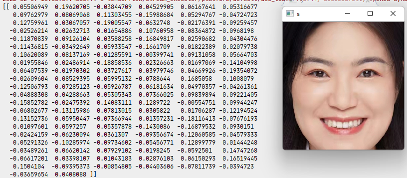
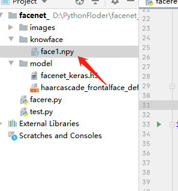

## <center>任务2.3.2 人脸特征提取</center>

### 【任务描述】

&nbsp;&nbsp;&nbsp;&nbsp;输入一张人脸图像，调用face_net模型输出对应的人脸特征向量。完成后效果参考图2.3.3.1。


图2.3.3.1人脸特征向量提取效果


### 【学习目标】
&nbsp;&nbsp;&nbsp;&nbsp;**1.知识目标**  
&nbsp;&nbsp;&nbsp;&nbsp;（1）了解人脸特征提取的流程和方法；  
&nbsp;&nbsp;&nbsp;&nbsp;（2）掌握调用人脸识别模型进行人脸特征提取的方法；  
&nbsp;&nbsp;&nbsp;&nbsp;**2.能力目标**   
&nbsp;&nbsp;&nbsp;&nbsp;（1）能调用人脸识别模型进行人脸特征提取并存储；  
&nbsp;&nbsp;&nbsp;&nbsp;（2）能利用人脸特征进行人脸识别。  
&nbsp;&nbsp;&nbsp;&nbsp;**3.素质素养目标** 
&nbsp;&nbsp;&nbsp;&nbsp;（1）培养学生树立人类命运共同体意识；  
&nbsp;&nbsp;&nbsp;&nbsp;（2）培养学生遵守规范的意识；  
&nbsp;&nbsp;&nbsp;&nbsp;（3）培养学生探索多种方法解决问题的思维意识    
### 【任务分析】  
&nbsp;&nbsp;&nbsp;&nbsp;**1.重点**  
&nbsp;&nbsp;&nbsp;&nbsp;调用face_net模型进行人脸特征提取  
&nbsp;&nbsp;&nbsp;&nbsp;**2.难点**  
&nbsp;&nbsp;&nbsp;&nbsp;理解人脸特征提取的原理  
### 【知识链接】  
&nbsp;&nbsp;&nbsp;&nbsp;**一、人脸特征和人脸体征提取方法**  
&nbsp;&nbsp;&nbsp;&nbsp;特征提取是指通过一些数字来表征人脸信息。常见的人脸特征分为两类：几何特征和表征特征。  
&nbsp;&nbsp;&nbsp;&nbsp;几何特征是指眼睛、鼻子和嘴等面部特征之间的几何关系，如距离、面积和角度等。各器官之间欧氏距离、角度及其大小和外形被量化成一系列参数，来衡量人脸特征，所以对眼、鼻、嘴等的定位就是一个很重要的工作。由于算法利用了一些直观的特征，计算量小。但是几何特征所需的特征点不能精确选择，限制了它的应用范围。另外，当光照变化、人脸有外物遮挡、面部表情变化时，几何特征变化较大，很不鲁棒。  
&nbsp;&nbsp;&nbsp;&nbsp;表征特征利用人脸图像的灰度信息，通过一些算法提取全局或局部特征。常见的特征提取算法有主成分特征分析（PCA）算法，BP神经网络识别方法，以及Gabor特征提取算法等。  
&nbsp;&nbsp;&nbsp;&nbsp;PCA（Principal Component Analysis）是一种常用的数据分析方法，PCA通过线性变换将原始数据变换为一组各维度线性无关的表示，可用于提取数据的主要特征分量，可用于高维数据的降维。基于PCA的人脸识别方法通过只保留某些关键像素进行人脸特征的提取，可以使识别速度大大提升。  
&nbsp;&nbsp;&nbsp;&nbsp;LBP(Local Binary Patterns)方法首先将图像分成若干区域，在每个区域的邻域中用中心值作阈值化，将结果看成是二进制数。LBP算子的特点是对单调灰度变化保持不变。每个区域通过这样的运算得到一组直方图，然后将所有的直方图连起来组成一个大的直方图并进行直方图匹配计算进行分类。基于LBP的人脸特征提取是采用将人脸图像分块，统计每块中的人脸纹理特征。  
&nbsp;&nbsp;&nbsp;&nbsp;BP(back propagation)神经网络是一种按照误差逆向传播算法训练的多层前馈神经网络，是应用最广泛的神经网络模型之一。BP神经网络具有任意复杂的模式分类能力和优良的多维函数映射能力。BP网络具有输入层、隐藏层和输出层，BP算法就是以网络误差平方为目标函数、采用梯度下降法来计算目标函数的最小值。   
&nbsp;&nbsp;&nbsp;&nbsp;**二、facenet模型**  
&nbsp;&nbsp;&nbsp;&nbsp;FaceNet模型由Google工程师Florian Schroff，Dmitry Kalenichenko，James Philbin提出的一种人脸识别解决方案，是一个对识别（即：这是谁？）、验证（即：这是同一个人吗？）、聚类（即：在这些面孔中找到同一个人）等问题的统一解决框架。 FaceNet模型主要思想是把人脸图像映射到一个多维空间，通过空间距离表示人脸的相似度。即它们都可以放到特征空间里统一处理，只需要专注于解决的仅仅是如何将人脸更好的映射到特征空间。其本质是通过卷积神经网络学习人脸图像到128维欧几里得空间的映射，该映射将人脸图像映射为128维的特征向量，使用特征向量之间的距离的倒数来表征人脸图像之间的“相关系数”，对于相同个体的不同图片，其特征向量之间的距离较小（即是同一个人的可能性大），对于不同个体的图像，其特征向量之间的距离较大（即是同一个人的可能小）。最后基于特征向量之间的距离大小来解决人脸图像的识别、验证和聚类等问题  
 &nbsp;&nbsp;&nbsp;&nbsp;**三、提取人脸特征向量**  
&nbsp;&nbsp;&nbsp;&nbsp;目前比较主流的人脸特征提取方法是把人脸图像通过神经网络，得到一个特定维数的特征向量，该向量可以很好地表征人脸数据，使得不同人脸的两个特征向量距离尽可能大，同一张人脸的两个特征向量尽可能小，这样就可以通过特征向量来进行人脸识别。这就是FaceNet模型的解决方案。  
&nbsp;&nbsp;&nbsp;&nbsp;在人脸特征提取开始之前，我们需要有一个已训练好了的face_net模型，可以到如下地址中获得。  
&nbsp;&nbsp;&nbsp;&nbsp;人脸特征提取的第一步就是要把人脸从图片中获取出来，根据任务1的流程我们很容易就可以获得人脸ROI图片，这里可以将任务1的实现过程封装起来，方便后面直接调用。参考代码如下：    


```python
import tensorflow.keras as k
import os
import cv2
import numpy as np
import matplotlib.pyplot as plt

# 获得人脸ROI区域
def get_face_roi(img):
    gray = cv2.cvtColor(img, cv2.COLOR_BGR2GRAY)
    faces = face_date.detectMultiScale(gray, 1.3, 5)
    for face in faces:
        x, y, w, h = face
        img = img[y:y+h,x:x+w]
    return img
```

&nbsp;&nbsp;&nbsp;&nbsp;接下来，我们定义一个函数get_face_features（）用来获取人脸特征，参考代码如下：  

```python
# 获得人脸特征
def get_face_features(img):
    # 将图片缩放为模型的输入大小
    image = cv2.resize(img,(160,160))
    image = np.asarray(image).astype(np.float64)/255.
    image = np.expand_dims(image,0)
    # 使用模型获得人脸特征向量
    features  = model.predict(image)
# 标准化数据
features = features / np.sqrt(np.maximum(np.sum(np.square(features), axis=-1, keepdims=True), 1e-10))

    return features
```

&nbsp;&nbsp;&nbsp;&nbsp;最后，在main函数中调用这2个函数，即可获得人脸特征向量，参考代码如下:  

```python
if __name__ == '__main__':
    # 加载模型
    face_date = cv2.CascadeClassifier('model\haarcascade_frontalface_default.xml')
    model = k.models.load_model(r'model\facenet_keras.h5')
    model.summary()

    # 加载图片
    image_path = r'images\face1.jpg'
    img= cv2.imread(image_path)
    img_roi = get_face_roi(img)
    features = get_face_features(img_roi)
    print(features)
    # 显示特征
    plt.imshow(features)
    plt.show()

    cv2.imshow('s',img_roi)
    cv2.waitKey(0)
```

程序运行结果参考图2.3.3.1。  


&nbsp;&nbsp;&nbsp;&nbsp;**四、人脸特征库搭建**

&nbsp;&nbsp;&nbsp;&nbsp;人脸特征库搭建有一个最简单的方法，就是直接保存人脸图片即可，但是这种方式有两个缺点：1.在进行网路传输时开销较大；2.在终端进行加载时速度较慢（因为需要重新找到人脸，获取特征），所以为了更好的性能，一般会直接提取人脸的特征进行保存。具体操作也十分简单，在get_face_features()添加如下代码即可：

```python
# 获得人脸特征
def get_face_features(img):
    # 将图片缩放为模型的输入大小
    image = cv2.resize(img,(160,160))
    image = np.asarray(image).astype(np.float64)/255.
    image = np.expand_dims(image,0)
    # 使用模型获得人脸特征向量
    features  = model.predict(image)
    # 标准化数据
    features = features / np.sqrt(np.maximum(np.sum(np.square(features), axis=-1, keepdims=True), 1e-10))

    # 添加代码-------------------
    np.save(r'knowface\face1',features)
    # ----------------------------------
    return features
```

&nbsp;&nbsp;&nbsp;&nbsp;运行后即可在项目目录中看到face1.npy文件，这就是我们已经保存好的人脸特征了。多次修改图片地址，就可以搭建好一个人脸特征库了。  
 

&nbsp;&nbsp;&nbsp;&nbsp;读取*.npy文件的代码如下：

```python
import numpy as np
data = np.load(r'knowface\face1.npy')
print(data)
```

### 【素质素养养成】  
&nbsp;&nbsp;&nbsp;&nbsp;(1)通过选取不同数量特征工具包、了解不同的人脸特征提取方法的优缺点培养学生探索多种方法解决问题的思维方式；  
&nbsp;&nbsp;&nbsp;&nbsp;(2)通过不同人种、不同民族的人脸特征都是一组向量数据，培养学生树立全球意识、人类命运共同体的意识；  
&nbsp;&nbsp;&nbsp;&nbsp;(3)通过构建人脸特征库引导学生在多种方法综合考量客观情况来选择最优方式的职业素养。  
### 【任务分组】  
<center>学生任务分配表</center>
链接:[学生任务分配表](https://docs.qq.com/sheet/DWVpHVlFySlRGc1dC)  
### 【任务实施】 
<center>任务工作单1：认知人脸特征向量</center>  
组号：————————           姓名：————————            学号：————————           检索号： ————————     
**引导问题：**               
（1）人脸特征向量是什么？ 

---  
（2）人脸识别为什么要提取人脸特征向量？

---  
（3）简述常用的人脸特征向量提取方法有哪些？总结各自的优缺点

---  
<center>任务工作单2：人脸特征向量提取方法探究</center>  
组号：————————           姓名：————————            学号：————————           检索号： ————————                 
（1）人脸特征向量是什么？ 

---  
（2）人脸识别为什么要提取人脸特征向量？

---  
（3）简述常用的人脸特征向量提取方法有哪些？总结各自的优缺点

---  
<center>任务工作单3：人脸特征向量提取方法（讨论）</center>  
组号：————————           姓名：————————            学号：————————           检索号： ————————                  
（1）小组交流讨论，确定人脸特征向量提取的完整流程和每个环节的实现方法，将人脸特征向量保存到本地。

---  
（2）请记录自己在进行人脸特征提取过程中的错误。

---  
<center>任务工作单4：人脸特征向量提取方法（汇报）</center>  
组号：————————           姓名：————————            学号：————————           检索号： ————————                   
（1）每小组推荐一位小组长，汇报人脸特征提取和保存的实现过程，借鉴各组分享的经验，进一步完善实现的步骤。

---  
（2）总结别的小组的优点、自查自己存在的不足。

---  
<center>任务工作单4：人脸特征提取实现</center>  
组号：————————           姓名：————————            学号：————————           检索号： ————————                   
（1）按照正确的流程和方法按照要求完成人脸特征向量提取并保存人脸特征库。

---  
（2）检查自己不足的地方。

---  
**评价反馈**  
 <center>个人评价表</center>  
组号：————————           姓名：————————            学号：————————           检索号： ————————  
链接:[个人评价表](https://docs.qq.com/sheet/DWU9yclpISXdIeVhj)  

<center>小组内互评表</center>  
组号：————————           姓名：————————            学号：————————           检索号： ————————  
链接:[小组内互评表](https://docs.qq.com/sheet/DWWpXU3drTlBzSlBC)  

<center>小组间互评表</center>  
被评组号：————————           检索号：————————    
链接:[小组间互评表](https://docs.qq.com/sheet/DWUxXRkhJaVFJeUJU)

<center>教师评价表-任务工作单4</center>  
组号：————————           姓名：————————            学号：————————           检索号： ————————  
链接:[教师评价表](https://docs.qq.com/sheet/DWXJqak1xTUJkaGJK)


