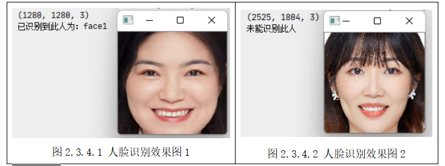
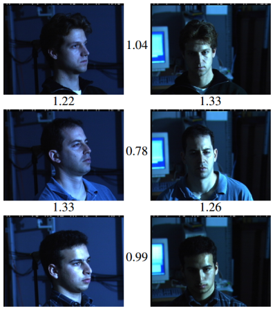
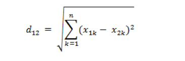
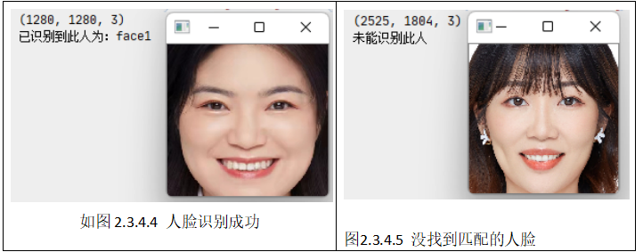

## 任务四 人脸识别

### 【任务描述】

&nbsp;&nbsp;&nbsp;&nbsp;输入一张人脸正脸的图像，对比人脸特征库，输出该图像中的人是谁（效果参考图2.3.4.1)或者输出未能识别此人（效果参考图2.3.4.2)。  




### 【学习目标】  
&nbsp;&nbsp;&nbsp;&nbsp;**1.知识目标**  
&nbsp;&nbsp;&nbsp;&nbsp;（1）理解人脸识别的概念；  
&nbsp;&nbsp;&nbsp;&nbsp;（2）理解人脸识别的原理。  
&nbsp;&nbsp;&nbsp;&nbsp;**2.能力目标**  
&nbsp;&nbsp;&nbsp;&nbsp;（1）能利用人脸特征库进行人脸识别；  
&nbsp;&nbsp;&nbsp;&nbsp;**3.素质素养目标**  
&nbsp;&nbsp;&nbsp;&nbsp;（1）培养学生树立技术服务人类的意识；  
&nbsp;&nbsp;&nbsp;&nbsp;（2）培养学生遵守规范、脚踏实地的工作作风；  
&nbsp;&nbsp;&nbsp;&nbsp;（3）培养学生认识量变质变的发展规律。  
&nbsp;&nbsp;&nbsp;&nbsp;（4）培养学生的法律法规意识。  
### 【任务分析】
&nbsp;&nbsp;&nbsp;&nbsp;**1.重点**  
&nbsp;&nbsp;&nbsp;&nbsp;利用人脸特征库完成人脸识别并输出结果。  
&nbsp;&nbsp;&nbsp;&nbsp;**2.难点**  
&nbsp;&nbsp;&nbsp;&nbsp;理解人脸识别的原理。  
### 【知识链接】  
&nbsp;&nbsp;&nbsp;&nbsp;**一、人脸识别概念和原理**  
&nbsp;&nbsp;&nbsp;&nbsp;经过前面的几个任务我们已经学会如何进行人脸检测、人脸矫正以及人脸特征提取了，那么提取的特征向量有什么作用呢？  
&nbsp;&nbsp;&nbsp;&nbsp;人脸识别(Facial Recognition)是指通过视频采集设备获取用户的面部图像，再利用核心的算法对其脸部的五官位置、脸型和角度进行计算分析，进而与通过特征向量提取完成的人脸特征库数据进行比对，从而判断出用户的真实身份。事实上当我们直接通过CNN学习一副输入人脸图像的欧式空间特征时，两幅图像特征向量间的欧式距离越小，表示两幅图像是同一个人的可能性越大。一旦有了这个人脸图像特征提取模型，那么人脸验证就变成了两幅图像相似度和指定阈值比较的问题。这就是人脸特征向量的作用。  
&nbsp;&nbsp;&nbsp;&nbsp;如图2.3.4.3所示，无论是改变光照还是角度，相同人之间的特征距离都要小于不同人之间的特征距离，所以我们只要通过判断特征距离是否小于某个阈值就可以判断是否是同一个人来实现人脸识别。  
<center></center>

<center>图2.3.4.3 人脸的特征距离展示 </center>
&nbsp;&nbsp;&nbsp;&nbsp;人脸识别技术在日常生活中主要有两种用途，一种用来进行人脸验证即人脸比对，用来判断“你是不是某人”，还有一种用于人脸识别，用来判断“你是谁”。   
&nbsp;&nbsp;&nbsp;&nbsp;人脸验证采用的是1：1的比对，本质上是机器对当前人脸与人脸数据库进行快速人脸比对并得出是否匹配的过程，可以简单理解为证明“张三是不是张三”。  
&nbsp;&nbsp;&nbsp;&nbsp;人脸识别采用的是1：N的比对，即采集了“张三”的一张照片之后，从海量的人脸数据库中找到与当前这张“张三”人脸数据相符合的图像并进行匹配，获得“张三是谁”的结果。人脸识别应用场景很多，比如疑犯追踪、寻亲、门禁、考勤签到等   
&nbsp;&nbsp;&nbsp;&nbsp;**二、欧氏距离**  
&nbsp;&nbsp;&nbsp;&nbsp;欧氏距离是最易于理解的一种距离计算方法，源自欧氏空间中两点间的距离公式，若存在两个n维向量a(x11,x12,…,x1n)与 b(x21,x22,…,x2n)，那么他们之间的距离可表示为：  
  <center></center>  
&nbsp;&nbsp;&nbsp;&nbsp;在python中的实现如下：

```python
import numpy as np

def  get_distance(image1,image2):
    l1 = np.sqrt(np.sum(np.square(image1 - image2), axis=-1))
    return l1
```

 &nbsp;&nbsp;&nbsp;&nbsp;**三、人脸识别**

&nbsp;&nbsp;&nbsp;&nbsp;获取人脸特征向量后我们就可以利用欧氏距离方法计算人脸距离，有了人脸距离我们就可以给定阈值，然后通过阈值判断是否是同一个人了。   
&nbsp;&nbsp;&nbsp;&nbsp;首先，我们先加载人脸特征库中的数据，代码如下：

```python
from  facefeatures import get_face_roi,get_face_features
import numpy as np
import cv2
import  os


# 加载人脸特征
def load_know_face(path):
    npy_paths = [os.path.join(path ,p) for p in os.listdir(path)]
    data =[]
    face_names = []
    for npy_path in npy_paths:
        name = npy_path.split('\\')[-1].split('.')[0]
        face_names.append(name)
        data.append(np.load(npy_path)[0])
    return data,face_names
```

&nbsp;&nbsp;&nbsp;&nbsp;接着，在main中写入如下代码，即可制作一个简易的人脸识别程序，由于我们这里调用了上一个任务中的函数，所以记得把get_face_features()中保存特征的代码去掉。

```python
if __name__ == '__main__':
    face_know_features,face_names = load_know_face('knowface')
    # 加载要识别的人的图片
    image_path = r'images\huge2.jpg'
    img= cv2.imread(image_path)
    img_roi = get_face_roi(img)
    #获得特征 
    features = get_face_features(img_roi)
    # 计算人脸距离
    distance = get_distance(face_know_features,features)

    # 判断最小的距离是否小于阈值
    min_dis_index = distance.argmin()
    if distance[min_dis_index]<0.7:
        print('已识别到此人为：%s'%face_names[min_dis_index])
    else:
        print('未能识别此人')
```

&nbsp;&nbsp;&nbsp;&nbsp;程序运行结果如图2.3.4.4和图2.3.4.5所示。第一张识别huge2.jpg，由于之前已经录入huge1.jpg的人脸特征，所以获得的结果是“已识别到此人为:huge1”，而第二张由于没有提前录入人脸(即人脸特征库里面是没有的），所以结果是“未能识别此人”。

  


### 【素质素养养成】  
&nbsp;&nbsp;&nbsp;&nbsp;(1)通过人脸识别的应用场景引导学生技术服务人类的意识；  
&nbsp;&nbsp;&nbsp;&nbsp;(2)通过人脸识别应用场景的学习，引导关注学生人脸数据如果被滥用的恶劣影响，树立法律意识；  
&nbsp;&nbsp;&nbsp;&nbsp;(3)人脸识别的整个流程的四个环节，缺一不可，培养学生遵守规则，脚踏实地的工作作风。  
&nbsp;&nbsp;&nbsp;&nbsp;(4)人脸识别中阈值的设定引导学生关注量变到质变的发展规律。  
### 【任务分组】  
<center>学生任务分配表</center>
[学生任务分配表](https://docs.qq.com/sheet/DWVpHVlFySlRGc1dC)  
### 【任务实施】 
<center>任务工作单1：人脸识别认知</center>  
组号：————————           姓名：————————            学号：————————           检索号： ————————     
**引导问题：**               
（1）简述人脸特征向量对人脸识别的作用 

————————————————————————————————————————
（2）人脸识别的原理

————————————————————————————————————————
（3）人脸验证和人脸识别有何不同？

————————————————————————————————————————  
<center>任务工作单2：人脸识别实现流程</center>  
组号：————————           姓名：————————            学号：————————           检索号： ————————     
**引导问题：**               
（1）人脸识别有哪些环节。

————————————————————————————————————————
（2）人脸识别每个环节如何实现？

————————————————————————————————————————
<center>任务工作单3：确定人脸识别实现方法（小组讨论）</center>  
组号：————————           姓名：————————            学号：————————           检索号： ————————     
**引导问题：**               
（1）小组交流讨论，确定人脸识别的完整流程和每个环节的实现方法。

———————————————————————————————————————— 

（2）小组分工，总结人脸识别的原理和应用场景。

———————————————————————————————————————— 

（3）请记录自己在进行人脸特征提取过程中的错误。

———————————————————————————————————————— 

<center>任务工作单4：人脸识别过程（展示汇报）</center>  
组号：————————           姓名：————————            学号：————————           检索号： ————————     
**引导问题：**               
（1）每小组推荐一位小组长，汇报实现过程和人脸识别的应用总结，借鉴各组分享的经验，进一步优化实现的步骤。
————————————————————————————————————————

（2）检查自己不足的地方。
————————————————————————————————————————

<center>任务工作单5：人脸识别实践和总结</center>  
组号：————————           姓名：————————            学号：————————           检索号： ————————     
**引导问题：**               
（1）按照正确的流程和实现方法，输入图像实现人脸识别。


———————————————————————————————————————— 

（2）自查人脸识别实验过程中出现错误的原因。

————————————————————————————————————————
 
### 【评价反馈】  
<center>个人评价表</center>  
组号：————————           姓名：————————            学号：————————           检索号： ————————  
这是链接[个人评价表](https://docs.qq.com/sheet/DWU9yclpISXdIeVhj)  

<center>小组内互评表</center>  
组号：————————           姓名：————————            学号：————————           检索号： ————————  
这是链接[小组内互评表](https://docs.qq.com/sheet/DWWpXU3drTlBzSlBC)  

<center>小组间互评表</center>  
被评组号：————————           检索号：————————    
这是链接[小组间互评表](https://docs.qq.com/sheet/DWUxXRkhJaVFJeUJU)

<center>教师评价表-任务工作单4</center>  
组号：————————           姓名：————————            学号：————————           检索号： ————————  
这是链接[教师评价表](https://docs.qq.com/sheet/DWXJqak1xTUJkaGJK)
