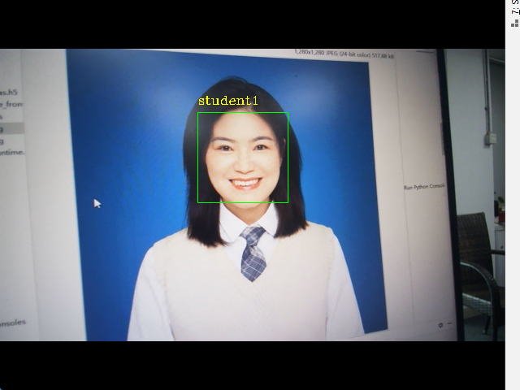
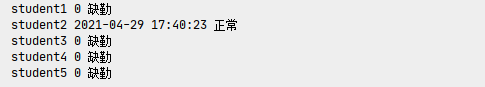
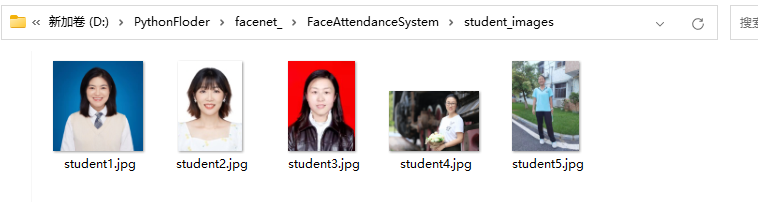
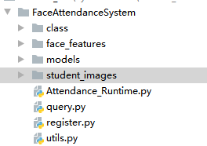
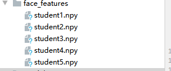
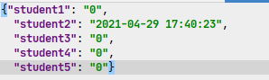

## <center>任务2.3.5 简易人脸识别考勤系统</center>

### 【任务描述】

&nbsp;&nbsp;&nbsp;&nbsp;利用任务1-4的人脸识别技术，针对给定的人脸图像库开发一个人脸识别考勤系统，实现人脸实时签到和输出考勤结果。参考结果如图2.3.5.1和图2.3.5.2所示。


图2.3.5.1 实时签到  

图2.3.5.2 输出考勤结果 


### 【学习目标】
&nbsp;&nbsp;&nbsp;&nbsp;**1.知识目标**  
&nbsp;&nbsp;&nbsp;&nbsp;（1）了解人脸识别应用开发流程。  
&nbsp;&nbsp;&nbsp;&nbsp;（2）掌握人脸识别与实际场景的融合方法。  
&nbsp;&nbsp;&nbsp;&nbsp;**2.能力目标**  
&nbsp;&nbsp;&nbsp;&nbsp;（1）能将人脸识别应用到实际场景。  
&nbsp;&nbsp;&nbsp;&nbsp;**3.素质素养目标**  
&nbsp;&nbsp;&nbsp;&nbsp;（1）培养学生树立技术服务人类的意识；  
&nbsp;&nbsp;&nbsp;&nbsp;（2）培养学生认可社会主义核心观，做一个守时、诚信的人。  
### 【任务分析】  
&nbsp;&nbsp;&nbsp;&nbsp;**1.重点**  
&nbsp;&nbsp;&nbsp;&nbsp;人脸识别应用项目的开发。  
&nbsp;&nbsp;&nbsp;&nbsp;**2.难点**  
&nbsp;&nbsp;&nbsp;&nbsp;人脸识别与实际场景的融合。  
### 【知识链接】   
**一、考勤系统功能和框架简介** 
&nbsp;&nbsp;&nbsp;&nbsp;人脸考勤系统是基于人脸识别技术的考勤管理系统，主要用于出勤统计，签到时需要通过摄像头采集签到人员的面部图像,再通过人脸识别算法从采集到的图像中提取特征值并与数据库中预先存入的人脸照片的特征值进行分析比较，根据识别结果和时间判断缺勤、迟到和正常。  
&nbsp;&nbsp;&nbsp;&nbsp;本次任务的简易人脸考勤系统场景为校园学生上课考勤，假设人脸数据可以通过校园管理系统得到。系统的整体流程如下六个环节，图2.3.5.3是项目开发流程图。  
&nbsp;&nbsp;&nbsp;&nbsp;获取上课的学生列表  
&nbsp;&nbsp;&nbsp;&nbsp;为学生注册某一课程  
&nbsp;&nbsp;&nbsp;&nbsp;搭建人脸特征库  
&nbsp;&nbsp;&nbsp;&nbsp;上课前进行人脸识别签到  
&nbsp;&nbsp;&nbsp;&nbsp;通过学生列表以及人脸识别的结果获得考勤记录  
&nbsp;&nbsp;&nbsp;&nbsp;考勤分析  
 
 
图2.3.5.3 校园人脸考勤系统开发流程          
          
**二、开发准备工作**  
&nbsp;&nbsp;&nbsp;&nbsp;在开发考勤系统之前，我们要做一些准备工作，包括人脸图像数据、搭建项目框架和将人脸检测、人脸特征提取和人脸距离计算等功能实现封装。  
&nbsp;&nbsp;&nbsp;&nbsp;首先我们从校园管理系统中获取要进行考勤的学生人脸图像，本项目的测试人脸图像如图2.3.5.4所示。  


图2.3.5.4 人脸图像数据列表 

&nbsp;&nbsp;&nbsp;&nbsp;然后根据需求创建如图2.3.5.5所示的目录结构，class用来存储某一节课的课程信息，face_features用来存储人脸特征库，我们提取到的人脸特征存储到这里，models用来存放haar分类器以及face_net模型，student_images用来存放我们从校园管理系统中获取到的学生人脸图像数据。

  
图2.3.5.5 人脸考勤系统目录结构

&nbsp;&nbsp;&nbsp;&nbsp;接着，我们将任务1、2、3、4中已经编写好了的一些函数放到utils.py文件中，方便后续直接调用，包括获取人脸ROI区域函数、获得人脸特征函数、加载人脸特征函数、计算人脸距离函数，完整的utils.py代码如下：
```python
import tensorflow.keras as k
import os
import cv2
import numpy as np
os.environ['CUDA_VISIBLE_DEVICES'] = "-1"

face_date = cv2.CascadeClassifier('models\haarcascade_frontalface_default.xml')
model = k.models.load_model(r'models\facenet_keras.h5')

# 获得人脸ROI区域
def get_face_roi(img):
    gray = cv2.cvtColor(img, cv2.COLOR_BGR2GRAY)
    faces = face_date.detectMultiScale(gray, 1.3, 5)

    # for face in faces:
    #     x, y, w, h = face
    #     img = img[y:y+h,x:x+w]
    return faces

# 获得人脸特征
def get_face_features(img):
    # 将图片缩放为模型的输入大小
    image = cv2.resize(img,(160,160))
    image = np.asarray(image).astype(np.float64)/255.
    image = np.expand_dims(image,0)
    # 使用模型获得人脸特征向量
    features  = model.predict(image)
    # 标准化数据
    features = features / np.sqrt(np.maximum(np.sum(np.square(features), axis=-1, keepdims=True), 1e-10))
    # 添加代码-------------------
    # np.save(r'knowface\face1',features)
    # --------------------------
    return features

# 加载人脸特征
def load_know_face(path):
    npy_paths = [os.path.join(path ,p) for p in os.listdir(path)]
    data =[]
    face_names = []
    for npy_path in npy_paths:
        name = npy_path.split('\\')[-1].split('.')[0]
        face_names.append(name)
        data.append(np.load(npy_path)[0])
    return data,face_names

# 计算人脸距离
def  get_distance(image1,image2):
    l1 = np.sqrt(np.sum(np.square(image1 - image2), axis=-1))
    return l1
```

**三、批量获取特征**

&nbsp;&nbsp;&nbsp;&nbsp;任务3 中我们获取人脸特征的方式比较简单，这里我们可以优化一下，新建register.py文件，实现将一个文件夹中的图片进行人脸特征的批量提取并自动保存到项目face_features文件夹中，实现代码如下：

```python
import os
from utils import get_face_roi,get_face_features
import cv2
import  numpy as np
from tqdm import tqdm

student_dir='student_images'

student_paths = [os.path.join(student_dir,p) for p in os.listdir(student_dir)]
for student_path in tqdm(student_paths):
    student_name = student_path.split('\\')[-1].split('.')[0]

    image = cv2.imread(student_path)
    face_roi= get_face_roi(image)
    features = get_face_features(face_roi)
    np.save(r'face_features\%s'%student_name,features)
```

&nbsp;&nbsp;&nbsp;&nbsp;程序运行成功后可以在face_features文件夹中得到如图2.3.5.6所示的人脸特征文件。

<center></center>   
<center>图 2.3.5.6 批量提取人脸特征</center> 

**四、实时人脸签到**

&nbsp;&nbsp;&nbsp;&nbsp;新建Attendance_Runtime.py，加载学生人脸图像数据、打开摄像头、初始化化学生签到列表（初始签到情况都是’0’），实现实时签到功能。签到功能主要包括：通过摄像头获取人脸区域、与人脸图像库中每个人脸进行比对计算人脸距离和根据人脸距离与阈值的比较结果给获取到的人脸图像添加签到结果。完整的Attendance_Runtime.py代码为如下：

```python
from utils import get_face_roi,get_face_features,load_know_face,get_distance
import  cv2
import time
import json

# 加载学生数据
student_face_features ,student_names= load_know_face('face_features')
print(student_names)
# 开打摄像头
cam = cv2.VideoCapture(0)

# 初始化学生列表
student_signin_dist={}
for student_name in student_names:
    student_signin_dist[student_name]='0'

while cam :
    _,frame = cam.read()
    # 获得人脸区域
    faces = get_face_roi(frame)
    # 对图像中的每一个人脸进行对比
    for face in faces:
        x, y, w, h = face
        cv2.rectangle(frame,(x,y),(x+w,y+h),(0,255,0),1)
        # 获得人脸roi区域
        img_roi = frame[y:y + h, x:x + w]
        # 获得人脸特征
        face_features = get_face_features(img_roi)
        # 计算人脸距离
        distance = get_distance(student_face_features,face_features)
        print(distance)

        # 判断最小的距离是否小于阈值
        min_dis_index = distance.argmin()
        if distance[min_dis_index] < 0.7:
            student_name= student_names[min_dis_index]
            # print('已识别到此人为：%s' % student_name)
            student_signin_dist[student_name]=time.strftime('%Y-%m-%d %H:%M:%S', time.localtime(time.time()))
            cv2.putText(frame,student_name,(x,y-10),cv2.FONT_HERSHEY_COMPLEX,.5,(0,255,255),1)

        else:
            # print('未能识别此人')
            cv2.putText(frame,'Unknow',(x, y - 10), cv2.FONT_HERSHEY_COMPLEX, .5, (0, 255, 255), 1)
    cv2.imshow('cam',frame)
    # 按下‘q’退出
    if cv2.waitKey(1) ==ord('q'):
        # 记录本次签到结果
        json_ = json.dumps(student_signin_dist)
        with open(r'class\student_att.json', 'w', encoding='utf8') as f:
            f.writelines(json_)
        break
cam.release()
cv2.destroyAllWindows()
```

&nbsp;&nbsp;&nbsp;&nbsp;程序运行后，你将会看到如图的界面，黄色字体为识别到的学生名称，并且使用按键’q’可以退出签到系统。

  
图 2.3.5.7 实时签到成功效果

&nbsp;&nbsp;&nbsp;&nbsp;在退出时会同时保存签到信息成json文件到class文件夹中，签到成功则该学生的签到状态值为签到时间，如若还未签到，则签到状态值还是为’0’。效果参考图2.3.5.8所示。


   
图 2.3.5.8 学生签到状态列表     

**五、考勤分析**  

&nbsp;&nbsp;&nbsp;&nbsp;新建一个query.py文件用来根据学生签完到后的考勤状态json文件来确定学生是迟到、缺勤还是正常，参考代码如下：  


```python
import json
import time

path = 'class\student_att.json'
# 定义上课时间  格式固定
start_class_time ='2021-04-29 17:41:00'
start_class_time_stamp = time.mktime(time.strptime(start_class_time, '%Y-%m-%d %H:%M:%S'))


with open(path, 'r', encoding='utf8') as f:
    class_datas= json.loads(f.read())

class_datas_dict = dict(class_datas)
for name in class_datas_dict.keys():

    att_time = class_datas_dict[name]
    if att_time == '0':
        state = '缺勤'
    else:
        # 如果签到时间大于上课时间则是迟到
        att_time_stamp = time.mktime(time.strptime(att_time, '%Y-%m-%d %H:%M:%S'))
        time_ = start_class_time_stamp-att_time_stamp
        if time_<0:
            state = '迟到'
        else:
            state='正常'
    print(name,att_time,state)
```

&nbsp;&nbsp;&nbsp;&nbsp;程序运行结果如图2.3.5.9所示，我们通过签到的时间来判断学生是否缺勤、迟到和正常。  
   
图2.3.5.9 学生考勤结果列表            
### 【素质素养养成】  
1.在人脸识别技术应用到签到考勤系统的过程中培养学生技术服务人类的意识。    
2.在通过签到时间计算考勤结果的过程中引导学生做一个守时、诚信的人。  
### 【任务分组】  
学生任务分配表
链接:[学生任务分配表](https://docs.qq.com/sheet/DWVpHVlFySlRGc1dC)  
### 【任务实施】  
任务工作单1：人脸识别认知  
组号：————————           姓名：————————            学号：————————           检索号： ————————     
**引导问题：**               
（1）简述人脸考勤系统的原理。

---  
（2）展示你创建的人脸识别项目结构并指出哪个文件夹用来存储人脸特征、哪个文件用来要签到的课程信息，哪个文件夹用来存放haar分类器以及face_net模型，哪个文件夹用来存储学生人脸图像数据

---  
（3）将获取人脸ROI区域、提取人脸特征、计算人脸距离封装成函数。

---    
任务工作单2：人脸考勤系统流程探究  
组号：————————           姓名：————————            学号：————————           检索号： ————————     
**引导问题：**               
（1）开发人脸考勤系统整个流程包括哪些环节？

---  
（2）人脸考勤系统每个环节如何实现。

---  
任务工作单3：人脸考勤系统流程确定（小组讨论） 
组号：————————           姓名：————————            学号：————————           检索号： ————————     
**引导问题：**               
（1）小组交流讨论，确定正确人脸考勤系统开发流程和每个环节的实现方法。

---  
（2）请记录自己在人脸考情系统开发过程中出现的问题。

---  
任务工作单4：开发人脸考勤系统流程（展示汇报）  
组号：————————           姓名：————————            学号：————————           检索号： ————————     
**引导问题：**               
（1）每小组推荐一位小组长，汇报实现过程，借鉴各组分享的经验，进一步优化实现的步骤。

---  
（2）检查自己不足的地方。

---  
---  
任务工作单5：人脸考勤系统开发实践  
组号：————————           姓名：————————            学号：————————           检索号： ————————     
**引导问题：**               
（1）按照正确的流程和实现方法，利用本地摄像头实现人脸考勤系统。

---  
（2）自查人脸考勤系统开发过程中出现错误的原因。

---  
### 【评价反馈】  
个人评价表
组号：————————           姓名：————————            学号：————————           检索号： ————————  
链接:[个人评价表](https://docs.qq.com/sheet/DWU9yclpISXdIeVhj)  

小组内互评表
组号：————————           姓名：————————            学号：————————           检索号： ————————  
链接:[小组内互评表](https://docs.qq.com/sheet/DWWpXU3drTlBzSlBC)  

小组间互评表
被评组号：————————           检索号：————————    
链接:[小组间互评表](https://docs.qq.com/sheet/DWUxXRkhJaVFJeUJU)

教师评价表  
组号：————————           姓名：————————            学号：————————           检索号： ————————  
链接:[教师评价表](https://docs.qq.com/sheet/DWXJqak1xTUJkaGJK)
