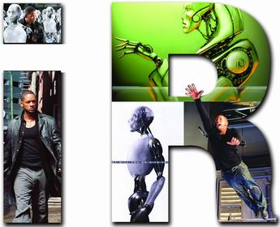
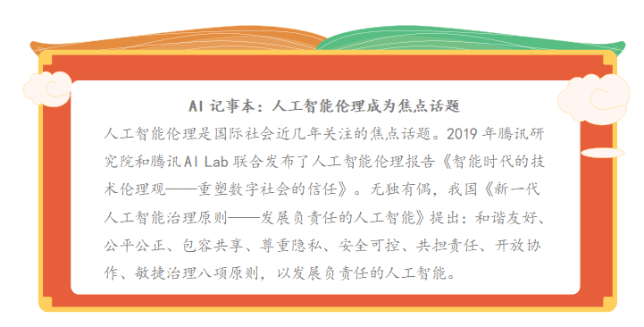

## 任务3.1.2 人工智能伦理探究

### 【任务描述】

&nbsp;&nbsp;&nbsp;&nbsp;假如一辆行驶在路上的自动驾驶汽车，遇到这样困境：如果它继续往前开，就会撞死前车上的5个人；如果它紧急打方向避让，就会冲上人行道撞死1个行人。在这种情形下，人们应该期待自动驾驶汽车如何选择呢？自动驾驶汽车生产厂家该如何设置，才能让汽车做出公认为正当的选择？这引发了人们对人工智能中伦理问题的思考。情景设想是非常简化的，而道德判断远比此更复杂。人工智能自研究开始，关于人工智能的伦理的讨论一直在进行。近年来，随着人工智能技术的不断发展，人工智能的发展取得重大的突破，人工智能相关伦理研究日益广泛，也必将深刻影响着我们的工作与生活。阅读材料、搜索网络资源，了解人工智能在发展过程中带来的伦理问题。

### 【学习目标】

#### 1.知识目标
&nbsp;&nbsp;（1）掌握人工智能伦理问题的主要表现；  
&nbsp;&nbsp;（2）理解人工智能领域技术发展带来的伦理问题。

#### 2.能力目标
&nbsp;&nbsp;（1）能遵守我国人工智能治理原则；  
&nbsp;&nbsp;（2）能参与构建友好的人工智能伦理道德。

#### 3.素质素养目标
&nbsp;&nbsp;（1）培养学生的辩证思维；  
&nbsp;&nbsp;（2）培养学生公民意识；  
&nbsp;&nbsp;（3）培养学生全球意识；  
&nbsp;&nbsp;（4）培养学生“科技向善”、造福人类的意识。

#### 【任务分析】
####&nbsp;&nbsp;1.重点
&nbsp;&nbsp;&nbsp;&nbsp;（1）当前人工智能伦理问题的表现形式；  
&nbsp;&nbsp;&nbsp;&nbsp;（2）从人工智能技术的飞速发展“双刃剑”带来了伦理问题。

####&nbsp;&nbsp;1.难点
&nbsp;&nbsp;&nbsp;&nbsp;构建友好人工智能伦理道德。

##知识链接

###&nbsp;&nbsp;&nbsp;&nbsp;一、人工智能存在的伦理问题

&nbsp;&nbsp;&nbsp;&nbsp;随着人工智能技术的发展和日趋完善，其在电子商务、自动驾驶、传媒、金融、医疗、政府等越来越多领域和场景应用的不断扩大和深入，人工智能的伦理风险已经显现。人工智能可能带来的伦理问题主要体现在两个方面：一方面，一旦人工智能具备了超越机器的属性，愈发类似于人的时候，人类是否应当给予其一定的“人权”；另一方面，人工智能正在逐步在某些社会生产、生活领域逐渐替代人类，那么其在生产生活中造成的过错应当如何解决，谁来负责。

####&nbsp;&nbsp;&nbsp;&nbsp;1.人工智能的面临的伦理问题
####&nbsp;&nbsp;&nbsp;&nbsp;（1）算法歧视
&nbsp;&nbsp;&nbsp;&nbsp;随着算法决策越来越多，算法带来的歧视也会越来越多，同时会带来危害也不容忽视。
####&nbsp;&nbsp;&nbsp;&nbsp;（2）隐私忧虑
&nbsp;&nbsp;&nbsp;&nbsp;很多AI系统，包括深度学习，都是大数据学习训练出来的模型，需要大量的数据来训练学习算法，这带来新的隐私忧虑。
####&nbsp;&nbsp;&nbsp;&nbsp;（3）精准营销
&nbsp;&nbsp;&nbsp;&nbsp;有效的人工智能推荐算法出现后，电子商务平台针对用户的精准营销成为可能。
####&nbsp;&nbsp;&nbsp;&nbsp;（4）自动驾驶
&nbsp;&nbsp;&nbsp;&nbsp;无人驾驶汽车可能会面临两难的选择，这就给开发者带来了潜在的困难和挑战。
####&nbsp;&nbsp;&nbsp;&nbsp;（5）智能推荐
&nbsp;&nbsp;&nbsp;&nbsp;媒体以用户的喜好为主要标准的定向推送，为用户精准地“量体裁衣”，同时可能导致推荐系统过度收集用户的个人数据，带来了隐私方面的问题。
####&nbsp;&nbsp;&nbsp;&nbsp;（6）智能风控
&nbsp;&nbsp;&nbsp;&nbsp;金融机构在收集用户的海量数据(如年龄、收入、职业、学历、资产等)，金融领域的数据可能会直接影响用户的个人信用。
####&nbsp;&nbsp;&nbsp;&nbsp;（7）智能医疗
&nbsp;&nbsp;&nbsp;&nbsp;人工智能进行疾病诊断和治疗，可能出现的算法安全和准确性问题，可能损害患者的身体健康。
####&nbsp;&nbsp;&nbsp;&nbsp;2.人工智能伦理道德设计
&nbsp;&nbsp;&nbsp;&nbsp;人工智能伦理成为纠偏和矫正科技行业的狭隘的技术向度和利益局限的重要保障。华裔AI科学家李飞飞曾预言，**要让伦理成为人工智能研究与发展的根本组成部分。**从政府到行业再到学术界，掀起了一股探索制定人工智能伦理原则的热潮，欧盟、德国、英国、OECD、G20、IEEE、谷歌、微软等诸多主体从各自的角度提出了相应的人工智能伦理原则，共同促进AI知识的共享和可信AI的构建。所以，人工智能的发展离不开对伦理的思考和伦理保障。  
&nbsp;&nbsp;&nbsp;&nbsp;人工智能已经展现出巨大的变革力量，为了更好地解决人工智能的伦理道德问题，需要我们认真思考与提前布局。只有建立完善的人工智能伦理规范，处理好机器与人的新关系，人们才能更多地获得人工智能技术发展带来的福利，让技术造福人类。在AI研发中贯彻伦理原则，进行合乎伦理的AI设计，要将人类社会的法律、道德等规范和价值嵌入AI系统。一方面，AI研发人员要遵守基本的伦理准则，包括有益性、不作恶、包容性的设计、多样性、透明性，以及隐私的保护等；另一方面，要建立AI伦理审查制度，伦理审查应当是跨学科的，多样性的，对AI技术和产品的伦理影响进行评估并提出建议；对算法进行必要的监管，避免算法作恶；针对算法决策和歧视，以及造成的人身财产损害，需要提供法律救济。在**“科技向善”理念**之下，确立以人为本的发展理念和敏捷灵活的治理方式，倡导面向人工智能的新的技术伦理观，包含三个层面：  
&nbsp;&nbsp;&nbsp;&nbsp;**一是技术信任**：虽然技术自身没有道德、伦理的品质，但是开发、使用技术的人会赋予其伦理价值，因为基于数据做决策的软件是人设计的，他们设计模型、选择数据并赋予数据意义，从而影响我们的行为。我们需要构建能够让社会公众信任人工智能等新技术的规制体系，让技术接受价值引导。人工智能技术的发展需要价值引导，做到可用、可靠、可知、可控（“四可”）。  
&nbsp;&nbsp;&nbsp;&nbsp;**二是个体幸福**：在人机共生的智能社会，给人类与技术之间的关系提出了新的命题，需要让智能社会实现人机共生，确保人人都有追求数字福祉、幸福工作的权利。各种智能机器正在成为人类社会不可或缺的一部分，和我们的生活和生产息息相关。  
&nbsp;&nbsp;&nbsp;&nbsp;**三是社会可持续**：技术创新是推动人类和人类社会发展的最主要因素，人工智能技术革命具有巨大的“向善”潜力，将对人类生活与社会进步带来突破性的提升。在二十一世纪的今天，人类拥有的技术能力，以及这些技术所具有的“向善”潜力，是历史上任何时候都无法比拟的。科技技术本身是“向善”的工具，可以成为一股“向善”的力量，用于解决人类发展面临着的各种挑战，助力可持续发展目标。

####3.构建友好人工智能
&nbsp;&nbsp;&nbsp;&nbsp;在新的发展阶段探索AI、个人、社会三者之间的平衡，我们提出新的伦理道德，需要价值引导，应做到可用、可靠、可知、可控(简称“四可”），让人们信任AI，也让AI给个人和社会创造价值。构建和谐共生的“人机”关系，保障个人的数字福祉和幸福工作权利,实现智能社会人机共生，让个体更自由、智慧、幸福地生活和发展。AI所具有的巨大的“向善”潜力是历史上任何时期的技术都无法比拟的，可以成为一股“向善”的力量，助力社会健康包容可持续发展。

&nbsp;&nbsp;&nbsp;&nbsp;**政府层面：**构建社会管理制度的人工智能伦理引论；协调人工智能发展与治理的关系，确保人工智能安全可控可靠，推动经济、社会及生态可持续发展，共建人类命运共同体。

&nbsp;&nbsp;&nbsp;&nbsp;**技术层面：**对人工智能技术发展过程中潜在风险持续地开展研究和预判，确保人工智能健康稳健发展，技术本身的安全性、公正性与人性化；确保人工智能安全可控可靠，规避风险隐患。积极促进绿色发展，符合环境友好、资源节约的要求，同时在发展中缩小地域差距，提升弱势群体的适应性，努力消除数字鸿沟。

&nbsp;&nbsp;&nbsp;&nbsp;**公众层面：**公众观念的调整与前瞻性准备；推动经济、社会及生态可持续发展，促进包容共享。在充分尊重各国人工智能治理原则和实践的前提下，推动形成具有广泛共识的国际人工智能治理框架和标准规范，才能增进人类共同福祉。

&nbsp;&nbsp;&nbsp;&nbsp;**关系层面：**：人工智能将成为未来经济社会发展的关键力量，也将成为国际竞争的重要领域，应当在积极促进和保障人工智能的发展的同时，未雨绸缪地判明人工智能发展中面临的法律风险点，力争在抢抓战略机遇、保持先发优势的同时，化危为机，以法律促进科学的良性发展。重视法律与科技发展的辩证关系，秉承着科技引领、系统布局、市场主导、资源开放的原则，大力加强人工智能领域的立法研究，制定相应的法律法规，建立健全公开透明的人工智能监管体系，构建人工智能创新发展的良好法治环境。  
&nbsp;&nbsp;&nbsp;&nbsp;人工智能等数字技术发展到今天，给个人和社会带来了诸多好处、便利和效率，未来还将持续推动经济发展和社会进步，我们需要呼吁以数据和算法为面向的新的技术伦理观，实现技术、人、社会之间的良性互动和发展。最终，我们希望以新的技术伦理观增进人类对于技术发展应用的信任，让人工智能等技术进步持续造福人类和人类社会发展进步，塑造更健康包容可持续的智慧社会。

###素质素养养成
&nbsp;&nbsp;&nbsp;&nbsp;（1）在新一代人工智能治理原则的学习中，引领学生构建文明和谐、自由平等、公正法治、诚信友善的社会主义核心价值观；  
&nbsp;&nbsp;&nbsp;&nbsp;（2) 通过科技造福人类确保人人都有追求数字福利、幸福工作的权力，学生在人机共生的智能社会中构建幸福人生观；  
&nbsp;&nbsp;&nbsp;&nbsp;（3）通过学习我国人工智能的治理原则，树立科学发展观，共建人类命运共同体，培养学生的大局意识；  
&nbsp;&nbsp;&nbsp;&nbsp;（4）通过构建友好人工智能的发展原则，培养学生“科技向善”、造福人类的意识。

###任务分组

学生任务分配表
  
[学生任务分配表](https://docs.qq.com/doc/DTmNSU2JXd2pHU1lL)

###任务实施
####
任务工作单1：人工智能伦理认知

组号:__________ 姓名：__________学号:__________检索号:________  
####引导问题：  
（1）什么是人工智能伦理问题？请查阅资料，给出解释。  
 __________________________________________________________ 
                                            
（2）人工智能伦理问题主要有哪些？请列举。  
 __________________________________________________________
                                                                              
（3）研究世界上对人工智能伦理的认识和发展历程，总结并展示。  
 ___________________________________________________________

####
任务工作单2：人工智能伦理探究

组号:__________ 姓名：__________学号:__________检索号:________  
####引导问题：  
（1）收集人工智能伦理发展的相关研究和资料进行总结，制作展示PPT。  
 __________________________________________________________ 
                                            
（2）请问人工智能伦理道德设计应该遵循什么原则?  
 __________________________________________________________
                                                                              
（3）根据人工智能伦理发展的相关资料，小组讨论如何构建友好人工智能？  
 ___________________________________________________________

（4）人工智能技术日新月异，小组讨论人工智能伦理发展应该如何与时俱进？  
 ___________________________________________________________

####
任务工作单3：人工智能伦理展示汇报

组号:__________ 姓名：__________学号:__________检索号:________  
####引导问题：  
&nbsp;&nbsp;每小组推荐一位同学代表本组汇报世界上对人工智能伦理问题的认识、发展历程以及如何设置人工智能伦理道德。  
 __________________________________________________________ 
     

####
任务工作单4：人工智能伦理学习反思

组号:__________ 姓名：__________学号:__________检索号:________  
####引导问题：  
自查、分析小组在探究人工智能伦理问题的过程中存在的不足及改进方法，并填写下表。
[表格](https://docs.qq.com/doc/DTldOUFFtVlRCR1dp)  

###评价反馈 
####
个人评价表

组号:__________ 姓名：__________学号:__________检索号:________   

[个人评价表](https://docs.qq.com/doc/DTkdSTnR0enptTXVX)     

####
小组内互评表

组号:__________ 姓名：__________学号:__________检索号:________  

[小组内互评表](https://docs.qq.com/doc/DTmZKY0dJek9sQ2JY) 

####
小组间互评表

&nbsp;&nbsp;被评组号：______________检索号：______________  
[小组间互评表](https://docs.qq.com/doc/DTkp4SGtwSkNJeXVY)

####
教师评价表

组号:__________ 姓名：__________学号:__________检索号:________  
[教师评价表](https://docs.qq.com/doc/DTm9vYXV5aFlRTW1q)
                 

