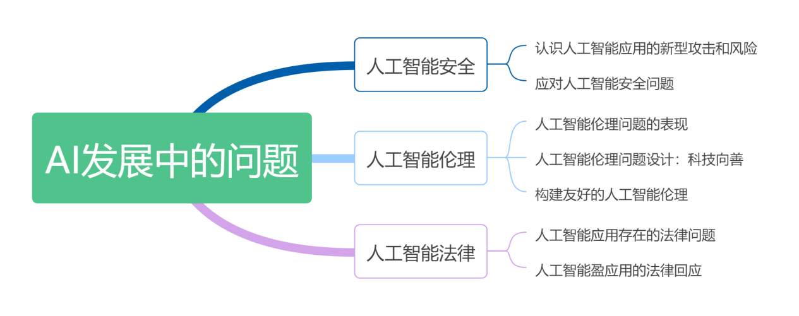
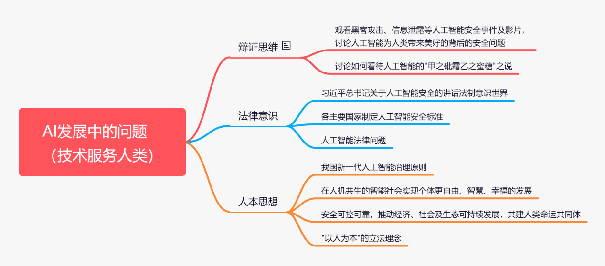

##
项目 3.1  AI发展中的问题认知

## 项目情景

霍金的警告

&nbsp;&nbsp;&nbsp;&nbsp;人工智能正在成为以新一轮科技革命为基础的国家竞争制高点。欧盟持续10年的“人脑计划”(Human Brain Project，HBP)、日本的“人工智能/大数据/物联网/网络安全综合项目”（AIP项目）以及美国的《国家人工智能研究与发展战略规划》，都将人工智能全面提升到国家战略层面。与此同时，“黑客”攻击电网导致大范围停电，政府内网被植入“后门”，机密情报被窃取、重要网站被劫持、个人信息集中泄露，家中摄像头被远程操控肆意窥探……这些曾经只出现在科幻小说里的安全问题，如今却在全球不时上演。人工智能的发展速度远远超越了人类自身的进化速度，这也引起了诸多学者的警惕。著名英国物理学家史蒂芬·威廉·霍金在全球移动互联网大会上做视频演讲时指出，人工智能可能是人类文明的终结者。“人工智能崛起要么是人类最好的事，要么就是最糟糕的事。人类需警惕人工智能发展的威胁。因为人工智能一旦脱离束缚，以不断加速的状态重新设计自身，人类由于受到漫长的生物进化限制，将无法与之竞争。”霍金警告说。
人类的职业是否会被机器代替？机器会不会反过来操控人类，控制人类居住的星球，并最终将人类淘汰出局？

## 项目导览

## 项目目标

* 能够感受人工智能安全对国家对社会对个人的影响
* 了解针对人工智能系统的威胁攻击方式
* 了解针人工智能系统的安全防范措施
* 了解人工智能伦理问题的主要表现
* 理解人工智能领域的安全、伦理、隐私、法律以及经济形态、生产方式中与人、自然和谐等方面的问题
* 能以正确的人工智能伦理导向思考人工智能未来的发展方向
* 了解人工智能的发展带来的具体法律问题
* 理解现代人工智能法律制定的指导思想 

## 思政聚焦  
  

