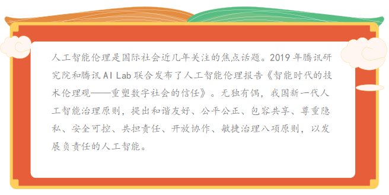
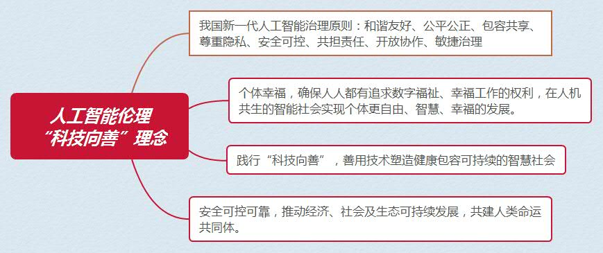

## 任务二 探究人工智能的伦理道德设计

### 【任务描述】

&nbsp;&nbsp;&nbsp;&nbsp;人工智能伦理从幕后走到前台，成为纠偏和矫正科技行业的狭隘的技术向度和利益局限的重要保障。正如华裔AI科学家李飞飞所言，要让伦理成为人工智能研究与发展的根本组成部分。在此背景下，从政府到行业再到学术界，全球掀起了一股探索制定人工智能伦理原则的热潮，欧盟、德国、英国、OECD、G20、IEEE、谷歌、微软等诸多主体从各自的角度提出了相应的人工智能伦理原则，共同促进AI知识的共享和可信AI的构建。要言之，各界已经基本达成共识，人工智能的发展离不开对伦理的思考和伦理保障。

### 【任务实施】

#### 2.1 人工智能伦理道德设计

&nbsp;&nbsp;&nbsp;&nbsp;当前，人工智能已经展现出巨大的变革力量，如何更好地解决人工智能的伦理道德问题，需要我们认真思考与提前布局。只有建立完善的人工智能伦理规范，处理好机器与人的新关系，我们才能更多地获得人工智能红利，让技术造福人类，进行合伦理的AI设计，要将人类社会的法律、道德等规范和价值嵌入AI系统；在AI研发中贯彻伦理原则。一方面，AI研发人员需要遵守一些基本的伦理准则，包括有益性、不作恶、包容性的设计、多样性、透明性，以及隐私的保护等。另一方面，需要建立AI伦理审查制度，伦理审查应当是跨学科的，多样性的，对AI技术和产品的伦理影响进行评估并提出建议；对算法进行必要的监管，避免算法作恶；针对算法决策和歧视，以及造成的人身财产损害，需要提供法律救济。国内外在人工智能伦理方面都有重大进展，首个由各国政府签署的AI原则，即“负责任地管理可信AI的原则”，成为人工智能治理方面的首个政府间国际共识，确立了以人为本的发展理念和敏捷灵活的治理方式。在“科技向善”理念之下，需要倡导面向人工智能的新的技术伦理观，包含三个层面：

&nbsp;&nbsp;&nbsp;&nbsp;**一 技术信任：**人工智能需要价值引导，做到可用、可靠、可知、可控（“四可”）就AI而言，虽然技术自身没有道德、伦理的品质，但是开发、使用技术的人会赋予其伦理价值，因为基于数据做决策的软件是人设计的，他们设计模型、选择数据并赋予数据意义，从而影响我们的行为。我们需要构建能够让社会公众信任人工智能等新技术的规制体系，让技术接受价值引导。

&nbsp;&nbsp;&nbsp;&nbsp;信任的建立，需要一套规则体系。在这些原则之下，人们可以探索制定标准、法律、国际公约等。对于人工智能需要采取包容审慎、敏捷灵活的治理方式，应避免严格、细致的法律要求，而是可以采取事后监管或者通过出台标准、行业公约、伦理框架、最佳实践、技术指南等调整人工智能等新技术的发展应用，支持行业自律。

&nbsp;&nbsp;&nbsp;&nbsp;**二 个体幸福：**在人机共生的智能社会，确保人人都有追求数字福祉、幸福工作的权利。各种智能机器正在成为人类社会不可或缺的一部分，和我们的生活和生产息息相关。这给人类与技术之间的关系提出了新的命题，需要深入思考智能社会如何实现人机共生。

&nbsp;&nbsp;&nbsp;&nbsp;**三 社会可持续：**践行“科技向善”，善用技术塑造健康包容可持续的智慧社会。技术创新是推动人类和人类社会发展的最主要因素。而这一轮技术革命具有巨大的“向善”潜力，将对人类生活与社会进步带来突破性的提升。在二十一世纪的今天，人类拥有的技术能力，以及这些技术所具有的“向善”潜力，是历史上任何时候都无法比拟的。换言之，这些技术本身是“向善”的工具，可以成为一股“向善”的力量，用于解决人类发展面临着的各种挑战，助力可持续发展目标。

&nbsp;&nbsp;&nbsp;&nbsp;在新的发展阶段，我们提出新的技术伦理，探索AI、个人、社会三者之间的平衡。就AI技术自身而言，AI需要价值引导，应做到可用、可靠、可知、可控（“四可”），从而让人们可以信任AI，让AI可以给个人和社会创造价值；就AI与个人之关系而言，幸福是人生的终极目的，需要构建和谐共生的人机关系，保障个人的数字福祉和幸福工作权利,实现智能社会人机共生，让个体更自由、智慧、幸福地生活和发展；就AI与社会之关系而言，AI所具有的巨大的“向善”潜力是历史上任何时候都无法比拟的，可以成为一股“向善”的力量，助力经济社会健康包容可持续发展。

#### 2.2 建构友好人工智能

&nbsp;&nbsp;&nbsp;&nbsp;**政府层面：**构建社会管理制度的人工智能伦理引论；协调人工智能发展与治理的关系，确保人工智能安全可控可靠，推动经济、社会及生态可持续发展，共建人类命运共同体。

&nbsp;&nbsp;&nbsp;&nbsp;**技术层面：**技术本身的安全性、公正性与人性化；确保人工智能安全可控可靠，规避风险隐患。对更高级的人工智能潜在风险持续地开展研究和预判，确保人工智能健康稳健发展。积极促进绿色发展，符合环境友好、资源节约的要求，同时在发展中缩小地域差距，提升弱势群体的适应性，努力消除数字鸿沟。

&nbsp;&nbsp;&nbsp;&nbsp;**公众层面：**公众观念的调整与前瞻性准备；推动经济、社会及生态可持续发展，促进包容共享。在充分尊重各国人工智能治理原则和实践的前提下，推动形成具有广泛共识的国际人工智能治理框架和标准规范，才能增进人类共同福祉。

&nbsp;&nbsp;&nbsp;&nbsp;**关系层面：**人工智能将成为未来经济社会发展的关键力量，也将成为国际竞争的重要领域，应当在积极促进和保障人工智能的发展的同时，未雨绸缪地判明人工智能发展中面临的法律风险点，力争在抢抓战略机遇、保持先发优势的同时，化危为机，以法律促进科学的良性发展。重视法律与科技发展的辩证关系，秉承着科技引领、系统布局、市场主导、资源开放的原则，大力加强人工智能领域的立法研究，制定相应的法律法规，建立健全公开透明的人工智能监管体系，构建人工智能创新发展的良好法治环境。

&nbsp;&nbsp;&nbsp;&nbsp;人工智能等数字技术发展到今天，给个人和社会带来了诸多好处、便利和效率，未来还将持续推动经济发展和社会进步，我们需要呼吁以数据和算法为面向的新的技术伦理观，实现技术、人、社会之间的良性互动和发展。最终，我们希望以新的技术伦理观增进人类对于技术发展应用的信任，让人工智能等技术进步持续造福人类和人类社会发展进步，塑造更健康包容可持续的智慧社会。

### 【任务拓展】

&nbsp;&nbsp;&nbsp;&nbsp;随着人工智能的发展趋势，人工智能伦理应如何与时俱进？

**思政聚焦**

