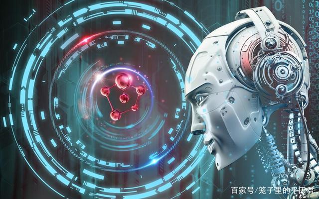

## 任务一 探究人工智能发展带来的法律难题

### 【任务描述】

&nbsp;&nbsp;&nbsp;&nbsp;我们已经进入人工智能时代，智能型机器人、自动驾驶、AI创作、语音识别……大数据和人工智能的发展深刻地改变了我们的生产和生活方式，也深刻地影响社会的方方面面。

### 【任务实施】

#### 1.1 人工智能时代提出的法律问题

&nbsp;&nbsp;&nbsp;&nbsp;科技是一把双刃剑，人工智能技术概莫能外，它们也提出了诸多的法律问题，当前，人工智能的应用越来越广泛，由此也产生了一系列法律问题，尚没有达成广泛共识。

**（一）人格权保护问题：**现在很多人工智能系统把一些人的声音、表情、肢体动作等植入内部系统，使所开发的人工智能产品可以模仿他人的声音、形体动作等，甚至能够像人一样表达，并与人进行交流。但如果未经他人同意而擅自进行上述模仿活动，就有可能构成对他人人格权的侵害。此外，人工智能还可能借助光学技术、声音控制、人脸识别技术等，对他人的人格权客体加以利用，这也对个人声音、肖像等的保护提出了新的挑战。

**（二）知识产权的保护问题：**从实践来看，机器人已经能够自己创作音乐、绘画，机器人写作的诗歌集也已经出版，这对现行知识产权法提出了新的挑战。例如，百度已经研发出可以创作诗歌的机器人，微软公司的人工智能产品“微软小冰”已于2017年5月出版人工智能诗集《阳光失了玻璃窗》。这就提出了一个问题，即这些机器人创作作品的著作权究竟归属于谁？是归属于机器人软件的发明者？还是机器人的所有权人？还是赋予机器人一定程度的法律主体地位从而由其自身享有相关权利？人工智能的发展也可能引发知识产权的争议。智能机器人要通过一定的程序进行“深度学习”“深度思维”，在这个过程中有可能收集、储存大量的他人已享有著作权的信息，这就有可能构成非法复制他人的作品，从而构成对他人著作权的侵害。

**（三）数据财产的保护问题：**人工智能的发展也对数据的保护提出了新的挑战，一方面，人工智能及其系统能够正常运作，在很大程度上是以海量的数据为支撑的，在利用人工智能时如何规范数据的收集、储存、利用行为，避免数据的泄露和滥用，并确保国家数据的安全，是亟需解决的重大现实问题。另一方面，人工智能的应用在很大程度上取决于其背后的一套算法，如何有效规范这一算法及其结果的运用，避免侵害他人权利，也需要法律制度予以应对。

**（四）侵权责任的认定问题：**随着人工智能应用范围的日益普及，其引发的侵权责任认定和承担问题将对现行侵权法律制度提出越来越多的挑战。无论是机器人致人损害，还是人类侵害机器人，都是新的法律责任。机器人是人制造的，其程序也是制造者控制的，所以，在造成损害后，谁研制的机器人，就应当由谁负责，似乎在法律上没有争议。人工智能就是人的手臂的延长，在人工智能造成他人损害时，当然应当适用产品责任的相关规则。其实不然，机器人与人类一样，是用“脑子”来思考的，机器人的脑子就是程序。我们都知道一个产品可以追踪属于哪个厂家，但程序是不一定的，有可能是由众多的人共同开发的，程序的产生可能无法追踪到某个具体的个人或组织。尤其是，智能机器人也会思考，如果有人故意挑逗，惹怒了它，它有可能会主动攻击人类，此时是否都要由研制者负责，就需要进一步研究。前不久，深圳已经测试无人驾驶公交线路，引发全球关注。但由此需要思考的问题就是，一旦发生交通事故，应当由谁承担责任？能否适用现行机动车交通事故责任认定相关主体的责任？法律上是否有必要为无人驾驶机动车制定专门的责任规则？这确实是一个新问题。

**（五）机器人的法律主体地位问题：**今天，人工智能机器人已经逐步具有一定程度的自我意识和自我表达能力，可以与人类进行一定的情感交流。有人估计，未来若干年，机器人可以达到人类50%的智力。这就提出了一个新的法律问题，即我们将来是否有必要在法律上承认人工智能机器人的法律主体地位？在实践中，机器人可以为我们接听电话、语音客服、身份识别、翻译、语音转换、智能交通，甚至案件分析。有人统计，现阶段23%的律师业务已可由人工智能完成。机器人本身能够形成自学能力，对既有的信息进行分析和研究，从而提供司法警示和建议。甚至有人认为，机器人未来可以直接当法官，人工智能已经不仅是一个工具，而且在一定程度上具有了自己的意识，并能作出简单的意思表示。这实际上对现有的权利主体、程序法治、用工制度、保险制度、绩效考核等一系列法律制度提出了挑战，我们需要妥善应对。

&nbsp;&nbsp;&nbsp;&nbsp;人工智能时代已经来临，它不仅改变人类世界，也会深刻改变人类的法律制度。我们的法学理论研究应当密切关注社会现实，积极回应大数据、人工智能等新兴科学技术所带来的一系列法律挑战，从而为我们立法的进一步完善提供有力的理论支撑。

### 【任务拓展】

&nbsp;&nbsp;&nbsp;&nbsp;人工智能发展过程中，还需要面对哪些法律问题？